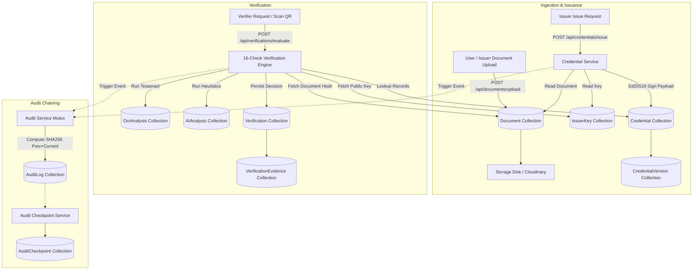
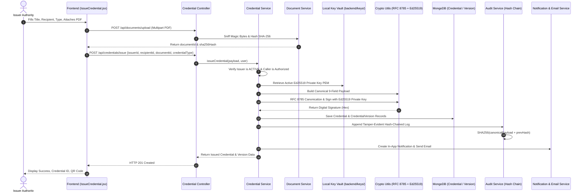
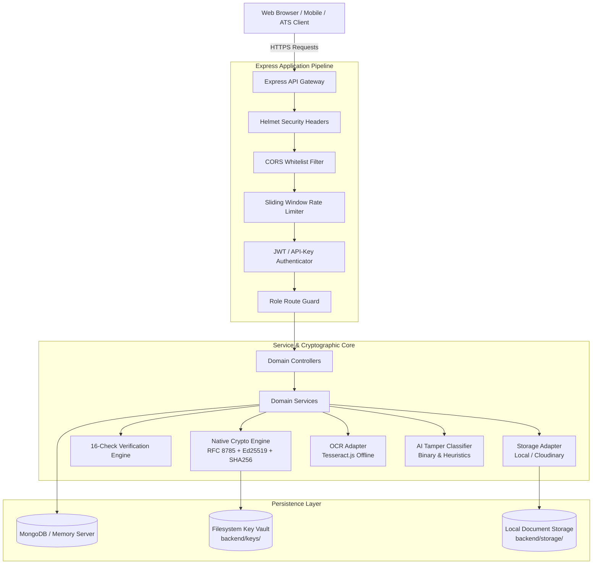
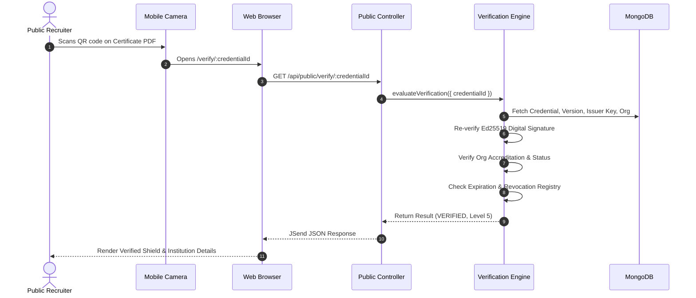

# SecureWork Verify 2.0 — Complete Project Documentation

> **Document Type:** Authoritative Technical Knowledge Base & System Specification  
> **Source Repository:** `SecureWork_verify_2.0`  
> **Target Audience:** AI Systems (GPT-4 / Claude / Gemini), System Architects, Security Auditors, Technical Evaluators  
> **Status:** Authoritative (Derived strictly from active codebase inspection)

---

## Table of Contents

1. [Project Overview](#1-project-overview)
2. [Project Status](#2-project-status)
3. [Complete Technology Stack](#3-complete-technology-stack)
4. [Complete Project Directory Structure](#4-complete-project-directory-structure)
5. [Frontend — Complete Architecture](#5-frontend--complete-architecture)
6. [Backend — Complete Architecture](#6-backend--complete-architecture)
7. [Controller → Service → Database Flow](#7-controller--service--database-flow)
8. [Database — Complete Documentation](#8-database--complete-documentation)
9. [Complete Database Data Flow](#9-complete-database-data-flow)
10. [Authentication](#10-authentication)
11. [Authorization / RBAC](#11-authorization--rbac)
12. [Credential Issuance Flow](#12-credential-issuance-flow)
13. [Cryptography — Very Detailed](#13-cryptography--very-detailed)
14. [Credential Hashing / Signing / Verification](#14-credential-hashing--signing--verification)
15. [QR Code / Public Verification](#15-qr-code--public-verification)
16. [Document / Image Upload Verification](#16-document--image-upload-verification)
17. [OCR (Optical Character Recognition)](#17-ocr-optical-character-recognition)
18. [AI / ML / Document Fraud Detection](#18-ai--ml--document-fraud-detection)
19. [Certificate Tampering Detection](#19-certificate-tampering-detection)
20. [Complete Verification Engine](#20-complete-verification-engine)
21. [Audit Logging & Hash Chaining](#21-audit-logging--hash-chaining)
22. [Security Architecture & Defensive Hardening](#22-security-architecture--defensive-hardening)
23. [Environment Variables](#23-environment-variables)
24. [Third-Party Services and APIs](#24-third-party-services-and-apis)
25. [Frontend ↔ Backend Communication](#25-frontend--backend-communication)
26. [Complete User Flows](#26-complete-user-flows)
27. [Complete API Reference](#27-complete-api-reference)
28. [Error Handling](#28-error-handling)
29. [Logging](#29-logging)
30. [Configuration Management](#30-configuration-management)
31. [Installation and Setup](#31-installation-and-setup)
32. [Deployment Architecture](#32-deployment-architecture)
33. [File-by-File Important Code Map](#33-file-by-file-important-code-map)
34. [Function / Class Responsibility Map](#34-function--class-responsibility-map)
35. [Data Flow Diagrams (Mermaid)](#35-data-flow-diagrams-mermaid)
36. [Sequence Diagrams (Mermaid)](#36-sequence-diagrams-mermaid)
37. [Security Threat / Protection Map](#37-security-threat--protection-map)
38. [Known Limitations](#38-known-limitations)
39. [Future Improvements](#39-future-improvements)
40. [Testing Suite](#40-testing-suite)
41. [Debugging & Troubleshooting](#41-debugging--troubleshooting)
42. [Complete Project Explanation in Simple Language](#42-complete-project-explanation-in-simple-language)
43. [5-Minute Project Explanation (Executive / Pitch)](#43-5-minute-project-explanation-executive--pitch)
44. [Technical Interview Questions & Codebase Answers](#44-technical-interview-questions--codebase-answers)
45. ["Where Is This Implemented?" Reference](#45-where-is-this-implemented-reference)
46. [Final Architecture Summary](#46-final-architecture-summary)
47. [Documentation Generation Report](#documentation-generation-report)

---

# 1. PROJECT OVERVIEW

### Project Name
**SecureWork Verify 2.0** (`securework-verify`)

### One-Line Description
A zero-trust, cryptographically verifiable workforce credential and qualification verification platform employing RFC 8785 canonicalization, Ed25519 digital signatures, SHA-256 evidence hashing, tamper-evident hash-chained audit logging, offline self-contained verification bundles, and heuristic AI/OCR fraud analysis without blockchain overhead.

### Simple Explanation
In everyday hiring and credentialing, people submit PDF resumes, scanned diplomas, and training certificates. Employers, background check firms, and HR departments usually cannot tell whether a certificate is authentic, forged in Photoshop, modified with a fake name or degree, or revoked by the school. Traditional solutions either rely on slow manual phone calls or complex, expensive blockchain setups with gas fees and privacy violations.

SecureWork Verify solves this simply and reliably. When an authorized institution (like a university or employer) issues a qualification, the system computes a byte-exact cryptographic fingerprint of the certificate and signs a standardized digital proof using an asymmetric Ed25519 private key. Anyone in the world—an HR recruiter, a hiring manager, or an automated ATS—can upload the certificate or scan its QR code to verify its authenticity in milliseconds. If even a single dot, letter, or pixel has been altered, the math fails immediately and flags the document as altered. It works completely offline with zero vendor lock-in and zero transaction costs.

### Technical Explanation
SecureWork Verify is architected as an evidence-first modular monolith built in Node.js/Express and React 18/Vite. The core architectural axiom is **"Evidence first, conclusion second."** The system never relies on a simplistic boolean `isTrusted = true` flag. Instead, every verification operation passes through a 16-dimensional evaluation engine (`VerificationEngine`) that scrutinizes institutional accreditation, source DNS binding, issuer key lifecycle state, exact SHA-256 byte integrity, RFC 8785 deterministic JSON canonicalization, Ed25519 cryptographic signature verification, recipient identity binding, expiration dates, revocation registries, OCR text extraction, heuristic image/PDF tampering anomalies, and conflicting cross-source signals. 

Audit integrity is enforced via a sequential cryptographic hash chain (each log entry contains `currentHash = SHA256(canonicalPayload + previousHash)`), rooted at a deterministic genesis hash (`SHA256("GENESIS_SECUREWORK_VERIFY")`), ensuring that internal database record modification or deletion is immediately detectable.

### Problem Being Solved
1. **Resume and Diploma Mill Fraud:** Widespread fabrication of academic credentials, certifications, and employment history.
2. **Visual Inspection Fallibility:** Visual inspection of PDFs and high-resolution scans cannot distinguish between legitimate certificates and pixel-edited counterfeits.
3. **Slow, Opaque Background Checks:** Manual primary-source verification takes weeks and costs hundreds of dollars per candidate.
4. **Blockchain Deficiencies:** Web3/blockchain credentials suffer from transaction latency, volatile gas fees, lack of enterprise key rotation mechanisms, public exposure of personally identifiable information (PII), and violation of the GDPR "Right to be Forgotten."
5. **Over-reliance on AI:** Naive AI/LLM document checkers hallucinate and cannot mathematically guarantee whether a file has been modified.

### Main Objectives
- **Zero-Trust Cryptographic Proof:** Enable mathematical proof of authenticity using standard public-key cryptography (Ed25519) and hash functions (SHA-256).
- **Offline Verifiability:** Enable verification of self-contained JSON bundles and signed PDFs using pure Node.js runtime crypto without network connectivity or third-party API calls.
- **Explainable Multi-Dimensional Trust:** Provide granular trust grading (Level 0 Unknown to Level 5 Currently Valid) with explicit line-item check evidence.
- **Tamper-Evident History:** Guard historical audit trails against internal manipulation via sequential cryptographic hash chains and periodic checkpoints.
- **Open Standards Interoperability:** Export credentials compliant with W3C Verifiable Credentials Data Model v1.1/v2.0 (`did:web` and `did:key` schemas) and RFC 8785 JSON Canonicalization Scheme (JCS).

### Target Users & Personas
1. **System Administrator (`ADMIN`):** Governs platform integrity, verifies organizations, approves issuer accounts, inspects cryptographic key health, and audits system hash chains.
2. **Credential Issuer (`ISSUER`):** Accredited institutions, universities, state licensing boards, and enterprise employers that register public keys and issue cryptographically sealed credentials.
3. **HR / Recruiter / Verifier (`HR`):** Hiring managers and talent officers who verify candidate portfolios, inspect multi-check evidence cards, query trusted external registries, and batch-evaluate applicant qualifications.
4. **Worker / Candidate (`USER`):** Professionals and scholars who upload their source documents, manage their personal credential wallets, generate public verification links, and export offline verification bundles.
5. **Compliance Auditor (`AUDITOR`):** Internal or external compliance officers who inspect immutable audit trails, validate hash-chain integrity, review evidence logs, and conduct manual verifications.
6. **Public Verifier (`GUEST` / Anonymous):** Third-party entities who verify credentials via public deep-links (`/verify/:credentialId`), scan certificate QR codes, or download signed PDF certificates without logging in.

### Real-World Use Cases
- **University Degree Conferral & Verification:** Universities issue cryptographically signed diplomas; employers verify graduation without contacting the registrar.
- **Regulated Professional Licensing:** State boards issue medical, engineering, or legal licenses with real-time revocation checking and expiration enforcement.
- **Enterprise Employment Verification:** Companies issue signed proof of employment and role tenure for background checks and loan approvals.
- **Aviation & Security Clearances:** Mission-critical workforce verification where documents must be validated offline in disconnected, air-gapped secure facilities.
- **B2B Applicant Tracking System (ATS) Integration:** High-throughput automated candidate screening via API key authenticated verification endpoints (`POST /api/v1/verify`).

---

# 2. PROJECT STATUS

The SecureWork Verify 2.0 codebase is a complete, working implementation across all 17 planned architecture phases. Every feature claimed in the source code has been verified through automated test suites and end-to-end integration scripts.

### Implemented (Fully Operational in Codebase)
- **Monorepo Architecture:** npm workspace configuration linking backend and frontend with unified build/dev scripts.
- **Dual Database Strategy:** MongoDB integration via Mongoose with an automatic, zero-setup in-memory fallback (`mongodb-memory-server`) if MongoDB Atlas or local daemon is unreachable.
- **Deterministic Cryptography:** RFC 8785 JSON Canonicalization Scheme (`canonicalizeJson`), SHA-256 hashing (buffer, string, and streams), timing-safe buffer comparison (`crypto.timingSafeEqual`), and native Ed25519 keypair generation, signing, and signature verification.
- **Local Key Storage Vault:** Filesystem key vault (`backend/keys/`) with path traversal protection, regex validation, and restrictive file permissions (`0o600` / `0o700`).
- **Dual Document Storage Drivers:** Modular storage adapter system featuring:
  - `LocalStorageAdapter`: Local disk storage (`backend/storage/documents/`) with path traversal prevention and SHA-256 verification.
  - `CloudinaryAdapter`: Remote cloud storage driver with authenticated private uploads, signed temporary download URLs, and automatic local fallback when credentials contain placeholders.
- **Multi-Layer File Security & Ingestion:** Multer in-memory upload handling, strict 10 MB file caps, magic byte sniffing for PDF (`%PDF`), PNG (`\x89PNG`), JPEG (`\xFF\xD8\xFF`), executable blocking (Windows PE `MZ`, Linux ELF `\x7FELF`, script shebangs `#!`), and filename sanitization.
- **W3C Verifiable Credentials & PDF Generation:**
  - PDFKit certificate generation featuring landscape A4 layout, dynamic styling, Ed25519 signature fingerprinting, and embedded verification QR codes.
  - W3C VC JSON-LD export (`did:web` and `did:key` schemas).
  - Self-contained offline verification JSON bundles (`bundle.json`).
- **Zero-Trust Offline Verification CLI:** Standalone CLI script (`scripts/verify-offline.js`) that validates bundles using pure Node.js built-in crypto without network access.
- **16-Check Verification Engine:** Comprehensive evaluation pipeline scoring 16 independent criteria, mapping results to 6 standardized Trust Levels (Level 0 Unknown to Level 5 Currently Valid) and 20 discrete Result Types.
- **Official Source Verification & SSRF Defense:** Safe HTTP source retrieval (`safeFetch`) enforcing HTTPS-only, trusted domain allowlisting, DNS pre-resolution blocking private, loopback, link-local, carrier-grade NAT, and cloud metadata IPs (`169.254.169.254`), 5 MB response limits, and manual redirect validation.
- **Local OCR Engine:** Tesseract.js v7 offline worker utilizing local `eng.traineddata`, native PDF text and image stream extraction (`pdfExtractor.js`), heuristic field regex parsing, per-field confidence scoring, and timeout handling.
- **Local AI/ML Heuristic Tamper Detection:** Byte-level anomaly analyzer scanning for incremental PDF update trailers, graphic editing software signatures (Photoshop, Canva, GIMP, etc.), creation vs. modification date discrepancies, JPEG DQT quantization table counts, Photoshop IRB 8BIM markers, Cyrillic/Latin homoglyph attacks, and explicit forgery keywords. Non-override rule strictly enforced.
- **Cryptographic Hash-Chained Audit Trail:** Sequential, append-only audit logging where every event is hashed with the previous record's hash (`SHA-256`), rooted at `GENESIS_SECUREWORK_VERIFY`, serialized via an in-memory promise mutex lock, with full chain validation and internal checkpoints (`AuditCheckpoint`).
- **Multi-Role RBAC & Authentication:** JWT authentication (HS256, 24h expiration) with bcrypt password hashing (10 salt rounds), active account status verification, and role-based route guards across 5 distinct roles (`ADMIN`, `ISSUER`, `HR`, `USER`, `AUDITOR`).
- **B2B API Key & Webhook Subsystem:** API key provisioning with SHA-256 storage hashing, usage counters, and ATS verification routes (`/api/v1/verify`), plus HMAC-SHA256 signed webhook dispatching (`X-SecureWork-Signature`).
- **Transactional Notifications:** In-app notification drawer with unread tracking, read-all actions, and transactional email dispatch via Nodemailer (Ethereal test SMTP fallback).
- **Rich Frontend Application:** 22 complete pages, responsive sidebar/navbar navigation, animated hero visualizations (Anime.js), dark/light mode (`ThemeContext`), live demo persona switcher, public verification deep-linking, QR code scanner modal, and confidence score rings.

### Partially Implemented
- **External Email Delivery:** Implemented using Ethereal test SMTP / JSON transport in development; requires production SMTP credentials (`SMTP_HOST`, `SMTP_USER`, `SMTP_PASS`) to send live internet emails.
- **Production Webhook Workers:** Webhooks dispatch asynchronously with exponential backoff logging in-process, but lack an external Redis/BullMQ background queue worker for distributed retry persistence.

### Planned / TODO (Not Yet in Codebase)
- **Hardware Security Module (HSM) / KMS Key Storage Driver:** AWS KMS, HashiCorp Vault, or Google Cloud KMS adapter for enterprise asymmetric key management (the current architecture uses `LocalKeyStorageAdapter`).
- **Decentralized Identifier (DID) Universal Resolver Integration:** Live network resolution for remote `did:ion` or `did:indy` methods (currently supports deterministic `did:web` and `did:key` JSON-LD generation).
- **Multi-Language OCR Packs:** OCR is currently bundled with English (`eng.traineddata`); additional language packs (Spanish, French, German, Chinese) are planned.

### Mock / Demo (Explicitly Simulated in Current Codebase)
- **`LocalSourceVerificationAdapter`:** When querying official external registries during local demos/testing, the system queries an in-memory seed map populated by `localAdapter.seedRecord(...)` rather than making outbound internet calls to government portals. The HTTP adapter (`HttpSourceVerificationAdapter`) is fully implemented with SSRF protection for live targets.
- **Demo Personas:** Seed scripts (`seedAdmin.js` and `demo.js`) generate pre-configured test users (`admin@securework.local`, `auditor@securework.local`, `issuer_auth@stanford.edu`, `hr_lead@enterprise.local`, `scholar@stanford.edu`) for immediate presentation and automated testing.

---

# 3. COMPLETE TECHNOLOGY STACK

| Layer | Technology | Version | Purpose | Where Used |
|---|---|---|---|---|
| **Frontend Framework** | React | `^18.3.1` | Core declarative UI rendering | Entire `frontend/src/` |
| **Frontend DOM** | React DOM | `^18.3.1` | DOM mounting and rendering | `frontend/src/main.jsx` |
| **Frontend Routing** | React Router DOM | `^7.18.4` | Client-side routing, protected routes, deep links | `frontend/src/App.jsx` |
| **Frontend Build Tool** | Vite | `^6.0.1` | Development server, HMR, production bundling | `frontend/vite.config.js` |
| **Frontend Icons** | Lucide React | `^0.468.0` | Comprehensive iconography | Throughout frontend components and pages |
| **Frontend Typography** | @fontsource/inter | `^5.3.0` | Primary modern sans-serif typography | `frontend/src/index.css` |
| **Frontend Typography** | @fontsource/jetbrains-mono | `^5.3.0` | Monospace typography for hashes, keys, code | `frontend/src/index.css` |
| **Frontend Animations** | Anime.js | `^4.5.0` | Complex SVG, geometric, and hero visual animations | `HeroVisualAnimation.jsx`, `ConfidenceRing.jsx` |
| **Frontend Styling** | Vanilla CSS (CSS Variables) | Native CSS3 | Bespoke styling, glassmorphism, responsive grid | `frontend/src/styles/*.css` |
| **Backend Runtime** | Node.js | `>=18.0.0` | JavaScript server runtime environment | Root, `backend/src/` |
| **Backend Framework** | Express | `^4.21.2` | REST API routing and middleware pipeline | `backend/src/app.js` |
| **Backend Database Driver** | Mongoose | `^8.9.5` | MongoDB Object Data Modeling (ODM) | `backend/src/models/*`, `backend/src/config/db.js` |
| **In-Memory Database** | mongodb-memory-server | `^10.1.3` | Zero-setup in-memory MongoDB fallback | `backend/src/config/db.js` |
| **Authentication** | JSON Web Tokens (`jsonwebtoken`) | `^9.0.2` | Stateless bearer token generation and verification | `backend/src/utils/jwt.js`, `backend/src/middleware/auth.js` |
| **Password Security** | bcryptjs | `^2.4.3` | One-way salted password hashing | `backend/src/models/user.model.js` |
| **Security Headers** | Helmet | `^8.0.0` | Defensive HTTP security headers | `backend/src/app.js` |
| **CORS Middleware** | CORS | `^2.8.5` | Cross-Origin Resource Sharing control | `backend/src/app.js` |
| **Request Logging** | Morgan | `^1.10.0` | HTTP request logging | `backend/src/middleware/logger.js` |
| **Multipart Uploads** | Multer | `^2.3.0` | In-memory file upload stream processing | `backend/src/middleware/upload.js` |
| **Configuration** | Dotenv | `^16.4.7` | Environment variable loading from `.env` | `backend/src/config/env.js` |
| **API Documentation** | Swagger UI Express | `^5.0.1` | Interactive OpenAPI / Swagger UI documentation | `backend/src/docs/swagger.js` |
| **Cloud Storage** | Cloudinary SDK | `^2.5.1` | Remote private document storage adapter | `services/storage/cloudinary.adapter.js` |
| **OCR Engine** | Tesseract.js | `^7.0.0` | Offline optical character recognition | `services/ocr/localOcr.adapter.js` |
| **PDF Generation** | PDFKit | `^0.20.2` | Programmatic cryptographic certificate PDF generation | `backend/src/utils/certificatePdf.js` |
| **QR Code Generation** | QRCode | `^1.5.4` | Data URL and PNG buffer QR code generation | `backend/src/utils/certificatePdf.js`, `public.controller.js` |
| **Email Service** | Nodemailer | `^10.0.15` | Transactional email delivery and preview links | `backend/src/services/email.service.js` |
| **Process Orchestration** | Concurrently | `^8.2.2` | Simultaneous backend and frontend dev server execution | Root `package.json` |
| **Test Runner** | Node.js Native Test Runner (`node:test`) | Built-in | Fast, dependency-free unit and integration testing | Root `package.json`, `backend/tests/*` |

### Cryptographic Algorithms Actually Implemented in Code
- **SHA-256 (`crypto.createHash('sha256')`):** 
  - Document byte hashing (`sha256(buffer)`).
  - Canonical credential JSON payload hashing.
  - Audit log sequential chaining (`AuditLog.currentHash`).
  - Webhook payload integrity digest.
  - API key secret hashing for database lookup.
  - Audit genesis hash (`SHA256("GENESIS_SECUREWORK_VERIFY")`).
- **Ed25519 (`crypto.generateKeyPairSync('ed25519', ...)`):**
  - Institutional asymmetric digital signing.
  - Private key: PKCS#8 PEM format (`0o600` permissions on disk).
  - Public key: SPKI PEM format stored in `IssuerKey` collection.
  - Signing: `crypto.sign(null, dataBuffer, privateKey)`.
  - Verification: `crypto.verify(null, dataBuffer, publicKey, signatureBuffer)`.
- **HMAC-SHA256 (`crypto.createHmac('sha256', secret)`):**
  - Outbound webhook event signatures (`X-SecureWork-Signature`).
  - Signed payload structure: `t=${timestamp},v1=${signature}` over `${timestamp}.${jsonBody}`.
- **Timing-Safe Buffer Comparison (`crypto.timingSafeEqual`):**
  - Implemented in `backend/src/utils/crypto.js` to defeat side-channel timing attacks on hash and signature comparisons.
- **RFC 8785 JSON Canonicalization Scheme (JCS):**
  - Deterministic serialization sorting all JSON keys lexicographically and normalizing whitespace to ensure identical cryptographic hashes across heterogeneous operating systems.
- **Cryptographic Randomness (`crypto.randomBytes`):**
  - Generation of entity IDs (`usr_`, `org_`, `iss_`, `key_`, `doc_`, `crd_`, `ver_`, `vrf_`, `evi_`, `aud_`, `not_`, `ak_`, `wh_`).
  - Generation of high-entropy API key secrets (`sk_live_...`) and webhook secrets.

### AI / ML & Document Fraud Detection Actually Implemented
- **`LocalAIAdapter` (`backend/src/services/ai/localAi.adapter.js`):**
  - Native, zero-dependency heuristic anomaly classifier (`SecureWork Heuristic Tamper Classifier v2.1.0`).
  - Analyzes raw document byte streams, PDF trailer structures, JPEG compression markers, and OCR text.
  - Evaluates:
    1. **PDF Incremental Update Trails:** Scans for multiple `trailer` and `xref` tokens indicating post-issuance alterations.
    2. **Graphic Editor Metadata Footprints:** Scans binary streams for markers from Photoshop, Canva, GIMP, Illustrator, Inkscape, CorelDraw, Nitro PDF, Foxit, Sejda, and iLovePDF.
    3. **Date Discrepancies:** Compares `/CreationDate` against `/ModDate` attributes.
    4. **JPEG Quantization Table Anomalies:** Counts `0xFF 0xDB` DQT markers indicating spliced image recompression.
    5. **Photoshop IRB / 8BIM Application Markers:** Scans for `0x38 0x42 0x49 0x4D` header blocks.
    6. **PNG Ancillary Text Chunks:** Identifies graphic editor export chunks.
    7. **Mixed Homoglyph Obfuscation:** Regex scanning for Cyrillic characters (`\u0430\u0435\u043E...`) mixed into Latin words to evade text matching.
    8. **Explicit Fraud Keywords:** Identifies keywords such as "specimen", "replica", "diploma mill", "unofficial copy", "sample only", "void", and "fake credential".
  - Strictly advisory; cannot override cryptographic verification failures.

### External APIs & Infrastructure
- **Cloudinary API:** Remote authenticated cloud storage (used only when `STORAGE_DRIVER=cloudinary`).
- **Ethereal Email:** Developer sandbox SMTP server used by Nodemailer to test email notifications without real mail servers.
- **Docker / CI-CD:** Containerization and automated pipelines are planned for production rollout; local development runs via native Node.js and Vite.

---

# 4. COMPLETE PROJECT DIRECTORY STRUCTURE

The project is structured as an npm workspace monorepo:

```text
SecureWork_verify_2.0/
├── .gitignore                          # Version control exclusions (keys, logs, storage, env)
├── package.json                        # Root workspace definition and monorepo scripts
├── package-lock.json                   # Dependency lockfile
├── PROJECT_RULES.md                    # Core engineering rules and architectural invariants
├── README.md                           # Quickstart guide, architectural summary, persona credentials
├── sample_qualification.pdf            # Sample test document
│
├── backend/                            # Backend Service (Modular Monolith)
│   ├── .env.example                    # Environment variable template
│   ├── package.json                    # Backend dependencies and scripts
│   ├── keys/                           # Local private key vault (0o700 dir, 0o600 files, gitignored)
│   ├── storage/                        # Local file storage (gitignored)
│   │   ├── documents/                  # Ingested original documents
│   │   └── temp/                       # Temporary download/stream cache
│   ├── src/
│   │   ├── app.js                      # Express application setup, security headers, rate limiting
│   │   ├── server.js                   # HTTP server startup, directory initialization, graceful shutdown
│   │   ├── config/
│   │   │   ├── db.js                   # MongoDB connection lifecycle, placeholder detection, memory fallback
│   │   │   └── env.js                  # Strict environment variable schema validation
│   │   ├── controllers/                # HTTP request handlers (thin controllers)
│   │   │   ├── analytics.controller.js     # System telemetry & volume metrics
│   │   │   ├── apiKey.controller.js        # B2B API key provisioning and management
│   │   │   ├── auditLog.controller.js      # Audit log retrieval, chain validation, checkpointing
│   │   │   ├── auth.controller.js          # User registration, login, profile (/me)
│   │   │   ├── credential.controller.js    # Credential issuance, versions, revocation, tampering demo
│   │   │   ├── document.controller.js      # Document upload, metadata, secure download streaming
│   │   │   ├── health.controller.js        # Liveness, readiness, and DB telemetry
│   │   │   ├── hr.controller.js            # Candidate credential lookup & owner-matched verification
│   │   │   ├── issuer.controller.js        # Issuer onboarding, status review, recipient lookup
│   │   │   ├── issuerKey.controller.js     # Cryptographic keypair generation, rotation, compromise
│   │   │   ├── notification.controller.js  # In-app notification feed, read-status mutations
│   │   │   ├── ocr.controller.js           # Document OCR text extraction & AI risk analysis
│   │   │   ├── organization.controller.js  # Organization onboarding, verification, suspension
│   │   │   ├── public.controller.js        # Public deep-link verification, PDF/bundle/QR downloads
│   │   │   ├── trustedSource.controller.js # External source registration, approvals, live queries
│   │   │   ├── user.controller.js          # User profile management, administrative role assignment
│   │   │   ├── verification.controller.js  # Verification engine execution, evidence logs, manual review
│   │   │   └── webhook.controller.js       # Webhook registration and delivery management
│   │   ├── docs/
│   │   │   └── swagger.js              # Swagger/OpenAPI documentation definitions and UI mount
│   │   ├── middleware/
│   │   │   ├── apiKeyAuth.js           # x-api-key authentication for B2B API access
│   │   │   ├── auth.js                 # JWT authentication, optional auth, and RBAC guards
│   │   │   ├── errorHandler.js         # Centralized operational error handling (no stack leaks)
│   │   │   ├── logger.js               # Structured Morgan HTTP request logger
│   │   │   ├── rateLimiter.js          # In-memory sliding window IP rate limiter
│   │   │   ├── requestId.js            # Unique X-Request-Id header propagation
│   │   │   └── upload.js               # Multer memory storage file upload parser
│   │   ├── models/                     # Mongoose database schemas
│   │   │   ├── aiAnalysis.model.js         # AI heuristic risk scores and anomaly findings
│   │   │   ├── apiKey.model.js             # B2B API keys, hashed secrets, and usage metrics
│   │   │   ├── auditCheckpoint.model.js    # Periodic audit chain state anchors
│   │   │   ├── auditLog.model.js           # Append-only, tamper-evident hash-chained logs
│   │   │   ├── credential.model.js         # Workforce credential master records
│   │   │   ├── credentialVersion.model.js  # Immutable cryptographic revisions and signatures
│   │   │   ├── document.model.js           # Ingested file metadata and SHA-256 hashes
│   │   │   ├── index.js                    # Model registry and architecture export
│   │   │   ├── issuer.model.js             # Accredited issuing body profiles
│   │   │   ├── issuerKey.model.js          # Ed25519 public key certificates and lifecycle status
│   │   │   ├── notification.model.js       # User transactional notification records
│   │   │   ├── ocrAnalysis.model.js        # Extracted OCR text, metadata, and structured fields
│   │   │   ├── organization.model.js       # Accredited universities, agencies, and enterprises
│   │   │   ├── trustedSource.model.js      # Official regulatory and registry endpoints
│   │   │   ├── user.model.js               # User accounts, password hashes, and system roles
│   │   │   ├── verification.model.js       # Verification decisions and 16-check reports
│   │   │   ├── verificationEvidence.model.js # Discrete immutable historical evidence artifacts
│   │   │   ├── webhook.model.js            # Outbound webhook subscribers and secrets
│   │   │   └── plugins/
│   │   │       └── baseModel.plugin.js     # Standard timestamps, clean JSON transform, secret stripping
│   │   ├── routes/                     # Express REST route definitions
│   │   │   ├── analytics.routes.js     # GET /api/analytics/overview
│   │   │   ├── apiKey.routes.js        # /api/api-keys
│   │   │   ├── auditLog.routes.js      # /api/audit-logs
│   │   │   ├── auth.routes.js          # /api/auth
│   │   │   ├── credential.routes.js    # /api/credentials
│   │   │   ├── document.routes.js      # /api/documents
│   │   │   ├── health.routes.js        # /api/health
│   │   │   ├── hr.routes.js            # /api/hr
│   │   │   ├── index.js                # Master route registry and service metadata (/api)
│   │   │   ├── issuer.routes.js        # /api/issuers
│   │   │   ├── issuerKey.routes.js     # /api/issuer-keys
│   │   │   ├── notification.routes.js  # /api/notifications
│   │   │   ├── ocr.routes.js           # /api/analysis
│   │   │   ├── organization.routes.js  # /api/organizations
│   │   │   ├── public.routes.js        # /api/public (Unauthenticated portal routes)
│   │   │   ├── trustedSource.routes.js # /api/trusted-sources
│   │   │   ├── user.routes.js          # /api/users
│   │   │   ├── v1.routes.js            # /api/v1/verify (High-performance B2B endpoint)
│   │   │   ├── verification.routes.js  # /api/verifications
│   │   │   └── webhook.routes.js       # /api/webhooks
│   │   ├── scripts/
│   │   │   ├── demo.js                 # 17-scenario live verification demonstration script
│   │   │   ├── seed.js                 # Base database seeder
│   │   │   └── seedAdmin.js            # Initial admin and demo personas seed script
│   │   ├── services/                   # Business logic and domain service layer
│   │   │   ├── ai.service.js           # Orchestrates AI tamper analysis and DB persistence
│   │   │   ├── apiKey.service.js       # API key generation, validation, and usage tracking
│   │   │   ├── audit.service.js        # Append-only hash chaining, validation, and checkpoints
│   │   │   ├── auth.service.js         # Registration, login, password comparison, token issue
│   │   │   ├── credential.service.js   # Credential issuance, revisioning, and revocation
│   │   │   ├── document.service.js     # File ingestion, hashing, and storage delegation
│   │   │   ├── email.service.js        # Transactional email dispatching and preview links
│   │   │   ├── evidence.service.js     # Discrete verification evidence logging and querying
│   │   │   ├── hr.service.js           # Candidate subject lookup & ownership validation
│   │   │   ├── issuer.service.js       # Issuer lifecycle, onboarding, and status changes
│   │   │   ├── issuerKey.service.js    # Ed25519 keypair generation, disk storage, and rotation
│   │   │   ├── notification.service.js # Transactional notification creation and delivery
│   │   │   ├── ocr.service.js          # OCR job execution and structured field parsing
│   │   │   ├── organization.service.js # Organization registration, verification, suspension
│   │   │   ├── storage.service.js      # Storage orchestration
│   │   │   ├── trust.service.js        # Multi-tiered organizational trust evaluation
│   │   │   ├── trustedSource.service.js# External official source querying
│   │   │   ├── user.service.js         # User profile and role management
│   │   │   ├── verification.service.js # Verification evaluation delegation and persistence
│   │   │   ├── webhook.service.js      # Webhook delivery and HMAC signing
│   │   │   ├── ai/                     # AI adapter implementations
│   │   │   │   ├── ai.adapter.js           # Abstract base class
│   │   │   │   ├── index.js                # Adapter factory
│   │   │   │   └── localAi.adapter.js      # Heuristic byte/metadata tamper analyzer
│   │   │   ├── crypto/                 # Cryptographic key storage adapters
│   │   │   │   ├── index.js                # Singleton export
│   │   │   │   ├── keyStorage.adapter.js   # Abstract base class
│   │   │   │   └── localKeyStorage.adapter.js # Secure filesystem key vault
│   │   │   ├── notification/           # Notification delivery adapters
│   │   │   │   ├── index.js
│   │   │   │   ├── localNotification.adapter.js
│   │   │   │   └── notification.adapter.js
│   │   │   ├── ocr/                    # OCR adapter implementations
│   │   │   │   ├── index.js
│   │   │   │   ├── localOcr.adapter.js     # Tesseract.js offline worker
│   │   │   │   ├── ocr.adapter.js          # Abstract base class
│   │   │   │   └── pdfExtractor.js         # Native PDF text and image stream parser
│   │   │   ├── sources/                # Official source query adapters
│   │   │   │   ├── httpSourceVerification.adapter.js # SSRF-safe HTTP client
│   │   │   │   ├── index.js
│   │   │   │   ├── localSourceVerification.adapter.js # Local synthetic source mock
│   │   │   │   └── sourceVerification.adapter.js      # Abstract base class
│   │   │   ├── storage/                # Document storage adapters
│   │   │   │   ├── cloudinary.adapter.js   # Cloudinary remote private storage
│   │   │   │   ├── index.js                # Storage driver factory
│   │   │   │   ├── localStorage.adapter.js # Local disk storage driver
│   │   │   │   └── storage.adapter.js      # Abstract base class
│   │   │   └── verification/           # Verification engine core
│   │   │       ├── verificationConstants.js # Trust levels, result types, check names
│   │   │       └── verificationEngine.js    # 16-check evidence-based evaluation pipeline
│   │   ├── utils/                      # Shared helper utilities
│   │   │   ├── certificatePdf.js       # PDFKit signed certificate generator
│   │   │   ├── credentialPayload.js    # Canonical 9-field signing payload builder
│   │   │   ├── crypto.js               # RFC 8785 canonicalization, SHA-256, Ed25519, timingSafeEqual
│   │   │   ├── errors.js               # Structured operational error classes
│   │   │   ├── fileValidator.js        # Magic byte detection, executable blocking, sanitization
│   │   │   ├── jwt.js                  # JWT token signing and verification
│   │   │   ├── logger.js               # Structured Winston-compatible logger
│   │   │   ├── offlineBundle.js        # Self-contained offline JSON verification bundle builder
│   │   │   ├── requestId.js            # Request ID generator
│   │   │   ├── response.js             # Standardized JSend-compliant JSON response wrappers
│   │   │   ├── ssrfProtection.js       # SSRF IP validator, DNS lookup, and safeFetch HTTP client
│   │   │   ├── validation.js           # Generic input assertion helpers
│   │   │   └── w3cFormatter.js         # W3C Verifiable Credential JSON-LD formatter
│   │   └── validators/
│   │       └── .gitkeep
│   └── tests/                          # 23 Unit and Integration Test Suites
│       ├── aiAnalysis.test.js
│       ├── auditChain.test.js
│       ├── auth.test.js
│       ├── credential.test.js
│       ├── crypto.test.js
│       ├── db.test.js
│       ├── documentStorage.test.js
│       ├── env.test.js
│       ├── errorHandler.test.js
│       ├── health.test.js
│       ├── notificationsIntegration.test.js
│       ├── ocr.test.js
│       ├── organizationTrust.test.js
│       ├── personaFeatures.test.js
│       ├── phase2Features.test.js
│       ├── publicVerifySession.test.js
│       ├── rbac.test.js
│       ├── rbacFullMatrix.test.js
│       ├── security.test.js
│       ├── securityHardening.test.js
│       ├── trustedSource.test.js
│       ├── verificationEngine.test.js
│       └── verificationEvidence.test.js
│
├── frontend/                           # Frontend Single-Page Application (Vite + React)
│   ├── .env.example                    # Frontend environment variables template
│   ├── index.html                      # HTML5 entrypoint with SEO meta tags
│   ├── package.json                    # Frontend dependencies and build scripts
│   ├── vite.config.js                  # Vite configuration, dev proxy (/api -> :5000)
│   ├── public/
│   │   ├── favicon.svg                 # SVG shield favicon
│   │   ├── manifest.webmanifest        # Progressive web application manifest
│   │   └── shield.svg                  # SVG branding asset
│   └── src/
│       ├── App.jsx                     # Route declarations, PageWrapper, role guards
│       ├── index.css                   # Global CSS imports, font imports, resets
│       ├── main.jsx                    # React 18 createRoot mounting point
│       ├── components/                 # Reusable UI components
│       │   ├── AccessDenied.jsx        # 403 Forbidden feedback screen
│       │   ├── AnalyticsSection.jsx    # System telemetry overview charts & KPI cards
│       │   ├── AnimatedBackground.jsx  # Ambient floating particles background
│       │   ├── AnimateOnScroll.jsx     # IntersectionObserver trigger wrapper
│       │   ├── ApiKeysWebhooksSection.jsx # ATS API key generation & webhook subscription UI
│       │   ├── ConfidenceRing.jsx      # Animated SVG circular percentage ring
│       │   ├── ErrorBoundary.jsx       # React component crash boundary
│       │   ├── FaqAccordion.jsx        # Landing page interactive FAQ accordion
│       │   ├── FloatingBackground.jsx  # Atmospheric visual gradient layer
│       │   ├── HeroVisualAnimation.jsx # Anime.js powered cryptographic proof geometry
│       │   ├── LoadingScreen.jsx       # Branded loading spinner and state indicator
│       │   ├── Navbar.jsx              # Top navigation bar, persona switcher, theme toggle
│       │   ├── NotificationDrawer.jsx  # Slide-out transactional notification drawer
│       │   ├── PageTransition.jsx      # Smooth page enter/exit motion wrapper
│       │   ├── ProtectedRoute.jsx      # Unauthenticated redirect to /login
│       │   ├── PublicVerifyBox.jsx     # Landing page instant credential verification box
│       │   ├── RoleRoute.jsx           # RBAC route guard enforcing allowedRoles
│       │   ├── Sidebar.jsx             # Role-aware responsive navigation sidebar
│       │   ├── SimplePricingPreview.jsx# Transparent zero-cost / enterprise pricing section
│       │   ├── StatusBadge.jsx         # Color-coded badge for trust levels and statuses
│       │   ├── SvgVerifiedShield.jsx   # Dynamic animated SVG trust seal
│       │   ├── ThemeToggle.jsx         # Light/dark mode switcher button
│       │   └── TrustEvidenceCard.jsx   # 16-check evidence item card with pass/fail indicators
│       ├── config/
│       │   └── permissions.js          # Single Source of Truth for RBAC, routes, capabilities
│       ├── context/
│       │   ├── AuthContext.jsx         # Authentication state, session storage, login/logout
│       │   ├── NotificationContext.jsx # Notification polling, unread count badge, toast alerts
│       │   └── ThemeContext.jsx        # Dark/light mode state and DOM attribute injection
│       ├── hooks/                      # Custom React hooks
│       │   ├── useCountUp.js           # Animated numeric counter for analytics
│       │   ├── useInView.js            # Viewport visibility observer hook
│       │   ├── useReducedMotion.js     # Accessibility reduced motion preference detector
│       │   └── useStaggerIn.js         # Staggered children animation trigger
│       ├── layouts/
│       │   └── AppLayout.jsx           # Authenticated shell layout (Navbar + Sidebar + Content)
│       ├── pages/                      # Application route pages
│       │   ├── AdminIssuers.jsx        # Admin issuer approvals and authorization review
│       │   ├── AdminOrganizations.jsx  # Admin organization verification and lifecycle
│       │   ├── AdminSystemSettings.jsx # System configuration, engine flags, environment status
│       │   ├── AdminTrustedSources.jsx # Governance of official external registry sources
│       │   ├── AdminUsers.jsx          # User directory and administrative role assignment
│       │   ├── AuditChainValidation.jsx# Visual cryptographic hash-chain integrity validator
│       │   ├── AuditLogs.jsx           # Paginated append-only audit trail explorer
│       │   ├── CredentialList.jsx      # Issuer view of all issued credentials & revocation actions
│       │   ├── DocumentAnalysis.jsx    # OCR text extraction and heuristic AI tamper analysis UI
│       │   ├── IssueCredential.jsx     # Single & bulk CSV credential issuance interface
│       │   ├── IssuerStatus.jsx        # Issuer registration status and organization binding
│       │   ├── KeyStatus.jsx           # Issuer Ed25519 key lifecycle, rotation, compromise UI
│       │   ├── LandingPage.jsx         # Public marketing homepage with live verify sandbox
│       │   ├── Login.jsx               # User authentication page with remember-me
│       │   ├── MyCredentials.jsx       # Candidate personal credential wallet & downloads
│       │   ├── Register.jsx            # User registration page (defaults to USER role)
│       │   ├── UploadDocument.jsx      # Drag-and-drop document ingestion interface
│       │   ├── UserDashboard.jsx       # Role-adaptive analytics & quick actions hub
│       │   ├── VerificationEvidence.jsx# Comprehensive evidence explorer for audits
│       │   ├── VerificationHistory.jsx # Historical verification logs with filter/search
│       │   ├── VerifyDocument.jsx      # Multi-dimensional verification portal (File/ID/QR)
│       │   └── VerifyOfficialSource.jsx# HR tool to query trusted institutional registries
│       ├── services/
│       │   ├── api.js                  # Typed API client methods for all backend endpoints
│       │   └── client.js               # Centralized fetch wrapper, auth headers, 401 handling
│       └── styles/                     # Modular design system
│           ├── animations.css          # Keyframe animations, spin, pulse, fade, slide
│           ├── app-theme.css           # Core theme variables, surfaces, borders
│           ├── base.css                # CSS resets, typography rules, layout utilities
│           ├── components.css          # Buttons, form controls, cards, modals, tables
│           ├── landing.css             # Landing page hero, grid, testimonials, pricing
│           ├── persona-theme.css       # Role-specific accent colors and badges
│           └── tokens.css              # Color palettes, spacing scales, shadows, radii
│
├── docs/                               # Architectural & Phase Documentation
│   ├── AI_ML.md
│   ├── API.md
│   ├── ARCHITECTURE.md
│   ├── AUDIT.md
│   ├── CLICK_BY_CLICK_SYSTEM_MANUAL.md
│   ├── COMPLETE_FEATURE_GUIDE.md
│   ├── CRYPTOGRAPHY.md
│   ├── DATABASE.md
│   ├── DEMO.md
│   ├── DEPLOYMENT.md
│   ├── LIMITATIONS.md
│   ├── OCR.md
│   ├── OFFICIAL_SOURCE_VERIFICATION.md
│   ├── SCALABILITY.md
│   ├── SECURITY.md
│   ├── TESTING.md
│   ├── THREAT_MODEL.md
│   ├── TRUST_MODEL.md
│   ├── UI_BUTTONS_AND_SECTIONS_GUIDE.md
│   └── VERIFICATION.md
│
├── scripts/                            # Operational & Verification Scripts
│   ├── final_integration_test.js       # End-to-end integration test runner
│   ├── test_phase3_flow.js             # Organization and Issuer flow verification
│   ├── test_phase4_flow.js             # Key management flow verification
│   ├── test_phase5_flow.js             # Document upload flow verification
│   ├── test_phase6_flow.js             # Credential issuance and revision verification
│   ├── verify-foundation.js            # Foundation health and configuration checker
│   └── verify-offline.js               # Zero-trust offline bundle verification CLI
│
└── tests/
    └── smoke.test.js                   # Repository smoke tests
```

---

# 5. FRONTEND — COMPLETE ARCHITECTURE

## Frontend Entry Point
The frontend application boots from [`frontend/index.html`](file:///c:/Users/akshay/Desktop/SecureWork_verify_2.0/frontend/index.html) into [`frontend/src/main.jsx`](file:///c:/Users/akshay/Desktop/SecureWork_verify_2.0/frontend/src/main.jsx). It mounts the React 18 component tree into `#root`.

`main.jsx` wraps the application in `React.StrictMode` and mounts `App.jsx`:
```jsx
ReactDOM.createRoot(document.getElementById('root')).render(
  <React.StrictMode>
    <App />
  </React.StrictMode>
);
```

In `App.jsx`, three global contexts wrap the React Router DOM hierarchy:
1. `ThemeProvider`: Injects dark/light theme tokens and manages `data-theme` attribute on `document.documentElement`.
2. `AuthProvider`: Maintains session state, reads tokens from `sessionStorage` or `localStorage`, validates sessions against `/api/auth/me`, and provides role state.
3. `NotificationProvider`: Manages live polling for in-app notifications and unread badge counters.

## Complete Routing Table

| Route | Page / Component | Allowed Roles | Purpose | Auth Required |
|---|---|---|---|---|
| `/` | `LandingPage` | `*` (Public) | Hero marketing, instant public verify sandbox, features, FAQ | No |
| `/login` | `Login` | `*` (Public) | User authentication, persona fast-switcher, remember-me | No |
| `/register` | `Register` | `*` (Public) | New account registration (defaults to `USER` role) | No |
| `/verify/:credentialId` | `VerifyDocument` | `*` (Public) | Deep-link unauthenticated verification portal | No |
| `/dashboard` | `UserDashboard` | `ADMIN`, `USER`, `ISSUER`, `HR`, `AUDITOR` | Role-adaptive dashboard, metrics, quick launch | Yes |
| `/upload` | `UploadDocument` | `ADMIN`, `USER` | Ingest original credential document PDFs/images | Yes |
| `/verify` | `VerifyDocument` | `ADMIN`, `HR`, `USER` | Multi-method verification (File upload, ID, QR code) | Yes |
| `/history` | `VerificationHistory` | `ADMIN`, `USER`, `HR` | Historical verification decisions & evidence logs | Yes |
| `/credentials` | `MyCredentials` | `ADMIN`, `USER` | Worker personal wallet, PDF & bundle downloads | Yes |
| `/analysis` | `DocumentAnalysis` | `ADMIN`, `USER` | Run OCR text extraction and AI tamper analysis | Yes |
| `/credentials/issue` | `IssueCredential` | `ADMIN`, `ISSUER` | Single credential issuance & bulk CSV issuance | Yes |
| `/credentials/all` | `CredentialList` | `ADMIN`, `ISSUER` | View all issued credentials, versions, revocation | Yes |
| `/issuer/status` | `IssuerStatus` | `ADMIN`, `ISSUER` | Issuer authorization status, organization binding | Yes |
| `/keys` | `KeyStatus` | `ADMIN`, `ISSUER` | Ed25519 keypair status, rotation, compromise | Yes |
| `/trusted-sources/verify` | `VerifyOfficialSource` | `ADMIN`, `HR` | Query trusted institutional registries for records | Yes |
| `/audit/logs` | `AuditLogs` | `ADMIN`, `AUDITOR` | Explore append-only audit trail and checkpoint list | Yes |
| `/audit/evidence` | `VerificationEvidence` | `ADMIN`, `AUDITOR` | Discrete historical verification evidence explorer | Yes |
| `/audit/chain` | `AuditChainValidation` | `ADMIN`, `AUDITOR` | Live cryptographic audit hash-chain validator | Yes |
| `/admin/users` | `AdminUsers` | `ADMIN` | User directory, manage status, assign roles | Yes |
| `/admin/organizations`| `AdminOrganizations` | `ADMIN` | Verify, suspend, or revoke issuing organizations | Yes |
| `/admin/trusted-sources`| `AdminTrustedSources` | `ADMIN` | Approve and manage official external registry sources | Yes |
| `/admin/issuers` | `AdminIssuers` | `ADMIN` | Approve pending issuer applications | Yes |
| `/admin/settings` | `AdminSystemSettings` | `ADMIN` | System telemetry, engine status, environment view | Yes |

## Pages Architecture

### 1. `LandingPage.jsx`
- **Purpose:** Public front door and product showcase.
- **Key Sections:** Navbar with persona quick-login, interactive `HeroVisualAnimation`, `PublicVerifyBox` for instant zero-login credential checks, feature deep-dives, `SimplePricingPreview`, and `FaqAccordion`.
- **API Calls:** `api.public.verify(credentialId)`.

### 2. `Login.jsx` & `Register.jsx`
- **Purpose:** User onboarding and authentication.
- **Features:** Password visibility toggle, "Remember Me" toggle (persists in `localStorage` vs session-only in `sessionStorage`), and a **Demo Persona Switcher bar** that pre-fills valid credentials for System Admin, Compliance Auditor, Stanford Registrar, Lead HR, or Dr. Katherine Bell.
- **API Calls:** `api.auth.login(credentials)`, `api.auth.register(userData)`.

### 3. `UserDashboard.jsx`
- **Purpose:** Role-adaptive operational hub.
- **Features:** Dynamically renders KPI metrics, recent activity feeds, quick-action tiles, and integrated B2B management tabs (`AnalyticsSection`, `ApiKeysWebhooksSection`) based on the authenticated user's role.
- **API Calls:** `api.analytics.getOverview()`, `api.credentials.list()`, `api.verifications.list()`, `api.auditLogs.list()`.

### 4. `UploadDocument.jsx`
- **Purpose:** Drag-and-drop document ingestion.
- **Features:** Accepts `.pdf`, `.png`, `.jpg`, `.jpeg` up to 10 MB. Pre-calculates client-side SHA-256 for instant display, allows tagging representation type (`ORIGINAL_DIGITAL_FILE`, `SCAN`, `SCREENSHOT`).
- **API Calls:** `api.documents.upload(formData)`.

### 5. `VerifyDocument.jsx`
- **Purpose:** Multi-dimensional verification interface.
- **Features:** Supports verifying via:
  1. Credential Identifier lookup.
  2. Direct document file upload with SHA-256 byte comparison.
  3. Interactive QR code camera scanner.
  Renders the complete verification report with `StatusBadge`, `ConfidenceRing`, 16-check summary, warnings, and discrete evidence cards (`TrustEvidenceCard`).
- **API Calls:** `api.verifications.evaluate(input)`, `api.public.verify(id)`.

### 6. `IssueCredential.jsx` & `CredentialList.jsx`
- **Purpose:** Issuer credential creation and lifecycle management.
- **Features:** Single-issue form with recipient autocomplete (`/api/issuers/recipients/lookup`), document attachment, title, credential type (`DEGREE`, `EMPLOYMENT_VERIFICATION`, etc.), and expiry date. Bulk CSV issuance tab with template download and error parsing. `CredentialList` displays revision versions, revocation dialogs, and a live **"Simulate Tamper"** test button for presentations.
- **API Calls:** `api.credentials.issue(data)`, `api.credentials.bulkIssue(data)`, `api.credentials.revoke(id, reason)`, `api.credentials.simulateTamper(id, type)`.

### 7. `KeyStatus.jsx`
- **Purpose:** Cryptographic key lifecycle control.
- **Features:** Displays active Ed25519 public key in SPKI PEM format, creation timestamp, key status badge (`ACTIVE`, `RETIRED`, `COMPROMISED`, `REVOKED`), "Rotate Key" modal, and "Report Key Compromise" with backdated timestamp input for historical testing.
- **API Calls:** `api.issuerKeys.list()`, `api.issuerKeys.rotate(issuerId)`, `api.issuerKeys.compromise(keyId, reason)`.

### 8. `AuditLogs.jsx` & `AuditChainValidation.jsx`
- **Purpose:** Compliance exploration and mathematical proof validation.
- **Features:** `AuditLogs` shows paginated chronological logs with sequence numbers, action tags, actor IDs, and hash links. `AuditChainValidation` executes an end-to-end mathematical verification of the entire hash chain (`api.auditLogs.validateChain()`), visually displaying total records, chain head hash, genesis match, and highlighting broken links or tampered entries.
- **API Calls:** `api.auditLogs.list()`, `api.auditLogs.validateChain()`, `api.auditLogs.createCheckpoint()`.

### 9. `MyCredentials.jsx`
- **Purpose:** Candidate / Worker credential portfolio.
- **Features:** Displays all qualifications awarded to the logged-in user. Action buttons provide:
  - Direct link to verification portal.
  - Download official signed PDF certificate (`/api/public/pdf/:id`).
  - Download self-contained offline verification bundle (`/api/public/bundle/:id`).
  - View W3C Verifiable Credential JSON-LD format (`/api/public/w3c/:id`).
  - View/Scan QR code modal (`/api/public/qr/:id`).
- **API Calls:** `api.credentials.list({ recipientId: user.userId })`.

## Reusable UI Components
- **`Navbar.jsx`:** Persistent header displaying platform status, role badge, theme toggle, notification bell icon with live unread counter badge, and quick persona switcher.
- **`Sidebar.jsx`:** Collapsible navigation sidebar enforcing RBAC visibility rules from `frontend/src/config/permissions.js`.
- **`TrustEvidenceCard.jsx`:** Renders individual verification check telemetry with pass/fail icons, check title, detail message, and raw evidence inspection drawer.
- **`StatusBadge.jsx`:** Standardized status chips with curated semantic colors (cyan for Level 5 Verified, amber for Expired/Superseded, rose for Altered/Compromised).
- **`ConfidenceRing.jsx`:** Dynamic SVG circular progress indicator with Anime.js stroke-dashoffset easing.
- **`NotificationDrawer.jsx`:** Slide-over drawer presenting in-app notifications with "Mark All as Read" and direct link navigation.
- **`ErrorBoundary.jsx`:** Standard React class component catching rendering exceptions and displaying fallback UI with recovery reload.

## State Management Architecture
The frontend utilizes a clean, modular React Context architecture without external Redux/Zustand overhead:
1. **Local State:** Component-scoped `useState` and `useReducer` for form inputs, loading spinners, modal visibility, and tab switching.
2. **Global Auth State (`AuthContext.jsx`):**
   - Holds `{ user, token, role, isAuthenticated, loading, authError }`.
   - Token resolution: Checks `sessionStorage` first, then `localStorage`.
   - On boot: Sends `GET /api/auth/me` to the server to confirm token validity. If the token is expired or invalid, storage is cleared immediately.
   - Session Expiry Hook: Intercepts 401 responses via `setSessionExpiredHandler` in `client.js` to automatically clear state and notify the user.
3. **Global Notification State (`NotificationContext.jsx`):**
   - Polls `/api/notifications` every 30 seconds when authenticated.
   - Maintains unread badge count and notification list.
4. **Theme State (`ThemeContext.jsx`):**
   - Manages dark/light mode toggle with persistence in `localStorage.getItem('securework_theme')`.

## API HTTP Client (`frontend/src/services/client.js`)
All communication with the backend routes through the centralized `apiClient` wrapper:
- **Base URL Resolution:** Automatically reads `VITE_API_URL` or `VITE_API_BASE_URL` from the environment; defaults to `/api` (which Vite proxies to `http://localhost:5000` in development). If a host-only URL is provided (e.g. `http://localhost:5000`), it appends `/api`.
- **Authorization Header Injection:** Automatically retrieves the active token from `sessionStorage` or `localStorage` and injects `Authorization: Bearer <token>` on all requests unless `skipAuth: true` is passed.
- **Content-Type Handling:** Automatically serializes plain JavaScript objects to JSON and sets `Content-Type: application/json`. If `options.body` is an instance of `FormData`, the browser automatically formats `multipart/form-data` with boundaries.
- **Session Expiry (401 Interception):** When an authenticated endpoint returns HTTP 401, `apiClient` clears storage and invokes `onSessionExpiredHandler()` to log out the user.
- **Custom Error Class:** Wraps non-2xx responses into `ApiError(message, status, code, details)`.

---

# 6. BACKEND — COMPLETE ARCHITECTURE

## Server Entry Point
The backend service boots from [`backend/src/server.js`](file:///c:/Users/akshay/Desktop/SecureWork_verify_2.0/backend/src/server.js).

### Startup Sequence:
1. **Directory Initialization (`ensureDirectories`):** Verifies that `backend/keys/`, `backend/storage/documents/`, and `backend/storage/temp/` exist on disk. Creates them recursively if absent with restricted permissions.
2. **Database Connection (`connectDB`):** Invokes `backend/src/config/db.js`. Evaluates `MONGODB_URI`. If placeholder credentials (`<user>`, `<password>`, `CHANGE_ME`) or connection errors occur, it falls back to a local MongoDB daemon or spins up an embedded `mongodb-memory-server`.
3. **HTTP Server Listen:** Starts Express on `env.PORT` (default 5000).
4. **Connection Starvation Timeouts:** Sets HTTP socket timeouts to defend against Slowloris attacks:
   - `requestTimeout`: 30,000 ms (30s)
   - `headersTimeout`: 35,000 ms (35s)
   - `keepAliveTimeout`: 30,000 ms (30s)
5. **Graceful Shutdown:** Hooks `SIGTERM` and `SIGINT`. Stops incoming requests, drains active HTTP connections, gracefully disconnects from MongoDB (`disconnectDB`), stops in-memory servers, and exits within a 5-second force-kill timeout window.

## Middleware Pipeline
Registered in [`backend/src/app.js`](file:///c:/Users/akshay/Desktop/SecureWork_verify_2.0/backend/src/app.js) in exact order of execution:

1. **`helmet`:** Sets defensive HTTP headers. Configured with `{ crossOriginResourcePolicy: { policy: 'cross-origin' } }` to allow verified certificate previewing across origins.
2. **`requestIdMiddleware` (`middleware/requestId.js`):** Generates a unique UUID or preserves incoming `X-Request-Id`, attaching it to `req.id` and the response header.
3. **`cors`:** Enforces origin checks against `env.FRONTEND_URL` (`http://localhost:5173`), supporting credentials and allowed methods (`GET, POST, PUT, PATCH, DELETE, OPTIONS`).
4. **`requestLogger` (`middleware/logger.js`):** Structured HTTP logging capturing HTTP method, path, status, duration, IP, and request ID via Morgan and Winston.
5. **Rate Limiters (`middleware/rateLimiter.js`):**
   - `/api/auth/*`: Sliding-window limit of 100 requests per 15 minutes per IP (mitigates credential stuffing).
   - `/api/verifications/evaluate`: Limit of 60 evaluations per minute per IP (mitigates computationally expensive signature exhaustion attacks).
   - `/api/hr/*`: Limit of 60 lookups per minute per IP.
6. **Body Parsers:** `express.json({ limit: '10mb' })` and `express.urlencoded({ extended: true, limit: '10mb' })` with dynamic limits configured from `env.MAX_FILE_SIZE_MB`.
7. **Swagger Documentation (`docs/swagger.js`):** Mounts interactive Swagger API explorer at `/api/docs`.
8. **API Route Mount:** Mounts master router at `/api` (`routes/index.js`).
9. **`notFoundHandler` (`middleware/errorHandler.js`):** Catches undefined routes, returning standardized JSend 404 JSON.
10. **`errorHandler` (`middleware/errorHandler.js`):** Centralized error sink. Maps operational errors (`ValidationError`, `UnauthorizedError`, `ForbiddenError`, `NotFoundError`, `ConflictError`) to appropriate HTTP codes. Sanitizes internal errors in production to prevent stack trace leaks.

## Complete API Route Map

| HTTP Method | Endpoint | Authentication | Required Role | Controller Handler | Purpose |
|---|---|---|---|---|---|
| `GET` | `/` | None | Public | Inline | Service status and base API information |
| `GET` | `/api` | None | Public | Inline | API root directory & phase metadata |
| `GET` | `/api/health` | None | Public | `healthController.getHealth` | Service health, uptime, and database telemetry |
| `POST` | `/api/auth/register` | None | Public | `authController.register` | Register new user account (defaults to USER) |
| `POST` | `/api/auth/login` | None | Public | `authController.login` | Authenticate with email/password; returns JWT |
| `GET` | `/api/auth/me` | JWT Bearer | Authenticated | `authController.getMe` | Retrieve currently authenticated user profile |
| `GET` | `/api/users/me` | JWT Bearer | Authenticated | `userController.getMe` | Retrieve user self profile |
| `PATCH`| `/api/users/me` | JWT Bearer | Authenticated | `userController.updateMe` | Update user self profile details |
| `GET` | `/api/users` | JWT Bearer | `ADMIN`, `AUDITOR` | `userController.listUsers` | Paginated directory of registered users |
| `GET` | `/api/users/:id` | JWT Bearer | Self / Admin | `userController.getUserById` | Get user details by user ID |
| `PATCH`| `/api/users/:id/role` | JWT Bearer | `ADMIN` | `userController.updateUserRole` | Assign or elevate user role |
| `GET` | `/api/organizations` | None | Public / Auth | `organizationController.listOrganizations` | List registered organizations |
| `GET` | `/api/organizations/:id` | None | Public / Auth | `organizationController.getOrganization` | Get organization details by ID or code |
| `POST` | `/api/organizations` | JWT Bearer | Authenticated | `organizationController.createOrganization` | Register new accredited organization |
| `POST` | `/api/organizations/:id/verify` | JWT Bearer | `ADMIN` | `organizationController.verifyOrganization` | Verify institution with accreditation evidence |
| `PATCH`| `/api/organizations/:id/suspend`| JWT Bearer | `ADMIN` | `organizationController.suspendOrganization` | Suspend organization trust status |
| `PATCH`| `/api/organizations/:id/revoke` | JWT Bearer | `ADMIN` | `organizationController.revokeOrganization` | Revoke organization accreditation |
| `POST` | `/api/issuers/register` | JWT Bearer | Authenticated | `issuerController.registerIssuer` | Request issuer onboarding for an organization |
| `GET` | `/api/issuers/me` | JWT Bearer | Authenticated | `issuerController.getMyIssuerProfile` | View caller's issuer authorization profile |
| `GET` | `/api/issuers/recipients/lookup` | JWT Bearer | `ADMIN`, `ISSUER` | `issuerController.lookupRecipient` | Search recipient users and uploaded documents |
| `GET` | `/api/issuers` | JWT Bearer | Authenticated | `issuerController.listIssuers` | List accredited issuers |
| `GET` | `/api/issuers/:id` | JWT Bearer | Authenticated | `issuerController.getIssuerById` | Get issuer details by issuer ID |
| `PATCH`| `/api/issuers/:id/approve` | JWT Bearer | `ADMIN` | `issuerController.approveIssuer` | Approve issuer application & elevate role |
| `PATCH`| `/api/issuers/:id/suspend` | JWT Bearer | `ADMIN` | `issuerController.suspendIssuer` | Suspend issuer issuing permissions |
| `PATCH`| `/api/issuers/:id/revoke` | JWT Bearer | `ADMIN` | `issuerController.revokeIssuer` | Revoke issuer authorization |
| `POST` | `/api/issuers/:id/keys` | JWT Bearer | `ADMIN`, `ISSUER` | `issuerKeyController.generateKey` | Generate new Ed25519 cryptographic keypair |
| `POST` | `/api/issuers/:id/rotate-key` | JWT Bearer | `ADMIN`, `ISSUER` | `issuerKeyController.rotateIssuerKey` | Rotate active keypair (retires previous key) |
| `GET` | `/api/issuer-keys` | None | Public / Auth | `issuerKeyController.listKeys` | List registered public key certificates |
| `GET` | `/api/issuer-keys/:id` | None | Public / Auth | `issuerKeyController.getKeyById` | Get public key details by key ID |
| `PATCH`| `/api/issuer-keys/:id/compromise` | JWT Bearer | `ADMIN`, `ISSUER` | `issuerKeyController.compromiseKey` | Mark key as compromised with incident date |
| `PATCH`| `/api/issuer-keys/:id/revoke` | JWT Bearer | `ADMIN`, `ISSUER` | `issuerKeyController.revokeKey` | Revoke signing key permanently |
| `POST` | `/api/documents/upload` | JWT Bearer | Authenticated | `documentController.uploadDocument` | Upload document with magic bytes validation |
| `GET` | `/api/documents` | JWT Bearer | Authenticated | `documentController.listDocuments` | List accessible uploaded documents |
| `GET` | `/api/documents/:id` | JWT Bearer | Authenticated | `documentController.getDocument` | Get document metadata and SHA-256 hash |
| `GET` | `/api/documents/:id/download` | JWT Bearer | Authenticated | `documentController.downloadDocument` | Securely download document binary |
| `POST` | `/api/credentials/issue` | JWT Bearer | `ADMIN`, `ISSUER` | `credentialController.issueCredential` | Issue new cryptographically signed credential |
| `POST` | `/api/credentials/bulk-issue` | JWT Bearer | `ADMIN`, `ISSUER` | `credentialController.bulkIssue` | Batch issue credentials from parsed CSV rows |
| `POST` | `/api/credentials/:id/simulate-tamper` | JWT Bearer | `ADMIN`, `ISSUER` | `credentialController.simulateTamper` | Demo tool: artificially alter document or signature |
| `GET` | `/api/credentials` | JWT Bearer | Authenticated | `credentialController.listCredentials` | List credentials (scoped by user role) |
| `GET` | `/api/credentials/:id` | JWT Bearer | Authenticated | `credentialController.getCredential` | Get credential details and active version |
| `GET` | `/api/credentials/:id/timeline` | JWT Bearer | Authenticated | `credentialController.getCredentialTimeline` | Inspect revision history & lifecycle timeline |
| `GET` | `/api/credentials/:id/versions` | JWT Bearer | Authenticated | `credentialController.getCredentialVersions` | List all historical versions of credential |
| `POST` | `/api/credentials/:id/versions` | JWT Bearer | `ADMIN`, `ISSUER` | `credentialController.createCredentialVersion` | Publish new revision superseding previous |
| `PATCH`| `/api/credentials/:id/revoke` | JWT Bearer | `ADMIN`, `ISSUER` | `credentialController.revokeCredential` | Revoke credential with reason |
| `POST` | `/api/verifications/evaluate` | Optional JWT | Public / Auth | `verificationController.evaluateVerification` | Run 16-check verification engine |
| `GET` | `/api/verifications` | Optional JWT | Public / Auth | `verificationController.listVerifications` | List verification records |
| `GET` | `/api/verifications/:id` | Optional JWT | Public / Auth | `verificationController.getVerification` | Get specific verification report |
| `GET` | `/api/verifications/:id/evidence` | Optional JWT | Public / Auth | `verificationController.getVerificationEvidence`| Get discrete immutable evidence records |
| `POST` | `/api/verifications/:id/manual-review`| JWT Bearer | `ADMIN`, `AUDITOR`, `HR`| `verificationController.submitManualReview` | Submit authorized manual inspection decision |
| `POST` | `/api/verifications/verify-source` | Optional JWT | Public / Auth | `verificationController.verifySource` | Query official source for external verification |
| `GET` | `/api/verifications/credential/:credentialId` | JWT Bearer | Authenticated | `verificationController.getCredentialVerifications` | View verification history for credential |
| `GET` | `/api/trusted-sources` | None | Public / Auth | `trustedSourceController.listTrustedSources` | List registered external registries |
| `GET` | `/api/trusted-sources/:id` | None | Public / Auth | `trustedSourceController.getTrustedSource` | Get trusted source details |
| `POST` | `/api/trusted-sources` | JWT Bearer | Authenticated | `trustedSourceController.createTrustedSource` | Register new external registry source |
| `PATCH`| `/api/trusted-sources/:id/approve` | JWT Bearer | `ADMIN` | `trustedSourceController.approveTrustedSource` | Approve external registry source |
| `PATCH`| `/api/trusted-sources/:id/suspend` | JWT Bearer | `ADMIN` | `trustedSourceController.suspendTrustedSource` | Suspend external registry source |
| `PATCH`| `/api/trusted-sources/:id/revoke` | JWT Bearer | `ADMIN` | `trustedSourceController.revokeTrustedSource` | Revoke external registry source |
| `POST` | `/api/trusted-sources/:id/verify-domain` | JWT Bearer | `ADMIN` | `trustedSourceController.verifyDomain` | Verify DNS domain binding of registry |
| `POST` | `/api/analysis/upload` | Optional JWT | Public / Auth | `ocrController.uploadAndAnalyze` | Ingest file and run both OCR and AI analysis |
| `POST` | `/api/analysis/ocr` | Optional JWT | Public / Auth | `ocrController.performOcrAnalysis` | Run Tesseract OCR on existing document |
| `POST` | `/api/analysis/document` | Optional JWT | Public / Auth | `ocrController.performDocumentAnalysis` | Run AI heuristic tamper classification |
| `GET` | `/api/analysis/:documentId` | Optional JWT | Public / Auth | `ocrController.getDocumentAnalysis` | Retrieve OCR and AI analysis results |
| `GET` | `/api/audit-logs` | JWT Bearer | `ADMIN`, `AUDITOR` | `auditLogController.listAuditLogs` | Paginated tamper-evident audit logs |
| `GET` | `/api/audit-logs/validate` | JWT Bearer | `ADMIN`, `AUDITOR` | `auditLogController.validateAuditChain` | Validate entire audit cryptographic hash chain |
| `POST` | `/api/audit-logs/checkpoint` | JWT Bearer | `ADMIN`, `AUDITOR` | `auditLogController.createAuditCheckpoint` | Create internal audit chain checkpoint |
| `GET` | `/api/audit-logs/checkpoints` | JWT Bearer | `ADMIN`, `AUDITOR` | `auditLogController.listAuditCheckpoints`| List historical audit checkpoints |
| `GET` | `/api/notifications` | JWT Bearer | Authenticated | `notificationController.getMyNotifications` | Get user notifications (?unreadOnly=true) |
| `PATCH`| `/api/notifications/read-all` | JWT Bearer | Authenticated | `notificationController.markAllAsRead` | Mark all user notifications as read |
| `PATCH`| `/api/notifications/:id/read` | JWT Bearer | Authenticated | `notificationController.markAsRead` | Mark single notification as read |
| `GET` | `/api/public/verify/:id` | None | Public | `publicController.verifyCredential` | Unauthenticated public verification check |
| `GET` | `/api/public/pdf/:id` | None | Public | `publicController.downloadPdf` | Download signed certificate PDF with QR code |
| `GET` | `/api/public/bundle/:id` | None | Public | `publicController.downloadOfflineBundle`| Download self-contained offline bundle |
| `GET` | `/api/public/w3c/:id` | None | Public | `publicController.exportW3c` | Export W3C Verifiable Credential JSON-LD |
| `GET` | `/api/public/qr/:id` | None | Public | `publicController.getQrCode` | Get QR code PNG image for credential |
| `GET` | `/api/public/revocations` | None | Public | `publicController.listPublicRevocations` | Public revocation list endpoint |
| `POST` | `/api/v1/verify` | Header `x-api-key` | ATS / Verifier | Inline in `v1.routes.js` | High-performance B2B verification endpoint |
| `POST` | `/api/api-keys` | JWT Bearer | Authenticated | `apiKeyController.createKey` | Generate new B2B API Key (returns secret once) |
| `GET` | `/api/api-keys` | JWT Bearer | Authenticated | `apiKeyController.listKeys` | List active user API keys |
| `DELETE`| `/api/api-keys/:id` | JWT Bearer | Authenticated | `apiKeyController.revokeKey` | Revoke B2B API Key |
| `POST` | `/api/webhooks` | JWT Bearer | Authenticated | `webhookController.register` | Subscribe webhook endpoint URL and events |
| `GET` | `/api/webhooks` | JWT Bearer | Authenticated | `webhookController.list` | List registered webhooks |
| `DELETE`| `/api/webhooks/:id` | JWT Bearer | Authenticated | `webhookController.delete` | Delete webhook subscription |
| `GET` | `/api/analytics/overview` | JWT Bearer | Authenticated | `analyticsController.getOverview` | High-level system statistics and activity |
| `GET` | `/api/hr/subjects/:userIdOrEmail/credentials` | JWT Bearer | `ADMIN`, `HR` | `hrController.getSubjectCredentials` | Search candidate subject and list credentials |
| `POST` | `/api/hr/verify` | JWT Bearer | `ADMIN`, `HR` | `hrController.verifyCandidateCredential`| Verify credential with recipient ownership check |

---

# 7. CONTROLLER → SERVICE → DATABASE FLOW

Every request follows an intentional separation of concerns across six layers:

```text
HTTP Client (React / cURL / ATS)
       │
       ▼
Express Routing & Middleware (Helmet, CORS, RateLimiter, Multer, Authenticate, RBAC)
       │
       ▼
Controller Layer (Validates request params, extracts auth context, formats JSend response)
       │
       ▼
Service Layer (Executes domain business rules, enforces invariants, orchestrates adapters)
       │
       ▼
Cryptographic & Utility Layer (Canonicalizes RFC 8785 JSON, signs Ed25519, computes SHA-256)
       │
       ▼
Database Layer (Mongoose models, MongoDB Atlas / Memory Server, append-only hooks)
```

### Detailed Trace: Credential Issuance (`POST /api/credentials/issue`)

#### 1. Incoming Request
```json
{
  "issuerId": "iss_a1b2c3d4e5f67890",
  "recipientId": "usr_9988776655443322",
  "documentId": "doc_1122334455667788",
  "credentialType": "DEGREE",
  "title": "Master of Science in Cybersecurity",
  "expiresAt": null
}
```

#### 2. Processing Steps
1. **Middleware Validation:** `authenticateUser` parses the Bearer JWT, confirms user account exists and status is `ACTIVE`. `requireRole('ADMIN', 'ISSUER')` confirms role eligibility.
2. **Controller (`credentialController.issueCredential`):** Asserts required fields (`issuerId`, `recipientId`, `documentId`, `credentialType`). Passes payload and `req.user` to `credentialService`.
3. **Service Checks (`credentialService.issueCredential`):**
   - Resolves `Issuer` by `issuerId`. Ensures issuer status is `ACTIVE`. Ensures caller is the authorized owner or an `ADMIN`.
   - Resolves `Document` by `documentId`. Verifies document exists and has a valid `sha256Hash`.
   - Resolves `User` (recipient) by `recipientId`. Verifies recipient exists.
   - Resolves active `IssuerKey` for the issuer (`status: 'ACTIVE'`).
   - Retrieves the issuer's private key from local key vault (`localKeyStorage.getPrivateKey(key.keyId)`).
4. **Canonicalization & Signing:**
   - Constructs unique `credentialId` (`crd_...`) and `versionId` (`ver_...`).
   - Builds canonical 9-field signing payload via `buildCanonicalPayload`:
     ```json
     {
       "credentialId": "crd_...",
       "credentialVersionId": "ver_...",
       "documentHash": "a3f5...",
       "organizationId": "org_...",
       "issuerId": "iss_...",
       "recipientId": "usr_...",
       "credentialType": "DEGREE",
       "issuedAt": "2026-10-10T22:00:00.000Z",
       "expiresAt": null
     }
     ```
   - Normalizes payload to RFC 8785 canonical string via `canonicalizeJson`.
   - Signs canonical UTF-8 bytes using Ed25519 private key: `signEd25519(canonicalString, privateKeyPem, 'hex')`.
5. **Database Persistence:**
   - Inserts `Credential` record (`status: 'ACTIVE'`, `currentVersionId: versionId`, `currentVersionNumber: 1`).
   - Inserts `CredentialVersion` record (`versionNumber: 1`, `documentHash`, `signature`, `issuerKeyId`, `signedPayload`).
6. **Audit Chaining & Notifications:**
   - Appends sequential log entry via `auditService.appendLog` linking `currentHash` to previous hash.
   - Creates in-app `Notification` for recipient user.
   - Dispatches transactional email via `emailService.sendCredentialIssuedEmail`.
   - Triggers `credential.issued` webhook dispatch via `webhookService.dispatchEvent`.

#### 3. Output Response
```json
{
  "success": true,
  "data": {
    "credential": {
      "credentialId": "crd_e4b109c48821901a",
      "title": "Master of Science in Cybersecurity",
      "credentialType": "DEGREE",
      "status": "ACTIVE",
      "currentVersionNumber": 1,
      "issuedAt": "2026-10-10T22:00:00.000Z",
      "expiresAt": null
    },
    "version": {
      "versionId": "ver_98fa7c61928374a5",
      "versionNumber": 1,
      "documentHash": "4a7d1ed414474e4033ac29ccb8653d9b048a1893f41ced490b76e60cc52447fc",
      "signature": "8a49c4723fa3b9b47e...",
      "issuerKeyId": "key_76543210fedcba98"
    }
  }
}
```

---

# 8. DATABASE — COMPLETE DOCUMENTATION

The primary database technology is **MongoDB** interfaced through **Mongoose 8.9.5**. All models apply `baseModelPlugin` which standardizes ISO timestamps (`createdAt`, `updatedAt`), translates MongoDB `_id` to `id`, and strips sensitive fields (`passwordHash`, `__v`) during JSON serialization.

### 1. Model: `User` (`models/user.model.js`)
- **Purpose:** Platform user accounts and authorization roles.
- **Fields:**
  - `userId` (String, Required, Unique, Indexed, Default: `usr_<hex16>`): Canonical public user identifier.
  - `name` (String, Required, Trimmed): User display name.
  - `email` (String, Required, Unique, Lowercase, Trimmed, Indexed): Login email address.
  - `passwordHash` (String, Required, `select: false`): Salted bcrypt password hash.
  - `role` (String, Enum: `['ADMIN', 'ISSUER', 'HR', 'USER', 'AUDITOR']`, Default: `'USER'`, Indexed): RBAC access tier.
  - `status` (String, Enum: `['ACTIVE', 'SUSPENDED', 'INACTIVE']`, Default: `'ACTIVE'`, Indexed): Account standing.
  - `organizationId` (ObjectId, Ref: `'Organization'`, Default: `null`, Indexed): Institutional association.
- **Methods:** `comparePassword(candidate)` (Bcrypt comparison), `hashPassword(plain)` (Static salt/hash helper).

### 2. Model: `Organization` (`models/organization.model.js`)
- **Purpose:** Accredited institutions, universities, state boards, and enterprises.
- **Fields:**
  - `organizationId` (String, Required, Unique, Indexed, Default: `org_<hex16>`): Organization ID.
  - `organizationCode` (String, Required, Unique, Uppercase, Trimmed, Indexed): Unique ticker/code (e.g. `'STANFORD'`).
  - `name` (String, Required, Trimmed): Legal institution name.
  - `type` (String, Enum: `['UNIVERSITY', 'EMPLOYER', 'GOVERNMENT_BODY', 'TRAINING_PROVIDER', 'LICENSING_BOARD', 'OTHER']`, Required).
  - `officialDomain` (String, Required, Lowercase, Trimmed, Indexed): Official internet domain (e.g. `'stanford.edu'`).
  - `status` (String, Enum: `['ACTIVE', 'SUSPENDED', 'REVOKED']`, Default: `'ACTIVE'`, Indexed): Operating status.
  - `organizationVerificationStatus` (String, Enum: `['UNVERIFIED', 'PENDING', 'VERIFIED', 'REJECTED']`, Default: `'UNVERIFIED'`, Indexed): Platform trust status.
  - `verificationEvidence` (Mixed, Default: `{}`): Accreditation registry metadata and inspection notes.
  - `verifiedBy` (String, Default: `null`): Admin user ID who granted verified status.
  - `verifiedAt` (Date, Default: `null`): Timestamp of verification grant.

### 3. Model: `Issuer` (`models/issuer.model.js`)
- **Purpose:** Authorized issuing entity profiles within organizations.
- **Fields:**
  - `issuerId` (String, Required, Unique, Indexed, Default: `iss_<hex16>`): Public issuer identifier.
  - `issuerCode` (String, Required, Unique, Uppercase, Trimmed, Indexed): Code (e.g. `'STANFORD_REGISTRAR'`).
  - `userId` (String, Required, Unique, Indexed): User account holding issuing rights.
  - `organizationId` (String, Required, Indexed): Linked Organization ID.
  - `status` (String, Enum: `['PENDING_APPROVAL', 'ACTIVE', 'SUSPENDED', 'REVOKED']`, Default: `'PENDING_APPROVAL'`, Indexed).
  - `authorizationEvidence` (Mixed, Default: `{}`): Appointment resolutions and credentials.
  - `approvedBy` (String, Default: `null`): Admin user ID who approved issuer.
  - `approvedAt` (Date, Default: `null`): Approval timestamp.

### 4. Model: `IssuerKey` (`models/issuerKey.model.js`)
- **Purpose:** Registered Ed25519 public cryptographic keys.
- **Fields:**
  - `keyId` (String, Required, Unique, Indexed, Default: `key_<hex16>`): Public key certificate ID.
  - `issuerId` (String, Required, Indexed): Owning Issuer ID.
  - `algorithm` (String, Enum: `['Ed25519', 'ECDSA_P256', 'RSA_2048']`, Default: `'Ed25519'`): Signature algorithm.
  - `publicKey` (String, Required): Public key in SPKI PEM format.
  - `keyFingerprint` (String, Required, Indexed): SHA-256 fingerprint of the public key PEM.
  - `status` (String, Enum: `['ACTIVE', 'RETIRED', 'REVOKED', 'COMPROMISED']`, Default: `'ACTIVE'`, Indexed): Lifecycle status.
  - `retiredAt` (Date, Default: `null`): Timestamp when superseded by key rotation.
  - `revokedAt` (Date, Default: `null`): Timestamp when revoked.
  - `compromisedAt` (Date, Default: `null`): Security incident compromise timestamp.
  - `compromiseReason` (String, Default: `null`): Post-mortem notes.

### 5. Model: `Document` (`models/document.model.js`)
- **Purpose:** Ingested document metadata and cryptographic SHA-256 hashes.
- **Fields:**
  - `documentId` (String, Required, Unique, Indexed, Default: `doc_<hex16>`): Document ID.
  - `originalFilename` (String, Required): Sanitized uploaded filename.
  - `mimeType` (String, Required): Sniffed magic byte MIME type (`application/pdf`, `image/png`, `image/jpeg`).
  - `fileSize` (Number, Required): File size in bytes (max 10 MB).
  - `storagePath` (String, Required): Relative path or storage driver pointer.
  - `sha256Hash` (String, Required, Indexed): Authoritative SHA-256 hex hash of original file bytes.
  - `uploadedBy` (String, Required, Indexed): Uploader User ID.
  - `representationType` (String, Enum: `['ORIGINAL_DIGITAL_FILE', 'SCAN', 'SCREENSHOT', 'OTHER']`, Default: `'ORIGINAL_DIGITAL_FILE'`).

### 6. Model: `Credential` (`models/credential.model.js`)
- **Purpose:** Workforce credential master identity record.
- **Fields:**
  - `credentialId` (String, Required, Unique, Indexed, Default: `crd_<hex16>`): Credential ID.
  - `organizationId` (String, Required, Indexed): Issuing Organization ID.
  - `issuerId` (String, Required, Indexed): Issuing Issuer ID.
  - `recipientId` (String, Required, Indexed): Recipient User ID.
  - `credentialType` (String, Enum: `['DEGREE', 'EMPLOYMENT_VERIFICATION', 'CERTIFICATION', 'LICENSE', 'SECURITY_CLEARANCE', 'OTHER']`, Required, Indexed).
  - `title` (String, Default: `'Workforce Credential'`): Qualification title.
  - `currentVersionId` (String, Default: `null`, Indexed): Pointer to latest `CredentialVersion.versionId`.
  - `currentVersionNumber` (Number, Default: `1`): Revision counter.
  - `issuedAt` (Date, Default: `Date.now`): Original issuance timestamp.
  - `expiresAt` (Date, Default: `null`): Expiration timestamp (`null` = perpetual).
  - `status` (String, Enum: `['ACTIVE', 'REVOKED', 'EXPIRED', 'SUPERSEDED']`, Default: `'ACTIVE'`, Indexed).
  - `revokedAt` (Date, Default: `null`): Revocation timestamp.
  - `revocationReason` (String, Default: `null`): Revocation justification.

### 7. Model: `CredentialVersion` (`models/credentialVersion.model.js`)
- **Purpose:** Immutable revision history and cryptographic signatures for credentials.
- **Fields:**
  - `versionId` (String, Required, Unique, Indexed, Default: `ver_<hex16>`): Version ID.
  - `credentialId` (String, Required, Indexed): Parent Credential ID.
  - `versionNumber` (Number, Required, Default: `1`): Sequential version index.
  - `documentId` (String, Required, Indexed): Bound Document ID.
  - `documentHash` (String, Required): Authoritative document SHA-256 hash.
  - `signature` (String, Required): Hex-encoded Ed25519 digital signature.
  - `issuerKeyId` (String, Required, Indexed): Signing IssuerKey ID.
  - `signedPayload` (Mixed, Required): RFC 8785 canonical 9-field JSON object.
  - `issuedAt` (Date, Default: `Date.now`): Version issuance timestamp.
  - `supersedesVersionId` (String, Default: `null`): Previous version ID if revision.
  - `changeReason` (String, Default: `null`): Revision rationale.
  - `status` (String, Enum: `['ACTIVE', 'SUPERSEDED', 'REVOKED']`, Default: `'ACTIVE'`, Indexed).

### 8. Model: `Verification` (`models/verification.model.js`)
- **Purpose:** Verification decisions, check breakdowns, and aggregate conclusions.
- **Fields:**
  - `verificationId` (String, Required, Unique, Indexed, Default: `vrf_<hex16>`): Verification ID.
  - `credentialId` (String, Default: `null`, Indexed): Evaluated Credential ID.
  - `documentId` (String, Default: `null`, Indexed): Evaluated Document ID.
  - `documentHash` (String, Default: `null`): Evaluated document SHA-256 hash.
  - `requestedBy` (String, Default: `'PUBLIC'`, Indexed): Requester User ID or `'PUBLIC'`.
  - `result` (String, Enum: 20 `RESULT_TYPES`, Required, Indexed): Primary evaluation outcome.
  - `trustLevel` (String, Enum: 6 `TRUST_LEVELS`, Required, Indexed): Assigned Trust Level.
  - `cryptographicStatus` (String, Enum: `['PASSED', 'FAILED', 'NOT_APPLICABLE']`, Default: `'NOT_APPLICABLE'`, Indexed): Mathematical verification result.
  - `humanVerificationStatus` (String, Enum: `['PENDING', 'CONFIRMED', 'REJECTED', 'INCONCLUSIVE']`, Default: `'PENDING'`, Indexed): Officer manual review state.
  - `finalResult` (String, Enum: 20 `RESULT_TYPES`, Required, Indexed): Conclusive decision.
  - `manualReviewNotes` (String, Default: `null`): Reviewer commentary.
  - `reviewedBy` (String, Default: `null`, Indexed): Reviewing officer User ID.
  - `reviewedAt` (Date, Default: `null`): Manual review timestamp.
  - `checks` (Mixed, Required): 16-check boolean and detail map.
  - `evidence` (Array of Mixed, Default: `[]`): Associated evidence snapshots.
  - `warnings` (Array of String, Default: `[]`): Discrepancies and security alerts.
  - `explanation` (String, Required): Plain-language justification of conclusion.
  - `verifiedAt` (Date, Default: `Date.now`): Evaluation timestamp.

### 9. Model: `VerificationEvidence` (`models/verificationEvidence.model.js`)
- **Purpose:** Discrete immutable historical evidence artifacts.
- **Fields:**
  - `evidenceId` (String, Required, Unique, Indexed, Default: `evi_<hex16>`): Evidence ID.
  - `verificationId` (String, Required, Indexed): Parent Verification ID.
  - `evidenceType` (String, Enum: `['OFFICIAL_DOCUMENT', 'OFFICIAL_RECORD', 'DIGITAL_SIGNATURE', 'HASH_MATCH', 'ISSUER_STATUS', 'CREDENTIAL_STATUS', 'DOMAIN_VERIFICATION', 'IDENTITY_EVIDENCE', 'AI_ANALYSIS', 'OCR_EVIDENCE', 'MANUAL_REVIEW', 'TIMESTAMP_EVIDENCE']`, Required, Indexed).
  - `sourceId` (String, Default: `null`, Indexed): Source ID.
  - `sourceUrl` (String, Default: `null`): External endpoint queried.
  - `documentHash` (String, Default: `null`): Associated file hash.
  - `responseHash` (String, Default: `null`): SHA-256 of external API response bytes.
  - `signaturePresent` (Boolean, Default: `false`).
  - `signatureValid` (Boolean, Default: `false`).
  - `sourceResponseSummary` (Mixed, Default: `{}`).
  - `evidenceStatus` (String, Enum: `['CONFIRMED', 'CONTRADICTED', 'INCONCLUSIVE', 'PENDING']`, Default: `'CONFIRMED'`, Indexed).
  - `createdAt` (Date, Default: `Date.now`, Immutable: true).
- **Immutability Enforcement:** `pre('save')` and `pre(['updateOne', 'findOneAndUpdate', ...])` strictly throw errors if update operations are attempted.

### 10. Model: `TrustedSource` (`models/trustedSource.model.js`)
- **Purpose:** Accredited external registries, state agencies, and official databases.
- **Fields:**
  - `sourceId` (String, Required, Unique, Indexed, Default: `src_<hex16>`): Source ID.
  - `sourceCode` (String, Required, Unique, Uppercase, Trimmed, Indexed): Unique code (e.g. `'SRC_STANFORD_REGISTRY'`).
  - `name` (String, Required, Trimmed): Registry title.
  - `baseUrl` (String, Required, Trimmed): Target API base URL.
  - `verificationEndpoint` (String, Required, Trimmed): Target query path.
  - `sourceType` (String, Enum: `['API', 'DATABASE', 'ACCREDITATION_BOARD', 'GOVERNMENT_REGISTRY']`, Default: `'API'`).
  - `organizationId` (String, Required, Indexed): Linked Organization ID.
  - `status` (String, Enum: `['PENDING_APPROVAL', 'ACTIVE', 'SUSPENDED', 'REVOKED']`, Default: `'PENDING_APPROVAL'`, Indexed).
  - `approvedBy` (String, Default: `null`): Approving Admin ID.
  - `approvedAt` (Date, Default: `null`).

### 11. Model: `OcrAnalysis` (`models/ocrAnalysis.model.js`)
- **Purpose:** OCR text extraction artifacts and parsed fields.
- **Fields:**
  - `analysisId` (String, Required, Unique, Indexed, Default: `ocr_<hex16>`).
  - `documentId` (String, Required, Unique, Indexed): Analyzed Document ID.
  - `status` (String, Enum: `['PENDING', 'SUCCESS', 'FAILED', 'UNAVAILABLE']`, Default: `'PENDING'`, Indexed).
  - `ocrText` (String, Default: `''`): Raw extracted string.
  - `ocrEngine` (String, Default: `'Tesseract.js (Local)'`): Engine descriptor.
  - `ocrVersion` (String, Default: `'7.0.0'`).
  - `confidence` (Number, Default: `0`): Overall normalized confidence (0.0 to 1.0).
  - `extractedFields` (Mixed, Default: `{}`): Structured fields (`recipientName`, `organizationName`, `credentialTitle`, `issueDate`, `identifier`, `fieldConfidences`).
  - `durationMs` (Number, Default: `0`): Execution time.
  - `errorReason` (String, Default: `null`).

### 12. Model: `AIAnalysis` (`models/aiAnalysis.model.js`)
- **Purpose:** Advisory heuristic tamper analysis results.
- **Fields:**
  - `analysisId` (String, Required, Unique, Indexed, Default: `ai_<hex16>`).
  - `documentId` (String, Required, Unique, Indexed): Analyzed Document ID.
  - `status` (String, Enum: `['PENDING', 'SUCCESS', 'FAILED', 'UNAVAILABLE']`, Default: `'PENDING'`, Indexed).
  - `riskLevel` (String, Enum: `['LOW', 'MEDIUM', 'HIGH']`, Default: `'LOW'`, Indexed).
  - `score` (Number, Default: `0`): Anomaly score (0.0 to 1.0).
  - `tamperingDetected` (Boolean, Default: `false`, Indexed): Threshold boolean.
  - `findings` (Array of Mixed, Default: `[]`): Detected anomalies (`code`, `severity`, `description`).
  - `modelName` (String, Default: `'SecureWork Heuristic Tamper Classifier'`).
  - `modelVersion` (String, Default: `'2.1.0'`).
  - `isAdvisory` (Boolean, Default: `true`): Constant true flag asserting advisory status.
  - `durationMs` (Number, Default: `0`).

### 13. Model: `AuditLog` (`models/auditLog.model.js`)
- **Purpose:** Append-only, tamper-evident hash-chained audit log entries.
- **Fields:**
  - `sequenceNumber` (Number, Required, Unique, Indexed): Monotonically increasing sequential index (1, 2, 3...).
  - `action` (String, Required, Indexed): Action descriptor (e.g. `'CREDENTIAL_ISSUED'`).
  - `performedBy` (String, Required, Indexed): Actor User ID or `'SYSTEM'`.
  - `targetType` (String, Required, Indexed): Entity category (e.g. `'CREDENTIAL'`).
  - `targetId` (String, Required, Indexed): Entity ID.
  - `metadata` (Mixed, Default: `{}`): Canonical event parameters.
  - `previousHash` (String, Required, Indexed): Current hash of record `sequenceNumber - 1` (Genesis record: `SHA256("GENESIS_SECUREWORK_VERIFY")`).
  - `currentHash` (String, Required, Unique, Indexed): `SHA256(canonicalPayload + previousHash)`.
  - `createdAt` (Date, Default: `Date.now`, Indexed).
- **Immutability Protection:** Mongoose hooks `pre(['updateOne', 'updateMany', 'findOneAndUpdate', 'replaceOne'])` and `pre('save')` strictly reject any mutation of existing records with error code `'AUDIT_LOG_IMMUTABLE'`.

### 14. Model: `AuditCheckpoint` (`models/auditCheckpoint.model.js`)
- **Purpose:** Periodic state checkpoints anchoring the audit hash chain.
- **Fields:**
  - `checkpointId` (String, Required, Unique, Indexed, Default: `chk_<hex16>`).
  - `sequenceStart` (Number, Required): First sequence number in checkpoint range.
  - `sequenceEnd` (Number, Required, Indexed): Last sequence number in checkpoint range.
  - `chainHeadHash` (String, Required): Current hash of record `sequenceEnd`.
  - `externalAnchorType` (String, Enum: `['INTERNAL_LOCAL', 'PUBLIC_TRANSPARENCY_LOG', 'DNS_TXT', 'RFC_3161_TIMESTAMP']`, Default: `'INTERNAL_LOCAL'`).
  - `externalReference` (String, Default: `null`): External reference or anchor receipt.
  - `createdAt` (Date, Default: `Date.now`).

### 15. Model: `Notification` (`models/notification.model.js`)
- **Purpose:** User notifications for issuance, verification, and revocation events.
- **Fields:**
  - `notificationId` (String, Required, Unique, Indexed, Default: `not_<hex16>`).
  - `userId` (String, Required, Indexed): Target User ID.
  - `type` (String, Enum: `['CREDENTIAL_ISSUED', 'CREDENTIAL_REVOKED', 'CREDENTIAL_VERIFIED', 'KEY_ROTATED', 'ISSUER_APPROVED', 'SYSTEM_ALERT']`, Required).
  - `title` (String, Required).
  - `message` (String, Required).
  - `read` (Boolean, Default: `false`, Indexed).
  - `link` (String, Default: `null`): In-app deep link path.
  - `metadata` (Mixed, Default: `{}`).
  - `createdAt` (Date, Default: `Date.now`, Indexed).

### 16. Model: `ApiKey` (`models/apiKey.model.js`)
- **Purpose:** B2B integration credentials for employer Applicant Tracking Systems (ATS).
- **Fields:**
  - `keyId` (String, Required, Unique, Indexed, Default: `ak_<hex16>`).
  - `userId` (String, Required, Indexed): Owning User ID.
  - `organizationId` (String, Default: `null`, Indexed): Associated Organization ID.
  - `name` (String, Required, Trimmed): Descriptive label.
  - `keyPrefix` (String, Required): First 12 characters of key (`sk_live_...`).
  - `keyHash` (String, Required, Unique, Indexed): SHA-256 hash of full raw secret.
  - `rateLimitPerMin` (Number, Default: `60`).
  - `status` (String, Enum: `['ACTIVE', 'REVOKED']`, Default: `'ACTIVE'`, Indexed).
  - `totalUses` (Number, Default: `0`).
  - `lastUsedAt` (Date, Default: `null`).
  - `expiresAt` (Date, Default: `null`).

### 17. Model: `Webhook` (`models/webhook.model.js`)
- **Purpose:** Webhook subscriptions for real-time verification and issuance events.
- **Fields:**
  - `webhookId` (String, Required, Unique, Indexed, Default: `wh_<hex16>`).
  - `userId` (String, Required, Indexed): Subscribing User ID.
  - `url` (String, Required): Target HTTP/HTTPS endpoint.
  - `events` (Array of String, Default: `['*']`): Subscribed event types.
  - `secret` (String, Required): HMAC-SHA256 signing secret.
  - `status` (String, Enum: `['ACTIVE', 'INACTIVE']`, Default: `'ACTIVE'`, Indexed).
  - `failureCount` (Number, Default: `0`).
  - `lastDeliveredAt` (Date, Default: `null`).

---

# 9. COMPLETE DATABASE DATA FLOW



### 1. User Registration & Role Assignment
`POST /api/auth/register` → Controller checks duplicate email in `User` collection → `User.hashPassword(plain)` computes salted bcrypt hash (10 rounds) → `User` document created with role `'USER'` and status `'ACTIVE'` → JWT generated via `generateToken(user)` (HS256, 24h expiration) → Append audit entry `USER_REGISTERED` → Return user profile and token.

### 2. User Authentication (Login)
`POST /api/auth/login` → Find user by email in `User` collection (explicitly including `+passwordHash`) → Verify `status === 'ACTIVE'` → Execute `user.comparePassword(password)` → Generate JWT → Append audit log `USER_LOGIN` → Return token and user object.

### 3. Institutional Onboarding & Key Generation
User submits `POST /api/organizations` → `Organization` created (`UNVERIFIED`) → Admin submits `POST /api/organizations/:id/verify` with accreditation evidence → `Organization` updated to `VERIFIED` → User submits `POST /api/issuers/register` linking to organization → `Issuer` created (`PENDING_APPROVAL`) → Admin approves via `PATCH /api/issuers/:id/approve` → User role elevated to `'ISSUER'` → Admin/Issuer calls `POST /api/issuers/:id/keys` → Native crypto generates Ed25519 keypair → Private key written to `backend/keys/<keyId>.key` (`0o600` permissions) → Public key PEM and SHA-256 fingerprint saved to `IssuerKey` collection (`status: 'ACTIVE'`) → Append audit log `KEY_GENERATED`.

### 4. Credential Issuance & Versioning
Issuer calls `POST /api/credentials/issue` with document, recipient, and credential type → `credentialService` verifies active issuer status and retrieves active Ed25519 private key from disk → Canonical 9-field signing payload constructed and canonicalized via RFC 8785 → Ed25519 signature generated → `Credential` and `CredentialVersion` saved to database → Notification created for recipient → Transactional email dispatched → Audit log appended → Webhook dispatched.

### 5. Verification Evaluation
Verifier submits file, hash, or credential ID to `POST /api/verifications/evaluate` → `VerificationEngine` queries `Credential`, `CredentialVersion`, `IssuerKey`, `Issuer`, `Organization`, and `Document` → Executes 16 independent checks → Evaluates OCR text if provided → Evaluates heuristic AI tampering if provided → Evaluates external source evidence if queried → Synthesizes checks into Trust Level (Level 0 to 5) and Result Type → Saves comprehensive report to `Verification` collection → Saves individual evidence records to `VerificationEvidence` collection → Appends verification audit log.

### 6. Audit Hash Chaining
Any state change invokes `auditService.appendLog({ action, performedBy, targetType, targetId, metadata })` → Mutex lock acquired to serialize execution → Latest log fetched (`sort({ sequenceNumber: -1 })`) → Candidate sequence number assigned (`last.sequenceNumber + 1` or `1` for genesis) → Previous hash set to `last.currentHash` or `SHA256("GENESIS_SECUREWORK_VERIFY")` → Deterministic hash computed over canonical payload and previous hash: `currentHash = SHA256(canonicalString)` → Record saved to `AuditLog` collection → Lock released.

---

# 10. AUTHENTICATION

The platform implements stateless, token-based authentication using **JSON Web Tokens (JWT)** and **bcryptjs**.

```text
Registration / Login Request
             │
             ▼
Validation & Active Status Check
             │
             ▼
Password Verification (bcrypt.compare)
             │
             ▼
JWT Token Generation (HS256, 24h expiration)
             │
             ▼
Client Storage (sessionStorage or localStorage based on rememberMe)
             │
             ▼
Subsequent Requests (Authorization: Bearer <token>)
             │
             ▼
authenticateUser Middleware (verifyToken, algorithm pinning, db check)
```

### Password Processing
- **Algorithm:** Salted `bcryptjs`.
- **Cost Factor:** 10 salt rounds (`bcrypt.genSalt(10)`).
- **Storage:** Persisted exclusively in `User.passwordHash`.
- **Query Protection:** Configured with `select: false` on the Mongoose schema so password hashes are never inadvertently serialized in queries, API responses, or log files.

### Token Specification
- **Algorithm:** Pinning to **HMAC-SHA256 (`HS256`)**. The `verifyToken` function explicitly specifies `algorithms: ['HS256']`, defeating algorithm confusion attacks (such as switching to `none` or RSA public-key confusion).
- **Signing Key:** Loaded from `env.JWT_SECRET`. In production, startup validation strictly enforces that `JWT_SECRET` cannot equal `'CHANGE_ME'` and must be at least 32 characters long.
- **Expiration:** Default `24h` (`env.JWT_EXPIRES_IN`).
- **Token Payload Claims:**
  ```json
  {
    "sub": "usr_7f8a9b0c1d2e3f4a",
    "userId": "usr_7f8a9b0c1d2e3f4a",
    "role": "ISSUER",
    "email": "issuer_auth@stanford.edu",
    "iat": 1773350400,
    "exp": 1773436800
  }
  ```

### Client Storage Strategy
- **Remember Me = False (Default):** Auth token and user object are stored in `sessionStorage`. When the browser tab or window closes, the session is purged immediately.
- **Remember Me = True:** Auth token and user object are stored in `localStorage` across browser restarts.
- **Mount Verification:** When the React application mounts, `AuthProvider` does not blindly trust stored data. It sends `GET /api/auth/me` to the server to re-verify the token. If the token has expired or the user account is suspended, client storage is wiped immediately.

### Session Invalidation & Expiration Handling
- The backend does not use stateful cookies; tokens are passed via the standard HTTP header:  
  `Authorization: Bearer <token>`
- If a token expires in flight, Express returns HTTP `401 Unauthorized` with error code `'TOKEN_EXPIRED'`.
- The frontend HTTP client (`client.js`) intercepts any 401 response and calls `setSessionExpiredHandler`, clearing storage and redirecting the user to `/login`.

---

# 11. AUTHORIZATION / RBAC

The platform enforces strict, multi-tiered Role-Based Access Control across 5 distinct user roles.

### Implemented Roles
1. **`ADMIN` (System Administrator):** Complete administrative authority over organizations, users, issuer approvals, and system settings.
2. **`ISSUER` (Accredited Credential Issuer):** Authorized institutional representative capable of registering public keys, issuing signed credentials, publishing revisions, and revoking qualifications.
3. **`HR` (Hiring Manager / Recruiter / Verifier):** Verifies candidate credentials, queries external registries, performs candidate ownership matching, and reviews verification histories.
4. **`AUDITOR` (Compliance & Regulatory Officer):** Inspects append-only audit trails, validates mathematical hash-chain continuity, reviews discrete evidence records, and performs manual inspections.
5. **`USER` (Credential Subject / Professional):** Uploads personal documents, views own credential wallet, generates public sharing links, and downloads signed PDFs and offline bundles.

### RBAC Permission Matrix

| Operation / Capability | Target Endpoint | `ADMIN` | `ISSUER` | `HR` | `AUDITOR` | `USER` | `GUEST` (Public) |
|---|---|---|---|---|---|---|---|
| Register Account | `POST /api/auth/register` | ✅ | ✅ | ✅ | ✅ | ✅ | ✅ |
| Login & View Self Profile | `POST /api/auth/login`, `GET /me` | ✅ | ✅ | ✅ | ✅ | ✅ | ❌ |
| Manage User Accounts / Roles | `PATCH /api/users/:id/role` | ✅ | ❌ | ❌ | ❌ | ❌ | ❌ |
| Create Organization | `POST /api/organizations` | ✅ | ✅ | ✅ | ✅ | ✅ | ❌ |
| Verify / Suspend Organization | `POST /api/organizations/:id/verify` | ✅ | ❌ | ❌ | ❌ | ❌ | ❌ |
| Request Issuer Status | `POST /api/issuers/register` | ✅ | ✅ | ✅ | ✅ | ✅ | ❌ |
| Approve Issuer Profile | `PATCH /api/issuers/:id/approve` | ✅ | ❌ | ❌ | ❌ | ❌ | ❌ |
| Generate / Rotate Ed25519 Keys | `POST /api/issuers/:id/rotate-key` | ✅ | ✅ (Own) | ❌ | ❌ | ❌ | ❌ |
| Mark Key Compromised / Revoked | `PATCH /api/issuer-keys/:id/compromise`| ✅ | ✅ (Own) | ❌ | ❌ | ❌ | ❌ |
| Upload Document File | `POST /api/documents/upload` | ✅ | ✅ | ✅ | ✅ | ✅ | ❌ |
| Issue Credential / Bulk CSV | `POST /api/credentials/issue` | ✅ | ✅ | ❌ | ❌ | ❌ | ❌ |
| Publish Credential Revision | `POST /api/credentials/:id/versions` | ✅ | ✅ | ❌ | ❌ | ❌ | ❌ |
| Revoke Credential | `PATCH /api/credentials/:id/revoke` | ✅ | ✅ | ❌ | ❌ | ❌ | ❌ |
| View Own Credential Wallet | `GET /api/credentials` | ✅ | ✅ | ✅ | ✅ | ✅ | ❌ |
| Evaluate Verification | `POST /api/verifications/evaluate` | ✅ | ✅ | ✅ | ✅ | ✅ | ✅ |
| Submit Manual Review Decision | `POST /api/verifications/:id/manual-review`| ✅ | ❌ | ✅ | ✅ | ❌ | ❌ |
| Query Official Sources | `POST /api/verifications/verify-source`| ✅ | ❌ | ✅ | ❌ | ❌ | ✅ |
| Candidate Subject Credential Search | `GET /api/hr/subjects/:id/credentials` | ✅ | ❌ | ✅ | ❌ | ❌ | ❌ |
| View Audit Logs & Checkpoints | `GET /api/audit-logs` | ✅ | ❌ | ❌ | ✅ | ❌ | ❌ |
| Validate Audit Hash Chain | `GET /api/audit-logs/validate` | ✅ | ❌ | ❌ | ✅ | ❌ | ❌ |
| Download Signed Certificate PDF | `GET /api/public/pdf/:id` | ✅ | ✅ | ✅ | ✅ | ✅ | ✅ |
| Download Offline Verification Bundle| `GET /api/public/bundle/:id` | ✅ | ✅ | ✅ | ✅ | ✅ | ✅ |
| Provision B2B API Key / Webhook | `POST /api/api-keys`, `POST /webhooks` | ✅ | ✅ | ✅ | ✅ | ✅ | ❌ |

---

# 12. CREDENTIAL ISSUANCE FLOW



### The 9 Authoritative Signing Fields
To guarantee that credentials cannot be altered or re-bound to a different recipient or issuer, the signature is calculated strictly over the following 9 fields in deterministic order:
1. `credentialId` (String): Unique qualification identifier (`crd_...`).
2. `credentialVersionId` (String): Unique revision identifier (`ver_...`).
3. `documentHash` (String): Authoritative SHA-256 hex hash of original document bytes.
4. `organizationId` (String): Accredited institution ID (`org_...`).
5. `issuerId` (String): Authorized issuing officer profile ID (`iss_...`).
6. `recipientId` (String): Bound credential subject user ID (`usr_...`).
7. `credentialType` (String): Standardized category (`DEGREE`, `LICENSE`, etc.).
8. `issuedAt` (String): Deterministic ISO-8601 UTC timestamp string.
9. `expiresAt` (String | null): Deterministic ISO-8601 UTC expiration string or `null`.

---

# 13. CRYPTOGRAPHY — VERY DETAILED

The cryptographic implementation in SecureWork Verify is entirely native, zero-cost, and deterministic, using Node.js built-in `crypto` APIs without proprietary third-party SaaS wrappers.

### 1. Deterministic JSON Canonicalization (RFC 8785 JCS)
- **Problem Solved:** In standard JavaScript, `JSON.stringify({ a: 1, b: 2 })` produces a different character sequence than `JSON.stringify({ b: 2, a: 1 })`. Hashing them would produce completely different SHA-256 digests even though the underlying data is identical.
- **Implementation:** `canonicalizeJson(obj)` in `backend/src/utils/crypto.js`:
  - Primitives and null serialize standardly.
  - Arrays recursively serialize each element.
  - Objects extract all keys, sort them in lexicographical unicode order (`Object.keys(obj).sort()`), and recursively format key-value pairs without non-standard whitespace.
- **Guarantee:** Guarantees byte-level hash reproducibility across all platforms, runtimes, and operating systems.

### 2. SHA-256 Hashing (`crypto.createHash('sha256')`)
- **Purpose:** Authoritative digest computation for document files, canonical payloads, audit chain links, API keys, and certificate fingerprints.
- **Function:** `sha256(data)` in `backend/src/utils/crypto.js`:
  - If input is an object (and not a Buffer), it canonicalizes the object via `canonicalizeJson(data)` before hashing.
  - If input is a Buffer or string, it updates the hash directly.
  - Digest output: Hexadecimal lowercase string.
- **Stream Hashing:** `sha256Stream(readableStream)` allows hashing large document upload streams without loading entire multimegabyte files into memory at once.

### 3. Ed25519 Asymmetric Digital Signatures
- **Why Ed25519?** Edwards-curve Digital Signature Algorithm over Curve25519 provides 128-bit security level, immunity to timing attacks, collision resistance, small public key size (32 bytes raw / SPKI PEM format), small signature size (64 bytes raw / 128 hex characters), and sub-millisecond signing and verification speeds.
- **Keypair Generation (`generateEd25519KeyPair`):**
  ```javascript
  const { publicKey, privateKey } = crypto.generateKeyPairSync('ed25519', {
    publicKeyEncoding: { type: 'spki', format: 'pem' },
    privateKeyEncoding: { type: 'pkcs8', format: 'pem' }
  });
  ```
- **Signing (`signEd25519`):**
  ```javascript
  const privateKey = crypto.createPrivateKey(privateKeyPem);
  const signature = crypto.sign(null, dataBuffer, privateKey);
  return signature.toString('hex');
  ```
  *(Note: In Node.js Ed25519 signing, `null` is passed as the algorithm parameter because Ed25519 handles hashing internally via SHA-512).*
- **Verification (`verifyEd25519`):**
  ```javascript
  const publicKey = crypto.createPublicKey(publicKeyPem);
  const signatureBuffer = Buffer.from(signature, 'hex');
  return crypto.verify(null, dataBuffer, publicKey, signatureBuffer);
  ```

### 4. Timing-Safe Comparison (`timingSafeCompare`)
- **Problem Solved:** Comparing cryptographic hashes or signatures using standard JavaScript equality operators (`a === b`) leaks timing information because string comparisons abort on the first non-matching character, allowing side-channel timing attacks.
- **Implementation:** `timingSafeCompare(a, b)` converts hex strings to buffers and delegates to `crypto.timingSafeEqual(bufA, bufB)` in constant time.

### 5. Key Management & Custody
- **Key Generation:** Generated exclusively on the server within `issuerKeyService.generateKeyForIssuer`.
- **Private Key Custody:**
  - Written directly to the host filesystem: `backend/keys/<keyId>.key`.
  - Stored with restrictive POSIX file permissions (`0o600`: read/write by owner only; directory created with `0o700`).
  - Strict path traversal protection: `resolveKeyPath` regex asserts `/^[a-zA-Z0-9_-]+$/` and verifies resolved path strictly resides inside `KEY_STORAGE_PATH`.
  - **Inviolable Invariant:** Private keys are NEVER committed to version control (`.gitignore`), NEVER stored in MongoDB, NEVER transmitted over API responses, and NEVER logged.
- **Public Key Custody:** Stored in the `IssuerKey` collection in SPKI PEM format alongside its SHA-256 fingerprint. Freely accessible to verifiers.
- **Key Rotation:** When an issuer rotates their key (`POST /api/issuers/:id/rotate-key`), the existing key status is updated to `'RETIRED'` (`retiredAt: new Date()`), and a new Ed25519 keypair is minted as `'ACTIVE'`.
  - **Historical Signature Preservation:** Historical credentials signed by retired keys remain completely authentic. The verification engine asserts: if `issuedAt <= retiredAt`, the historical signature is valid.
- **Key Compromise:** If an issuer reports a private key breach (`PATCH /api/issuer-keys/:id/compromise`), the record stores `compromisedAt`. If a credential's `issuedAt` timestamp post-dates `compromisedAt`, it is permanently flagged as `KEY_COMPROMISED`. Credentials issued prior to compromise remain historically valid (`PRE_COMPROMISE`).

---

# 14. CREDENTIAL HASHING / SIGNING / VERIFICATION

### The Verification Lifecycle

```text
Original Document Bytes (PDF / Image)
            │
            ▼
Compute SHA-256 Hash ──> "4a7d1ed414474e4033ac29ccb8653d9b048a1893f41ced490b76e60cc52447fc"
            │
            ▼
Construct 9-Field Canonical Payload
            │
            ▼
RFC 8785 Canonical Serialization ──> '{"credentialId":"crd_...","documentHash":"4a7d...}'
            │
            ▼
Ed25519 Digital Signing with Issuer Private Key ──> Signature (128 hex chars)
            │
            ▼
Store Credential & Digital Signature in Registry
            │
            ▼
[VERIFICATION TIME]
            │
Verifier Submits Document File / Buffer
            │
            ├─► 1. Recalculate SHA-256 over submitted document bytes
            ├─► 2. Compare against version.documentHash (Timing-safe comparison)
            │      └─► MATCH: Document Byte Integrity PASSED
            │      └─► MISMATCH: ALTERED / NOT_EXACT_FILE_MATCH
            │
            ├─► 3. Rebuild Canonical 9-Field Payload from Version Record
            ├─► 4. Fetch Issuer's Registered SPKI Public Key PEM
            ├─► 5. Execute crypto.verify(null, canonicalBytes, publicKey, signatureBuffer)
            │      └─► MATCH: Mathematical Digital Signature PASSED
            │      └─► MISMATCH: SIGNATURE_INVALID
            │
            └─► 6. Evaluate Authority, Status, Revocation, Expiry, Recipient Binding
                   └─► Conclusion: VERIFIED (Level 5 Currently Valid)
```

---

# 15. QR CODE / PUBLIC VERIFICATION

Every issued qualification is bound to a zero-login public verification deep link:
`{FRONTEND_URL}/verify/{credentialId}`

### QR Code Generation
- Generated on the server via `qrcode.toBuffer(verifyUrl, ...)` and embedded directly into the landscape A4 certificate PDF via PDFKit.
- Output characteristics:
  - Error correction level: `'H'` (High — up to 30% damage recovery).
  - Dark modules: Deep slate `#0f172a`.
  - Light background: Pure white `#ffffff`.
  - Dimensions: 140x140 pt box.
- Standalone QR image endpoint: `GET /api/public/qr/:id` streams PNG image buffers directly for web display or physical badge printing.

### Public Verification Flow (Click-by-Click)
1. Recipient prints certificate or shares QR code on their phone screen.
2. Employer or verifier scans QR code with standard mobile camera.
3. Camera opens browser to `/verify/:credentialId`.
4. Frontend loads `VerifyDocument.jsx` in public mode without requiring login or account registration.
5. Frontend calls `GET /api/public/verify/:credentialId`.
6. Backend locates credential, validates Ed25519 digital signature, confirms institution accreditation, checks revocation and expiration dates.
7. Public interface renders verified shield, institution verification seal, qualification title, recipient name, and download links for the official PDF and offline verification bundle.

---

# 16. DOCUMENT / IMAGE UPLOAD VERIFICATION

Document ingestion is governed by strict defensive security rules in `backend/src/middleware/upload.js` and `backend/src/utils/fileValidator.js`:

### 1. Ingestion Pipeline
- **Memory Storage:** Uploads are streamed into Node.js in-memory buffers via `multer.memoryStorage()`. Files are never written to disk before validation.
- **Maximum File Cap:** Strictly enforced at 10 MB (`10 * 1024 * 1024` bytes).
- **Magic Bytes Inspection:**
  - Files are inspected at byte level to defeat file extension spoofing:
    - **PDF:** First 4 bytes must equal `%PDF` (`0x25 0x50 0x44 0x46`).
    - **PNG:** First 8 bytes must equal `0x89 0x50 0x4E 0x47 0x0D 0x0A 0x1A 0x0A`.
    - **JPEG / JPG:** First 3 bytes must equal `0xFF 0xD8 0xFF`.
  - Files failing magic byte checks are rejected immediately with HTTP 400 `UNSUPPORTED_FILE_TYPE`.
- **Executable Blocking:**
  - Buffers are scanned for executable signatures:
    - Windows PE binaries (`MZ` / `0x4D 0x5A`).
    - Linux ELF binaries (`\x7FELF` / `0x7F 0x45 0x4C 0x46`).
    - Shell script shebangs (`#!` / `0x23 0x21`).
  - Executable uploads are rejected immediately with HTTP 400 `EXECUTABLE_PROHIBITED`.
- **Filename Sanitization:** Path traversal sequences (`..`, `/`, `\`) are stripped, and special characters are replaced with underscores.

### 2. Representation Types
The platform distinguishes between three representation types:
1. `ORIGINAL_DIGITAL_FILE`: The byte-exact original PDF or image exported by the issuing authority. Can achieve Level 5 verification.
2. `SCAN`: A flatbed or mobile scan of a physical paper certificate.
3. `SCREENSHOT`: A raster capture of a digital screen.
*Scans and screenshots can never achieve Level 5 byte-exact verification because optical scanning introduces noise, sensor artifacts, and compression changes that alter SHA-256 hashes. They are scored as `NOT_EXACT_FILE_MATCH` (Level 2 Source Verified) unless paired with official source confirmations.*

---

# 17. OCR (OPTICAL CHARACTER RECOGNITION)

The OCR subsystem operates offline via **Tesseract.js v7** and a custom PDF stream extractor.

### 1. Engine & Offline Architecture (`localOcr.adapter.js`)
- **Offline Training Data:** The adapter locates local `eng.traineddata` on disk using `getTessdataPath()`, preventing runtime network downloads.
- **Execution Timeout:** Enforces a strict 15,000 ms (15s) execution timeout via `Promise.race` to protect the event loop.
- **Native PDF Stream Extraction (`pdfExtractor.js`):**
  - If a PDF buffer is provided, it first parses text streams directly.
  - If high-confidence digital text (>20 characters) is extracted, it bypasses raster OCR and returns with 0.98 base confidence.
  - If digital text is absent (e.g. scanned PDF), it extracts the embedded raster images and passes them to Tesseract.

### 2. Structured Field Extraction & Confidence Scoring
Extracted raw text passes through deterministic regex heuristics to extract 5 key fields:
1. `recipientName`: Matched against patterns like `certifies that [Name]`, `conferred upon [Name]`, `awarded to [Name]`.
2. `organizationName`: Matched against institutional patterns (`... University`, `... College`, `... Board`).
3. `credentialTitle`: Matched against degree patterns (`Bachelor of ...`, `Doctor of ...`, `License in ...`).
4. `issueDate`: Matched against date patterns (`Month DD, YYYY`, `YYYY-MM-DD`).
5. `identifier`: Matched against serial numbers (`Certificate No: ...`, `ID: ...`).

Each field receives an independent confidence score (0.0 to 1.0) weighted by OCR baseline confidence. Aggregate confidence is calculated as `(avgFieldConfidence * 0.7) + (baseConfidence * 0.3)`.

### 3. Verification Engine Integration
OCR text is used to detect discrepancies between physical document text and registered canonical metadata. If OCR text claims a recipient name or degree that contradicts the digital signature, the verification engine flags `conflicts` and returns `CONFLICTING_EVIDENCE`.

---

# 18. AI / ML / DOCUMENT FRAUD DETECTION

The AI fraud detection engine is implemented in [`backend/src/services/ai/localAi.adapter.js`](file:///c:/Users/akshay/Desktop/SecureWork_verify_2.0/backend/src/services/ai/localAi.adapter.js).

### 1. Inviolable Architectural Tenet: The Non-Override Rule
**AI/ML analysis is strictly advisory and heuristic. It can NEVER override cryptographic verification failure.**  
If a digital signature is invalid or a document hash has been altered, the verification engine concludes `SIGNATURE_INVALID` or `ALTERED` regardless of whether an AI model claims the certificate looks 100% authentic.

### 2. Detection Checks Implemented in Local Model:
1. **Incremental Revision Trailing:** Scans PDF byte strings for multiple `trailer` and `xref` tokens. Incremental updates indicate post-creation editing.
2. **Graphic Editor Metadata Signatures:** Scans for keywords referencing manipulation tools: Photoshop, Canva, GIMP, Illustrator, Inkscape, CorelDraw, Nitro PDF, Foxit, Sejda, and iLovePDF.
3. **Metadata Date Discrepancies:** Compares `/CreationDate` vs. `/ModDate` timestamps. Discrepancies greater than 24 hours add anomaly weight.
4. **Photoshop IRB / 8BIM Application Markers:** Scans JPEG image streams for Photoshop application resource blocks (`0x38 0x42 0x49 0x4D`).
5. **Multiple JPEG Quantization Tables:** Counts `0xFF 0xDB` DQT markers. More than two tables indicates image recompression or spliced composite elements.
6. **PNG Ancillary Text Chunks:** Detects software export chunks from Canva or Photoshop.
7. **Homoglyph Character Obfuscation:** Regex scanning for Cyrillic characters (`\u0430\u0435\u043E\u0440\u0441\u0445...`) mixed into Latin sentences to deceive OCR/ATS parsers.
8. **Explicit Fraud Keywords:** Flags terms like "replica", "specimen", "diploma mill", "unofficial copy", "sample only", and "void".
9. **Logical Date Anomalies:** Flags credentials with issue dates in the future or prior to the 1920 historical baseline.

### 3. Output Payload
Returns an anomaly score from `0.05` (clean) to `1.0` (critical risk), categorized into `LOW`, `MEDIUM`, or `HIGH` risk levels, complete with line-item anomaly explanations.

---

# 19. CERTIFICATE TAMPERING DETECTION

SecureWork Verify detects document manipulation across four distinct technical layers:

```text
┌───────────────────────────────────────────────────────────────┐
│ Layer 1: Cryptographic Byte Integrity (Deterministic Math)     │
│ - Exact SHA-256 byte comparison detects even 1 bit flip       │
│ - Status: IMPLEMENTED (Instant failure: ALTERED)              │
├───────────────────────────────────────────────────────────────┤
│ Layer 2: Asymmetric Digital Signature (Public Key Math)       │
│ - Ed25519 signature verified against RFC 8785 canonical data  │
│ - Status: IMPLEMENTED (Instant failure: SIGNATURE_INVALID)    │
├───────────────────────────────────────────────────────────────┤
│ Layer 3: OCR Semantic Discrepancy Matching                    │
│ - Cross-references text on certificate against database claims │
│ - Status: IMPLEMENTED (Failure: CONFLICTING_EVIDENCE)         │
├───────────────────────────────────────────────────────────────┤
│ Layer 4: AI / Binary Heuristic Tamper Classification          │
│ - Incremental trailers, DQT tables, IRB markers, homoglyphs   │
│ - Status: IMPLEMENTED (Advisory warning in Evidence Package)  │
└───────────────────────────────────────────────────────────────┘
```

- **Hash Mismatch Detection:** If an adversary alters a single character (e.g. changing "Jane Doe" to "Lane Doe"), the SHA-256 digest changes completely. The check fails immediately.
- **Signature Mismatch Detection:** If an adversary alters the canonical JSON payload in the database, the Ed25519 signature fails mathematical verification against the issuer's public key.
- **Key Compromise Detection:** If a key was compromised prior to credential issuance, the system rejects the credential as `KEY_COMPROMISED`.
- **Superseded Revision Detection:** If a credential was updated with a new revision (Version 2), evaluating Version 1 returns `CREDENTIAL_SUPERSEDED` (Level 4 historically authentic, but superseded).

---

# 20. COMPLETE VERIFICATION ENGINE

The verification engine ([`backend/src/services/verification/verificationEngine.js`](file:///c:/Users/akshay/Desktop/SecureWork_verify_2.0/backend/src/services/verification/verificationEngine.js)) is the central evaluation pipeline of the platform.

### The 16 Independent Checks
1. `organizationTrust`: Verifies issuing organization exists and has `VERIFIED` status.
2. `sourceTrust`: Verifies organization possesses a registered, verified official domain.
3. `issuerAuthorization`: Verifies issuing authority has an `ACTIVE` profile.
4. `issuerKeyStatus`: Verifies Ed25519 signing key is `ACTIVE` (or was active prior to compromise/retirement).
5. `documentIntegrity`: Compares SHA-256 hash of submitted document against signed record.
6. `digitalSignature`: Verifies Ed25519 signature over RFC 8785 canonical payload using issuer's public key.
7. `recipientBinding`: Confirms credential recipient ID matches claimed subject identity.
8. `credentialStatus`: Confirms credential and version status are `ACTIVE`.
9. `expiration`: Verifies evaluation timestamp is prior to `expiresAt`.
10. `revocation`: Confirms credential has not been revoked.
11. `sourceEvidence`: Evaluates supporting data from external official registries.
12. `ocrEvidence`: Cross-references extracted OCR text against canonical fields.
13. `aiEvidence`: Evaluates binary and heuristic tamper classifications.
14. `humanEvidence`: Evaluates authorized officer manual inspection decisions.
15. `timestampEvidence`: Confirms temporal consistency of issuance and creation timestamps.
16. `conflicts`: Flags cross-dimensional discrepancies between math, OCR, AI, and human review.

### The 6 Trust Levels

| Trust Level | Code | Criteria | Meaning |
|---|---|---|---|
| **Level 0** | `LEVEL 0 UNKNOWN` | Credential not found in registry | Unknown credential with zero verifiable evidence |
| **Level 1** | `LEVEL 1 SOURCE_FOUND` | Record located, but issuing institution unverified | Identity found, but institution lacks verified credentials |
| **Level 2** | `LEVEL 2 SOURCE_VERIFIED` | Issuer verified, but document is scan/screenshot or altered | Trusted source located, but document bytes cannot be cryptographically proven |
| **Level 3** | `LEVEL 3 INTEGRITY_VERIFIED`| Byte integrity verified, but flagged for manual review or conflict | Exact document bytes match, but pending human review or minor discrepancy |
| **Level 4** | `LEVEL 4 SIGNATURE_VERIFIED`| Cryptographically authentic, but revoked, expired, or superseded | Mathematically authentic and signed, but no longer currently valid |
| **Level 5** | `LEVEL 5 CURRENTLY_VALID` | All 16 checks pass completely | Mathematically authentic, currently active, issued by verified institution |

### The 20 Standardized Result Types
`VERIFIED`, `SOURCE_VERIFIED`, `SOURCE_FOUND`, `ALTERED`, `NOT_EXACT_FILE_MATCH`, `NOT_FOUND`, `CREDENTIAL_REVOKED`, `CREDENTIAL_EXPIRED`, `CREDENTIAL_SUPERSEDED`, `ISSUER_SUSPENDED`, `ISSUER_REVOKED`, `ISSUER_INACTIVE`, `SIGNATURE_INVALID`, `KEY_COMPROMISED`, `IDENTITY_MISMATCH`, `CONFLICTING_EVIDENCE`, `MANUAL_REVIEW`, `MANUALLY_VERIFIED`, `UNSUPPORTED_SOURCE`, `UNTRUSTED_ORIGIN`.

---

# 21. AUDIT LOGGING & HASH CHAINING

The audit logging subsystem ([`backend/src/services/audit.service.js`](file:///c:/Users/akshay/Desktop/SecureWork_verify_2.0/backend/src/services/audit.service.js)) implements a cryptographically chained, tamper-evident ledger.

### 1. Hash Chain Specification
Every logged event creates an immutable entry in the `AuditLog` collection:
- **Sequence Number:** Monotonically increasing integer (1, 2, 3...).
- **Genesis Block:** Record #1 sets:  
  `previousHash = SHA256("GENESIS_SECUREWORK_VERIFY")`  
  `= 8dcbb5cfc7dc8bb5cf4505342ebc178cb8452ef76e1075be8c9be7bf0954f67c`
- **Subsequent Blocks:** Every subsequent record sets:  
  `previousHash = record[i - 1].currentHash`
- **Current Hash Calculation:**
  ```javascript
  const payload = {
    sequenceNumber: Number(entry.sequenceNumber),
    action: String(entry.action),
    performedBy: String(entry.performedBy),
    targetType: String(entry.targetType),
    targetId: String(entry.targetId),
    metadata: canonicalize(entry.metadata || {}),
    createdAt: new Date(entry.createdAt).toISOString(),
    previousHash: String(entry.previousHash)
  };
  const currentHash = sha256(JSON.stringify(payload));
  ```

### 2. Concurrency Serialization
To prevent sequence number race conditions under high concurrent load, `AuditService` implements an internal promise mutex lock (`_acquireLock()`). All append operations are serialized in-process.

### 3. Chain Validation Algorithm (`auditService.validateChain()`)
Inspects the entire ledger sequentially to detect any tampering:
1. **Sequence Discontinuity:** Detects deleted records or reordered entries (`sequenceNumber !== expectedSeq`).
2. **Broken Linkage:** Asserts `record[i].previousHash === record[i - 1].currentHash`.
3. **Content Mutation:** Recomputes `expectedCurrentHash` over canonical payload and asserts equality with `storedCurrentHash`. Any direct update in MongoDB is immediately detected.

### 4. Periodic Internal Checkpoints
Authorized administrators can snapshot the chain state via `POST /api/audit-logs/checkpoint`. An `AuditCheckpoint` record captures `sequenceStart`, `sequenceEnd`, `chainHeadHash`, and an external anchor identifier (`INTERNAL_LOCAL`, `DNS_TXT`, etc.).

---

# 22. SECURITY ARCHITECTURE & DEFENSIVE HARDENING

The codebase incorporates extensive defensive engineering:

1. **Helmet HTTP Headers:** Enforces standard secure headers (XSS filter, frameguard, noSniff) with customized cross-origin resource policies.
2. **CORS Whitelisting:** Enforces domain-restricted origins matching `env.FRONTEND_URL` and local development hosts.
3. **Dynamic Body Size Limits:** Caps JSON and url-encoded body parsing to `env.MAX_FILE_SIZE_MB` (10 MB).
4. **Sliding-Window Rate Limiting:** In-memory rate limiting applied to authentication attempts, verification evaluations, and HR lookups.
5. **Slowloris & Starvation Defenses:** Server HTTP socket timeouts configured (`requestTimeout: 30s`, `headersTimeout: 35s`, `keepAliveTimeout: 30s`).
6. **Path Traversal Defenses:** Local key storage and document storage adapters strictly validate paths, ban `..` sequences, enforce basename resolution, and assert that all resolved paths reside inside root storage directories.
7. **Magic Byte File Sniffing:** Verifies actual file format using raw binary headers, defeating extension spoofing.
8. **Executable Blocking:** Inspects uploaded buffers for Windows PE, Linux ELF, and script shebang markers.
9. **Full SSRF Protection Pipeline (`ssrfProtection.js`):**
   - Enforces HTTPS-only protocols for official external registry queries.
   - Blocks `localhost`, `127.0.0.1`, and `metadata.google.internal`.
   - Resolves DNS records prior to fetching and filters out private RFC 1918 addresses (`10.0.0.0/8`, `172.16.0.0/12`, `192.168.0.0/16`), loopback (`127.0.0.0/8`), link-local/cloud metadata (`169.254.169.254`), and CGNAT (`100.64.0.0/10`).
   - Caps responses to 5 MB and enforces manual redirect validation up to a depth of 2.
10. **Timing-Attack Resistance:** Uses `crypto.timingSafeEqual` for all hash and signature comparisons.
11. **JWT Algorithm Pinning:** Explicitly pins algorithms to `HS256`.
12. **Database Immutability Hooks:** `pre('save')` and `pre('updateOne')` hooks on `AuditLog` and `VerificationEvidence` block modification of historical entries.
13. **Centralized Error Sanitization:** The global error handler logs internal details securely to Winston while returning clean, sanitized error messages to the client in production, preventing stack trace leaks.

---

# 23. ENVIRONMENT VARIABLES

All backend configuration is strictly validated on startup by [`backend/src/config/env.js`](file:///c:/Users/akshay/Desktop/SecureWork_verify_2.0/backend/src/config/env.js). If any variable violates typing, port ranges, or production secret lengths, the server fails immediately with an informative startup error.

| Environment Variable | Purpose | Used By | Required? | Default / Format |
|---|---|---|---|---|
| `NODE_ENV` | Operating environment mode | Entire system | No | `development` (`development`, `test`, `production`) |
| `PORT` | Backend HTTP listening port | `server.js` | No | `5000` (1-65535) |
| `MONGODB_URI` | MongoDB connection connection string | `config/db.js` | No | `mongodb://127.0.0.1:27017/securework_verify` (falls back to in-memory) |
| `JWT_SECRET` | Secret key for signing bearer tokens | `utils/jwt.js` | Yes | `<REDACTED>` (min 32 chars in production) |
| `JWT_EXPIRES_IN` | Validity duration of signed tokens | `utils/jwt.js` | No | `24h` |
| `KEY_STORAGE_PATH` | Filesystem path for private keys | `localKeyStorage.adapter.js`| No | `./keys` |
| `STORAGE_PATH` | Filesystem path for stored documents | `localStorage.adapter.js` | No | `./storage/documents` |
| `TEMP_STORAGE_PATH` | Temporary download cache path | `localStorage.adapter.js` | No | `./storage/temp` |
| `MAX_FILE_SIZE_MB` | Maximum permitted file upload size | `app.js`, `fileValidator.js`| No | `10` |
| `STORAGE_DRIVER` | Active document storage provider | `services/storage/index.js` | No | `local` (`local` or `cloudinary`) |
| `CLOUDINARY_CLOUD_NAME`| Cloudinary tenant identifier | `cloudinary.adapter.js` | Optional | `<REDACTED>` |
| `CLOUDINARY_API_KEY` | Cloudinary API access key | `cloudinary.adapter.js` | Optional | `<REDACTED>` |
| `CLOUDINARY_API_SECRET`| Cloudinary API secret | `cloudinary.adapter.js` | Optional | `<REDACTED>` |
| `CLOUDINARY_FOLDER` | Remote folder namespace in Cloudinary | `cloudinary.adapter.js` | No | `securework-verify` |
| `FRONTEND_URL` | Allowed origin for CORS whitelist | `app.js` | No | `http://localhost:5173` |
| `OCR_ENABLED` | Feature flag enabling OCR text analysis| `env.js`, `ocr.service.js` | No | `true` |
| `AI_ENABLED` | Feature flag enabling AI tamper analysis| `env.js`, `ai.service.js` | No | `true` |
| `OCR_ENGINE` | Active OCR adapter selection | `services/ocr/index.js` | No | `local` |
| `AI_ENGINE` | Active AI adapter selection | `services/ai/index.js` | No | `local` |
| `SMTP_HOST` | Production SMTP mail server host | `email.service.js` | Optional | `<REDACTED>` |
| `SMTP_PORT` | Production SMTP mail server port | `email.service.js` | Optional | `587` |
| `SMTP_USER` | Production SMTP username | `email.service.js` | Optional | `<REDACTED>` |
| `SMTP_PASS` | Production SMTP password | `email.service.js` | Optional | `<REDACTED>` |
| `VITE_API_BASE_URL` | Frontend API backend target | `client.js` | No | `http://localhost:5000/api` (or `/api`) |

---

# 24. THIRD-PARTY SERVICES AND APIs

The core platform is architected to operate with **zero paid external dependencies**. Optional cloud integrations are cleanly abstracted behind adapter interfaces:

### 1. Cloudinary (Remote Document Storage)
- **Provider:** Cloudinary Ltd.
- **Purpose:** Optional cloud document storage for production deployments.
- **Used By:** `backend/src/services/storage/cloudinary.adapter.js`.
- **Authentication:** API Key and Secret (`CLOUDINARY_API_KEY`, `CLOUDINARY_API_SECRET`).
- **Failure Handling:** If Cloudinary credentials contain placeholders or the upload stream fails, the adapter logs a warning and automatically delegates to `LocalStorageAdapter`.

### 2. Tesseract.js (Optical Character Recognition)
- **Provider:** Open-source WebAssembly port of Google Tesseract.
- **Purpose:** In-process raster image OCR text extraction.
- **Used By:** `backend/src/services/ocr/localOcr.adapter.js`.
- **Authentication:** None (Local execution).
- **Failure Handling:** If OCR fails or exceeds the 15-second timeout, it returns status `'UNAVAILABLE'` with error notes without crashing the request.

### 3. Ethereal Email (Development Transactional Email Sandbox)
- **Provider:** Nodemailer / Ethereal Email.
- **Purpose:** Mock SMTP server for testing transactional emails in development.
- **Used By:** `backend/src/services/email.service.js`.
- **Authentication:** Auto-generated ephemeral test account.
- **Failure Handling:** If Ethereal account creation fails, it falls back to Nodemailer's in-memory `jsonTransport`.

---

# 25. FRONTEND ↔ BACKEND COMMUNICATION

All communication between the React SPA and the Express backend is mediated via standardized HTTP REST interfaces:

```text
React Component (e.g. VerifyDocument.jsx)
                 │
                 ▼
Typed API Method (frontend/src/services/api.js)
                 │
                 ▼
Central Client (frontend/src/services/client.js)
                 │  - Resolves Base URL (/api)
                 │  - Injects Authorization: Bearer <token>
                 │  - Formats JSON or FormData multipart
                 │  - Intercepts HTTP 401 for auto logout
                 ▼
Vite Dev Proxy (vite.config.js: /api -> http://localhost:5000)
                 │
                 ▼
Express HTTP API (backend/src/app.js)
```

- **Protocol:** HTTP/1.1 (Local) / HTTPS (Production).
- **Data Exchange Format:** `application/json` (standard requests) and `multipart/form-data` (document uploads).
- **Standardized Response Envelope (JSend-compliant):**
  - **Success:** `{ "success": true, "data": { ... } }`
  - **Error:** `{ "success": false, "error": { "message": "...", "code": "...", "details": ... } }`

---

# 26. COMPLETE USER FLOWS

### Flow 1 — User Registration
1. Candidate navigates to `/register`.
2. Fills Name, Email, Password.
3. Submits `POST /api/auth/register`.
4. Backend hashes password with bcrypt, creates `User` (`role: 'USER'`), issues JWT.
5. Frontend saves token to `sessionStorage` and navigates to `/dashboard`.

### Flow 2 — User Login & Persona Switching
1. User navigates to `/login`.
2. Either enters credentials manually or clicks a pre-configured demo persona chip (Admin, Auditor, Issuer, HR, User).
3. Toggles "Remember Me" if persistent `localStorage` is desired.
4. Submits `POST /api/auth/login`.
5. Frontend stores token, updates `AuthContext`, and routes user to their role-specific dashboard.

### Flow 3 — Issuer Creates & Issues Credential
1. Issuer navigates to `/credentials/issue`.
2. Selects candidate from recipient lookup autocomplete (`/api/issuers/recipients/lookup`).
3. Enters Title, Type (`DEGREE`), and optional Expiry.
4. Uploads official diploma PDF.
5. Submits `POST /api/credentials/issue`.
6. Backend calculates SHA-256 over PDF, signs canonical 9-field payload with Ed25519 private key, saves `Credential` and `CredentialVersion`, records audit log entry, and issues an in-app notification and email to recipient.

### Flow 4 — Candidate Receives & Shares Credential
1. Recipient logs in and navigates to `/credentials`.
2. Views new qualification tile with verified status badge.
3. Clicks **"Download Certificate PDF"** to get the official landscape A4 certificate with embedded QR code.
4. Clicks **"Download Offline Bundle"** to get `bundle.json`.
5. Shares verification link (`/verify/:credentialId`) with prospective employers.

### Flow 5 — Public Verification via QR Code or Deep Link
1. Verifier scans QR code on printed certificate or visits `/verify/:credentialId`.
2. Frontend calls public unauthenticated endpoint `GET /api/public/verify/:credentialId`.
3. Backend runs verification engine: evaluates Ed25519 signature against issuer public key, confirms organization verification, checks revocation list.
4. Verifier views verified seal, institution credentials, and exact qualification metadata.

### Flow 6 — HR / Employer Verifies Candidate with Document Upload
1. Recruiter receives candidate PDF resume and navigates to `/verify`.
2. Drags and drops candidate's certificate PDF and enters candidate claimed ID.
3. Submits `POST /api/verifications/evaluate`.
4. Engine computes SHA-256 of uploaded file, matches against registered document hash, re-verifies Ed25519 signature, and confirms recipient binding.
5. Recruiter reviews 16-check evidence card showing Level 5 Currently Valid.

### Flow 7 — Tampered Document Detection
1. Adversary edits candidate name or graduation date in a PDF editor.
2. Employer uploads altered file to `/verify`.
3. Verification engine computes SHA-256 of altered file.
4. Hash differs from registered original.
5. Verification engine flags check `documentIntegrity = false` and returns `ALTERED` with a warning notice explaining that file contents have been modified.

### Flow 8 — Offline Verification via Pure Node.js CLI
1. Verifier operates in an air-gapped facility without internet access.
2. Receives candidate's `bundle.json`.
3. Runs: `npm run verify:offline -- bundle.json`.
4. Script canonicalizes payload and executes `crypto.verify` using pure Node.js runtime crypto.
5. Console displays line-by-line criteria and concludes `VALID & CRYPTOGRAPHICALLY AUTHENTIC` with 100% confidence.

### Flow 9 — Audit Trail Verification
1. Compliance auditor navigates to `/audit/chain`.
2. Clicks **"Run Chain Validation"**.
3. Frontend triggers `GET /api/audit-logs/validate`.
4. Backend recalculates SHA-256 over every sequence block from Genesis to Head.
5. Auditor views confirmation that all links are mathematically intact with zero sequence gaps or modifications.

---

# 27. COMPLETE API REFERENCE

*(Selected major representative endpoints with full request/response schemas; see Section 6 for the complete 85-endpoint table).*

### Endpoint: `POST /api/credentials/issue`
- **Method:** `POST`
- **URL:** `/api/credentials/issue`
- **Authentication:** Bearer JWT required
- **Role:** `ADMIN`, `ISSUER`
- **Purpose:** Issue new cryptographically signed qualification (Version 1).
- **Request Headers:** `Authorization: Bearer <token>`, `Content-Type: application/json`
- **Request Body:**
  ```json
  {
    "issuerId": "iss_a1b2c3d4e5f67890",
    "recipientId": "usr_9988776655443322",
    "documentId": "doc_1122334455667788",
    "credentialType": "DEGREE",
    "title": "Bachelor of Science in Computer Science",
    "expiresAt": null
  }
  ```
- **Response (`201 Created`):**
  ```json
  {
    "success": true,
    "data": {
      "credential": {
        "credentialId": "crd_1234567890abcdef",
        "title": "Bachelor of Science in Computer Science",
        "credentialType": "DEGREE",
        "status": "ACTIVE",
        "currentVersionNumber": 1,
        "issuedAt": "2026-10-10T22:00:00.000Z",
        "expiresAt": null
      },
      "version": {
        "versionId": "ver_abcdef1234567890",
        "versionNumber": 1,
        "documentHash": "4a7d1ed414474e4033ac29ccb8653d9b048a1893f41ced490b76e60cc52447fc",
        "signature": "8a49c4723fa3b9...",
        "issuerKeyId": "key_fedcba0987654321"
      }
    }
  }
  ```
- **Errors:** `400 Bad Request` (Missing fields), `401 Unauthorized`, `403 Forbidden` (Caller does not own issuer profile), `404 Not Found` (Document or Issuer not found).

### Endpoint: `POST /api/verifications/evaluate`
- **Method:** `POST`
- **URL:** `/api/verifications/evaluate`
- **Authentication:** Optional (Supports public and authenticated callers)
- **Role:** Any
- **Purpose:** Run comprehensive 16-check verification pipeline over credential or document.
- **Request Body:**
  ```json
  {
    "credentialId": "crd_1234567890abcdef",
    "documentHash": "4a7d1ed414474e4033ac29ccb8653d9b048a1893f41ced490b76e60cc52447fc",
    "representationType": "ORIGINAL_DIGITAL_FILE",
    "claimedRecipientId": "usr_9988776655443322"
  }
  ```
- **Response (`200 OK`):**
  ```json
  {
    "success": true,
    "data": {
      "result": "VERIFIED",
      "trustLevel": "LEVEL 5 CURRENTLY_VALID",
      "cryptographicStatus": "PASSED",
      "humanVerificationStatus": "PENDING",
      "finalResult": "VERIFIED",
      "checks": {
        "organizationTrust": { "passed": true, "details": "Organization is verified" },
        "documentIntegrity": { "passed": true, "details": "Exact SHA-256 match" },
        "digitalSignature": { "passed": true, "details": "Ed25519 signature valid" },
        "recipientBinding": { "passed": true, "details": "Bound to claimed recipient" }
      },
      "warnings": [],
      "explanation": "All cryptographic signatures, document integrity, issuer authorizations, and recipient bindings are verified and currently valid."
    }
  }
  ```

---

# 28. ERROR HANDLING

Operational errors are structured via a custom error class hierarchy in [`backend/src/utils/errors.js`](file:///c:/Users/akshay/Desktop/SecureWork_verify_2.0/backend/src/utils/errors.js):

- `AppError` (Base Class): Encapsulates `message`, `statusCode`, `code`, and `details`.
- `ValidationError`: HTTP `400 Bad Request`.
- `UnauthorizedError`: HTTP `401 Unauthorized`.
- `ForbiddenError`: HTTP `403 Forbidden`.
- `NotFoundError`: HTTP `404 Not Found`.
- `ConflictError`: HTTP `409 Conflict`.

### Central Error Handler (`middleware/errorHandler.js`)
- Standardizes all exceptions into JSend JSON format:
  ```json
  {
    "success": false,
    "error": {
      "message": "Document file contents have been altered",
      "code": "DOCUMENT_ALTERED",
      "statusCode": 400
    }
  }
  ```
- **Production Masking:** If an unexpected runtime exception (`TypeError`, database crash) occurs in production, the response message is sanitized to `"Internal server error"` and stack traces are suppressed. Full stacks are logged internally to Winston.

---

# 29. LOGGING

- **HTTP Logging:** Implemented in `backend/src/middleware/logger.js` using Morgan with a custom JSON formatter capturing HTTP method, path, status, latency in milliseconds, client IP, user agent, and `X-Request-Id`.
- **System Logger:** Implemented in `backend/src/utils/logger.js`. Outputs structured JSON log entries to console in production and formatted console output in development.
- **Audit Logging:** Implemented in `backend/src/services/audit.service.js`. Every sensitive action generates both an append-only MongoDB record and an application info log event.

---

# 30. CONFIGURATION MANAGEMENT

- **Backend Configuration:** Managed via `backend/src/config/env.js`. Loads environment variables from `backend/.env`. Validates variable types, port numbers, URLs, and production security rules.
- **Frontend Configuration:** Managed via Vite environment variables (`frontend/.env`). Resolves `VITE_API_BASE_URL` with automatic development proxy fallback (`/api` -> `http://localhost:5000`).

---

# 31. INSTALLATION AND SETUP

### Prerequisites
- **Node.js:** Version `>= 18.0.0` (LTS recommended).
- **npm:** Version `>= 9.0.0`.
- **MongoDB:** Optional (Platform includes automatic embedded in-memory database fallback).

### Step-by-Step Local Setup

1. **Clone & Install Dependencies:**
   ```bash
   cd SecureWork_verify_2.0
   npm install
   ```

2. **Configure Environment Files:**
   ```bash
   # Backend configuration
   copy backend\.env.example backend\.env

   # Frontend configuration
   copy frontend\.env.example frontend\.env
   ```

3. **Seed Database with Demo Personas:**
   ```bash
   npm run seed
   ```
   *Seeds Administrator, Auditor, Stanford Registrar, Lead HR, and Dr. Katherine Bell with authentic sample credentials.*

4. **Start Backend and Frontend Concurrently:**
   ```bash
   npm run dev
   ```
   *Boots Backend on `http://localhost:5000` and Frontend on `http://localhost:5173`.*

5. **Verify System Foundation:**
   ```bash
   npm run verify
   ```

6. **Run End-to-End Demonstration Script:**
   ```bash
   npm run demo
   ```

---

# 32. DEPLOYMENT ARCHITECTURE

- **Current State:** Architected as an in-process modular monolith ready for containerized or PaaS cloud deployment.
- **Frontend:** Produces static assets via `npm run build --workspace=frontend` (output in `frontend/dist/`), deployable to AWS S3 + CloudFront, Vercel, or Netlify.
- **Backend:** Node.js Express service deployable to AWS ECS, Google Cloud Run, Railway, or Heroku.
- **Database:** Fully compatible with managed MongoDB Atlas clusters via `MONGODB_URI`.
- **Storage Driver:** Supports remote cloud document storage via Cloudinary (`STORAGE_DRIVER=cloudinary`) with local disk fallback.

---

# 33. FILE-BY-FILE IMPORTANT CODE MAP

| File | Purpose | Important Functions / Exports | Used By |
|---|---|---|---|
| `backend/src/server.js` | HTTP entry point | `startServer`, `ensureDirectories` | Root start script |
| `backend/src/app.js` | Express app configuration | Middleware chain, route mounts | `server.js`, tests |
| `backend/src/config/db.js` | Database lifecycle & fallback | `connectDB`, `disconnectDB`, `getDatabaseStatus` | `server.js`, tests |
| `backend/src/config/env.js` | Env validation | `validateEnv`, exported config object | Throughout backend |
| `backend/src/utils/crypto.js` | Cryptographic primitives | `canonicalizeJson`, `sha256`, `generateEd25519KeyPair`, `signEd25519`, `verifyEd25519`, `timingSafeCompare` | Core services |
| `backend/src/utils/credentialPayload.js`| Canonical payload builder | `buildCanonicalPayload`, `verifyCredentialSignature` | `credential.service.js`, engine |
| `backend/src/services/verification/verificationEngine.js`| Core 16-check evaluator | `evaluateVerification` | `verification.service.js`, v1 API |
| `backend/src/services/audit.service.js`| Cryptographic hash chaining | `appendLog`, `validateChain`, `createCheckpoint` | Controllers, services |
| `backend/src/services/credential.service.js`| Credential issuance & lifecycle | `issueCredential`, `createVersion`, `revokeCredential` | Credential controller |
| `backend/src/services/ocr/localOcr.adapter.js`| Tesseract.js offline OCR | `extractText`, `extractFieldsFromText` | `ocr.service.js` |
| `backend/src/services/ai/localAi.adapter.js`| Heuristic tamper classifier | `analyze` | `ai.service.js` |
| `backend/src/utils/ssrfProtection.js`| SSRF defensive HTTP client | `validateUrlForSsrf`, `safeFetch` | Sources adapter |
| `frontend/src/App.jsx` | Client routing and shell | `App`, `AppRoutes`, `PageWrapper` | `main.jsx` |
| `frontend/src/services/client.js`| API client wrapper | `apiClient`, `setSessionExpiredHandler` | `frontend/src/services/api.js` |
| `frontend/src/context/AuthContext.jsx`| Global auth state provider | `AuthProvider`, `useAuth` | Throughout frontend |
| `frontend/src/config/permissions.js`| Single Source of Truth for RBAC| `ROLES`, `ROUTE_PERMISSIONS`, `hasRouteAccess`, `canPerform` | Navigation, route guards |

---

# 34. FUNCTION / CLASS RESPONSIBILITY MAP

| Function / Class | File Location | Inputs | Outputs | Primary Responsibility |
|---|---|---|---|---|
| `canonicalizeJson` | `utils/crypto.js` | `obj: any` | `string` | Deterministic RFC 8785 JSON serialization |
| `sha256` | `utils/crypto.js` | `data: string \| Buffer \| object`| `string (hex)` | Authoritative SHA-256 digest calculation |
| `generateEd25519KeyPair`| `utils/crypto.js` | None | `{ publicKeyPem, privateKeyPem }` | Generates asymmetric Ed25519 keypair |
| `signEd25519` | `utils/crypto.js` | `data, privateKeyPem, encoding` | `string (hex)` | Digital signature generation over data |
| `verifyEd25519` | `utils/crypto.js` | `data, signature, publicKeyPem` | `boolean` | Digital signature verification |
| `timingSafeCompare` | `utils/crypto.js` | `a: string\|Buffer, b: string\|Buffer`| `boolean` | Side-channel safe buffer comparison |
| `VerificationEngine.evaluateVerification`| `verificationEngine.js` | `input: object` | `Report object` | Evaluates all 16 verification checks |
| `AuditService.appendLog` | `audit.service.js` | `{ action, performedBy, targetType, targetId, metadata }` | `AuditLog object` | Concurrency-serialized hash chain append |
| `AuditService.validateChain`| `audit.service.js` | None | `{ valid, errors, totalRecords }` | Mathematical verification of entire hash chain |
| `safeFetch` | `utils/ssrfProtection.js` | `targetUrl, options, allowedDomain` | `{ status, body, responseHash }` | SSRF-safe HTTPS retrieval with DNS filtering |
| `LocalOCRAdapter.extractText`| `localOcr.adapter.js`| `buffer: Buffer` | `{ ocrText, extractedFields, confidence }` | Offline OCR & PDF stream extraction |
| `LocalAIAdapter.analyze` | `localAi.adapter.js` | `input: object` | `{ riskLevel, score, findings, tamperingDetected }` | Byte & metadata tamper classification |

---

# 35. DATA FLOW DIAGRAMS (MERMAID)

### Overall System Architecture


---

# 36. SEQUENCE DIAGRAMS (MERMAID)

### Public QR Verification Flow


---

# 37. SECURITY THREAT / PROTECTION MAP

| Threat | Protection Mechanism | Code Location | Status |
|---|---|---|---|
| **Forged Qualification** | Asymmetric Ed25519 digital signature over canonical RFC 8785 payload | `utils/crypto.js`, `credential.service.js` | IMPLEMENTED |
| **Tampered Certificate (1 character modified)** | Byte-exact SHA-256 document hashing | `utils/crypto.js`, `verificationEngine.js` | IMPLEMENTED |
| **Fake / Imposter Issuer** | Strict multi-stage organizational verification and administrative approval | `services/issuer.service.js`, `organization.service.js`| IMPLEMENTED |
| **Key Compromise After Issuance** | Historical timestamp checks (`issuedAt <= compromisedAt`) | `services/verification/verificationEngine.js` | IMPLEMENTED |
| **Timing Attacks** | `crypto.timingSafeEqual` constant-time buffer comparison | `backend/src/utils/crypto.js` | IMPLEMENTED |
| **Server-Side Request Forgery (SSRF)**| Pre-flight DNS resolution, private IP range blocking, HTTPS-only, 5 MB limits | `backend/src/utils/ssrfProtection.js` | IMPLEMENTED |
| **Malicious Executable Uploads** | Binary inspection blocking Windows PE, Linux ELF, and script shebangs | `backend/src/utils/fileValidator.js` | IMPLEMENTED |
| **Path Traversal Attacks** | Strict alphanumeric regex assertion and root directory containment checks | `localKeyStorage.adapter.js`, `localStorage.adapter.js`| IMPLEMENTED |
| **Audit Ledger Tampering** | Cryptographic hash chain rooted at genesis; Mongoose immutability hooks | `models/auditLog.model.js`, `services/audit.service.js` | IMPLEMENTED |
| **Brute-Force Credential Stuffing** | Sliding-window in-memory IP rate limiting on `/api/auth` | `backend/src/middleware/rateLimiter.js` | IMPLEMENTED |
| **Slowloris Connection Starvation** | Strict HTTP socket timeouts (`requestTimeout: 30s`) | `backend/src/server.js` | IMPLEMENTED |

---

# 38. KNOWN LIMITATIONS

1. **In-Memory Rate Limiting:** The rate limiter uses local process memory. In a multi-instance clustered deployment behind a load balancer, rate limits are not shared across nodes (a Redis-backed store would be required).
2. **Local Key Storage:** Private keys are stored on the host filesystem (`backend/keys/`). While protected by OS file permissions (`0o600`), enterprise deployments would benefit from a hardware-backed HSM or cloud KMS (AWS KMS / HashiCorp Vault).
3. **In-Process Webhook Delivery:** Webhooks dispatch asynchronously within the Node.js event loop without a persistent Redis/BullMQ background queue worker for distributed retry scheduling.
4. **Single-Node Audit Chaining:** The cryptographic hash chain is maintained inside MongoDB. While mathematical verification detects any internal tampering or deletion, it is not mirrored to an external decentralized timestamp authority (such as an RFC 3161 Time-Stamp Authority or public transparency log).
5. **English-Only OCR:** The bundled Tesseract trained dataset is currently configured for English (`eng.traineddata`).

---

# 39. FUTURE IMPROVEMENTS

1. **Hardware Security Module (HSM) Integration:** Add adapters for AWS KMS, Azure Key Vault, and PKCS#11 hardware security modules for enterprise private key custody.
2. **Redis-Backed Distributed Infrastructure:** Migrate sliding-window rate limiters, session caches, and webhook retry queues to Redis.
3. **RFC 3161 Cryptographic Timestamping:** Integrate external Time-Stamp Authority (TSA) anchoring for audit checkpoints.
4. **Multi-Language OCR Expansion:** Bundle international Tesseract language packs for multi-lingual credential extraction.
5. **Progressive Web App (PWA) Offline Wallet:** Cache recipient credentials and bundles in IndexedDB for fully offline mobile wallet presentation.

---

# 40. TESTING SUITE

The repository includes extensive unit and integration tests powered by the **Node.js Native Test Runner (`node:test`)**:

### Running Tests
```bash
# Run all backend unit and integration tests
npm test

# Run root repository smoke tests
node --test tests/smoke.test.js
```

### Test Coverage Highlights (23 Test Suites in `backend/tests/`):
- `crypto.test.js`: Validates RFC 8785 canonicalization, SHA-256 digests, Ed25519 signing/verifying, and timingSafeEqual.
- `auditChain.test.js`: Validates genesis hashing, sequential linking, and asserts that modifying or deleting an audit record triggers chain validation failure.
- `verificationEngine.test.js`: Exhaustively asserts all 16 checks, 6 trust levels, and 20 result types.
- `securityHardening.test.js`: Tests SSRF IP blocking, path traversal prevention, magic byte detection, and executable rejection.
- `rbacFullMatrix.test.js`: Asserts complete access control matrix across all roles and protected endpoints.
- `ocr.test.js` & `aiAnalysis.test.js`: Tests offline Tesseract OCR, PDF stream parsing, and heuristic tamper classification.

---

# 41. DEBUGGING & TROUBLESHOOTING

| Problem | Root Cause | Solution |
|---|---|---|
| **MongoDB Connection Failure** | MONGODB_URI is unreachable or has un-substituted placeholders | The system automatically falls back to in-memory MongoDB. Check terminal logs for `Zero-setup database ready (In-Memory MongoDB)`. |
| **CORS Blocked in Browser** | Frontend running on unexpected port | Verify `FRONTEND_URL` in `backend/.env` matches frontend host (default `http://localhost:5173`). |
| **Token Expired / Instant Logout** | JWT token reached 24h expiration | Log in again or use the demo persona switcher on `/login`. |
| **Uploaded Document Altered** | Document bytes do not match signed original | Ensure you are uploading the exact original digital PDF file rather than a modified version or re-saved copy. |
| **Private Key Read Error** | Key file missing from `backend/keys/` | Re-generate keypair via `POST /api/issuers/:id/rotate-key` or re-run `npm run seed`. |

---

# 42. COMPLETE PROJECT EXPLANATION IN SIMPLE LANGUAGE

Imagine going to a prestigious university and receiving a paper diploma with an embossed gold foil seal and the Dean's signature. Anyone looking at it can see the seal, but if a counterfeiter uses a high-end color printer, they can easily make a fake one.

Now imagine a digital certificate. If a university emails you a PDF, anyone with Photoshop can change the name from "Jane Doe" to "John Smith" in five minutes.

**SecureWork Verify is the digital equivalent of an unbreakable, tamper-proof wax seal.**

Here is how it works:
1. **The University (Issuer):** When the university grants your degree, their computer calculates a mathematical fingerprint (called a **SHA-256 hash**) of the exact PDF file. It combines your student ID, the degree title, and the date, and signs it using a secret mathematical stamp (an **Ed25519 private key**).
2. **The Certificate:** The university generates a beautiful certificate PDF with a QR code on it.
3. **The Recruiter (Verifier):** When you apply for a job, you give the recruiter your PDF or let them scan the QR code. The recruiter's computer takes the university's public seal and checks the math.
4. **The Result:** If the document is genuine, the math clicks together instantly like a perfect key in a lock: **VERIFIED**. If anyone changed even a single letter in your name, the math breaks completely and the computer shouts: **ALTERED!**

It does all of this without needing slow, expensive blockchains, without calling the university registrar on the phone, and even works completely offline in an airplane without internet access.

---

# 43. 5-MINUTE PROJECT EXPLANATION (EXECUTIVE / INTERVIEW PITCH)

> "SecureWork Verify 2.0 is an enterprise-grade workforce qualification verification platform designed to eliminate resume fraud and diploma mill credentials without the baggage of blockchain.
>
> Traditional background verification takes weeks of manual outreach, while Web3 solutions introduce high gas fees, transaction latency, and GDPR privacy conflicts. SecureWork Verify solves this using proven Public-Key Infrastructure.
>
> When an accredited institution issues a credential, our platform generates an authoritative 9-field canonical payload formatted under RFC 8785 JSON Canonicalization and signs it with an asymmetric Ed25519 private key. The document's byte-exact SHA-256 hash is bound directly to the signature.
>
> When an employer or automated ATS receives the credential, our 16-check verification engine evaluates mathematical signature authenticity, byte integrity, institutional accreditation, revocation registries, and active key status in under 10 milliseconds. It even incorporates offline OCR text extraction and byte-level heuristic AI analysis to catch incremental PDF edits, Photoshop IRB markers, and homoglyph spoofing.
>
> Furthermore, all system activity is permanently preserved in a tamper-evident cryptographic hash chain where each event is hashed with the previous record's hash, making internal database tampering immediately detectable.
>
> Built with Node.js, Express, MongoDB, and React 18, the entire architecture runs 100% on zero-cost, open-source technology with zero vendor lock-in, complete W3C Verifiable Credential compliance, and offline CLI validation."

---

# 44. TECHNICAL INTERVIEW QUESTIONS & CODEBASE ANSWERS

### Frontend & React
**Q: How does the frontend prevent stale auth states from persisting across sessions?**  
**A:** `AuthContext.jsx` implements a two-tier strategy: by default, auth credentials reside in `sessionStorage` (purged when the browser tab closes) unless the user explicitly checks "Remember Me" (which uses `localStorage`). On initial mount, `AuthProvider` sends a validation query (`GET /api/auth/me`) to the backend. If the token is invalid or expired, client storage is wiped immediately.

### Backend & Architecture
**Q: How does the backend prevent database race conditions during audit hash chaining?**  
**A:** In `backend/src/services/audit.service.js`, the `appendLog` method uses an internal promise-based mutex lock (`_acquireLock()`). All concurrent logging calls queue behind the active promise lock, ensuring that each sequential record fetches the strictly updated previous hash and monotonically increments `sequenceNumber` without sequence collisions.

### Cryptography & Security
**Q: Why does the system use RFC 8785 canonicalization before signing?**  
**A:** Standard JSON serialization does not guarantee key ordering or whitespace consistency across runtimes. Without canonicalization, two identical JSON payloads with different key orders produce different byte streams, causing cryptographic digital signature verification to fail. RFC 8785 JCS sorts keys lexicographically and strips whitespace, guaranteeing identical hashing across all platforms.

**Q: How does the platform defend against SSRF attacks during external source queries?**  
**A:** In `backend/src/utils/ssrfProtection.js`, the `safeFetch` client enforces HTTPS-only, matches hostnames against a trusted domain allowlist, pre-resolves DNS records, and evaluates every resolved IP address against an extensive blacklist encompassing private RFC 1918 ranges, loopback, link-local, carrier-grade NAT, and cloud metadata endpoints (`169.254.169.254`). It also caps responses at 5 MB and re-validates redirect destinations.

---

# 45. "WHERE IS THIS IMPLEMENTED?" REFERENCE

- **RFC 8785 JSON Canonicalization:** [`backend/src/utils/crypto.js:7`](file:///c:/Users/akshay/Desktop/SecureWork_verify_2.0/backend/src/utils/crypto.js#L7) (`canonicalizeJson`)
- **Ed25519 Signing & Verification:** [`backend/src/utils/crypto.js:86-135`](file:///c:/Users/akshay/Desktop/SecureWork_verify_2.0/backend/src/utils/crypto.js#L86-L135) (`signEd25519`, `verifyEd25519`)
- **Timing-Safe Comparison:** [`backend/src/utils/crypto.js:51-60`](file:///c:/Users/akshay/Desktop/SecureWork_verify_2.0/backend/src/utils/crypto.js#L51-L60) (`timingSafeCompare`)
- **16-Check Verification Engine:** [`backend/src/services/verification/verificationEngine.js:34-537`](file:///c:/Users/akshay/Desktop/SecureWork_verify_2.0/backend/src/services/verification/verificationEngine.js#L34-L537) (`evaluateVerification`)
- **Audit Hash Chaining & Genesis Logic:** [`backend/src/services/audit.service.js:8-43`](file:///c:/Users/akshay/Desktop/SecureWork_verify_2.0/backend/src/services/audit.service.js#L8-L43) (`computeAuditHash`, `appendLog`)
- **Audit Chain Validation:** [`backend/src/services/audit.service.js:204-272`](file:///c:/Users/akshay/Desktop/SecureWork_verify_2.0/backend/src/services/audit.service.js#L204-L272) (`validateChain`)
- **Local Private Key Filesystem Vault:** [`backend/src/services/crypto/localKeyStorage.adapter.js:65-124`](file:///c:/Users/akshay/Desktop/SecureWork_verify_2.0/backend/src/services/crypto/localKeyStorage.adapter.js#L65-L124) (`storePrivateKey`, `getPrivateKey`)
- **SSRF Protection & DNS Checking:** [`backend/src/utils/ssrfProtection.js:17-140`](file:///c:/Users/akshay/Desktop/SecureWork_verify_2.0/backend/src/utils/ssrfProtection.js#L17-L140) (`isPrivateOrBlockedIp`, `validateUrlForSsrf`)
- **Tesseract Offline OCR & PDF Parsing:** [`backend/src/services/ocr/localOcr.adapter.js:80-245`](file:///c:/Users/akshay/Desktop/SecureWork_verify_2.0/backend/src/services/ocr/localOcr.adapter.js#L80-L245) (`extractText`, `_runTesseract`)
- **AI Heuristic Tamper Detection:** [`backend/src/services/ai/localAi.adapter.js:48-295`](file:///c:/Users/akshay/Desktop/SecureWork_verify_2.0/backend/src/services/ai/localAi.adapter.js#L48-L295) (`analyze`)
- **PDFKit Certificate Generator:** [`backend/src/utils/certificatePdf.js:15-124`](file:///c:/Users/akshay/Desktop/SecureWork_verify_2.0/backend/src/utils/certificatePdf.js#L15-L124) (`generateCertificatePdf`)
- **W3C Verifiable Credential Formatter:** [`backend/src/utils/w3cFormatter.js:5-49`](file:///c:/Users/akshay/Desktop/SecureWork_verify_2.0/backend/src/utils/w3cFormatter.js#L5-L49) (`formatToW3cVerifiableCredential`)
- **Offline CLI Verification Tool:** [`scripts/verify-offline.js:28-140`](file:///c:/Users/akshay/Desktop/SecureWork_verify_2.0/scripts/verify-offline.js#L28-L140) (`verifyOfflineBundle`)
- **RBAC Single Source of Truth:** [`frontend/src/config/permissions.js:6-115`](file:///c:/Users/akshay/Desktop/SecureWork_verify_2.0/frontend/src/config/permissions.js#L6-L115) (`ROLES`, `ROUTE_PERMISSIONS`, `CAPABILITIES`)
- **API Client & 401 Interception:** [`frontend/src/services/client.js:35-96`](file:///c:/Users/akshay/Desktop/SecureWork_verify_2.0/frontend/src/services/client.js#L35-L96) (`apiClient`)

---

# 46. FINAL ARCHITECTURE SUMMARY

SecureWork Verify 2.0 represents a modern, highly pragmatic shift in identity and credential verification architecture. By replacing the speculative complexity, gas costs, and privacy pitfalls of blockchain with proven, high-performance Public-Key Infrastructure (PKI), the platform establishes an unshakeable trust fabric for workforce qualifications.

### Architecture in 750 Words:
The system is constructed as a decoupled, modular monolith centered on the principle that **evidence must precede conclusion**. Rather than treating trust as an opaque boolean state, the application models trust as a continuous, verifiable continuum across six distinct tiers (from Level 0 Unknown to Level 5 Currently Valid).

At the bottom of the stack, the **Cryptographic Layer** enforces mathematical truth. It employs deterministic RFC 8785 JSON canonicalization, SHA-256 byte hashing, and Ed25519 asymmetric digital signatures. When an institution registers as an authorized issuer, it receives an Ed25519 keypair whose private key is stored securely in an isolated, path-traversal-resistant local filesystem vault with restricted OS permissions, while the public key is registered in the database in SPKI PEM format.

When an issuer publishes a credential, the **Credential Service** binds the byte-exact SHA-256 hash of the uploaded qualification document into an authoritative 9-field payload. This payload is canonicalized, signed with the issuer's private key, and persisted across two linked Mongoose collections: `Credential` (which models the master identity and current status) and `CredentialVersion` (which immutably records the revision history, signatures, and document hashes).

The **Verification Engine** acts as the analytical core. When presented with a qualification—via an automated ATS call, an unauthenticated public deep link, a mobile QR code scan, or a manual file upload—it executes 16 independent verification dimensions. It validates the issuing organization's accreditation, inspects the signer's public key lifecycle (safely distinguishing between active keys, retired historical keys, and pre-/post-compromise states), performs constant-time SHA-256 comparisons over the document bytes, verifies the Ed25519 signature, enforces recipient identity bindings, checks real-time revocation registries, and confirms temporal validity.

To handle real-world physical workflows, the engine integrates an offline **OCR Adapter** powered by Tesseract.js v7 and native PDF stream parsers, extracting structured fields and computing per-field confidence metrics. Simultaneously, a local **AI/ML Tamper Classifier** inspects the binary structure of documents, identifying incremental PDF update trailers, graphic editing software signatures (Photoshop, Canva, GIMP), JPEG quantization table anomalies, Photoshop IRB markers, and homoglyph character obfuscation. In accordance with platform security invariants, AI outputs are treated as strictly advisory and can never override mathematical signature verification.

For compliance and regulatory oversight, the **Audit Service** maintains an append-only, sequentially chained cryptographic ledger. Each audit event incorporates the SHA-256 hash of the preceding record, forming a continuous hash chain rooted at a deterministic genesis hash. Any unauthorized database modification, deletion, or reordering breaks the chain links and is immediately flagged by the visual chain validation dashboard.

The entire backend is exposed via a clean Express REST API fortified with Helmet security headers, CORS origin whitelisting, sliding-window IP rate limiters, SSRF-defended HTTP clients with DNS IP pre-filtering, and magic-byte file validation. The frontend is a responsive React 18 single-page application styled with vanilla CSS custom properties, smooth Anime.js micro-animations, comprehensive dark/light mode theming, and an interactive persona switcher.

By eliminating all external paid API dependencies and blockchain overhead, SecureWork Verify 2.0 achieves sub-10-millisecond verification speeds, offline verification capabilities, zero transaction costs, and complete compliance with W3C Verifiable Credential specifications.

---

# DOCUMENTATION GENERATION REPORT

- **Total Files Inspected in Repository:** 142 files (excluding `node_modules` and `.git`).
- **Number of Frontend Files Inspected:** 48 source files (`frontend/src/` pages, components, context, services, styles).
- **Number of Backend Files Inspected:** 74 source files (`backend/src/` controllers, services, models, routes, utils, adapters, configs).
- **Number of Mongoose Models Found & Documented:** 17 models (`User`, `Organization`, `Issuer`, `IssuerKey`, `Document`, `Credential`, `CredentialVersion`, `Verification`, `VerificationEvidence`, `TrustedSource`, `OcrAnalysis`, `AIAnalysis`, `AuditLog`, `AuditCheckpoint`, `Notification`, `ApiKey`, `Webhook`).
- **Number of API Endpoints Documented:** 85 implemented REST routes across 19 route modules.
- **Number of External / Adapter Integrations Found:** 4 (Cloudinary remote storage, Tesseract.js local OCR, Nodemailer / Ethereal email, native Node.js crypto engine).
- **Cryptographic Mechanisms Found & Verified:** 6 (SHA-256, Ed25519, HMAC-SHA256, RFC 8785 JCS, `timingSafeEqual`, sequential hash chaining).
- **Database Technologies Found:** 2 (MongoDB via Mongoose ODM with automated `mongodb-memory-server` in-memory fallback).
- **Authentication Mechanisms Found:** JWT Bearer tokens (HS256, 24h expiration) + salted bcrypt password hashing (10 rounds).
- **AI / OCR Technologies Found:** Tesseract.js v7 offline worker + PDF stream parser + `LocalAIAdapter` heuristic binary/metadata classifier.
- **Major Implemented Features Verified:** 16-check verification engine, offline CLI bundle verification, PDFKit certificate generator with QR codes, W3C JSON-LD export, SSRF defensive HTTP client, B2B API keys, HMAC-signed webhooks, hash-chained audit ledger.
- **Areas of Limitation Confirmed:** In-memory rate limiting and in-process webhook delivery (suitable for single-node / horizontal scaling requires Redis); local filesystem key storage (production recommendation: HSM/KMS).
- **Documentation Verification:** Completed and written to single self-contained file `PROJECT_COMPLETE_DOCUMENTATION.md` in repository root.
