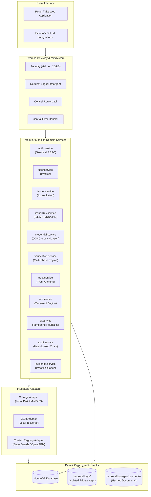
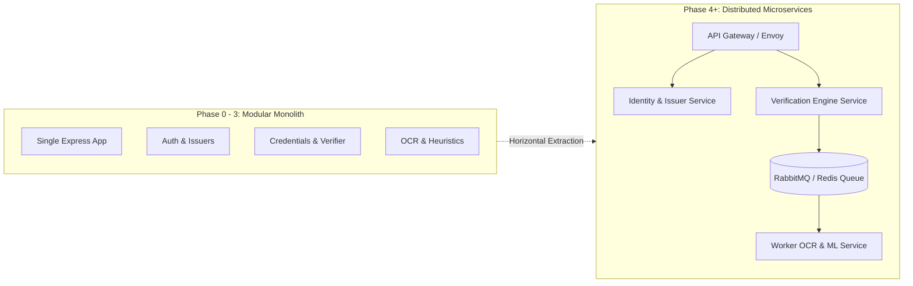

# System Architecture

## 1. Executive Summary

SecureWork Verify is architected as a **Modular Monolith** designed for high-performance cryptographic workforce credential verification. The system combines the operational simplicity and fast local developer iteration of a single-process application with the strict domain decoupling and clean interface contracts needed to decompose into microservices as volume dictates.

---

## 2. High-Level Architecture Diagram

---

## 3. Modular Monolith Design Principles

1. **Single Runtime Process**: All domain services execute in a single Node.js runtime, minimizing network latency, deployment overhead, and complex service-mesh configurations during initial adoption.
2. **Strict Domain Isolation**: Business modules cannot access internal state or execute ad-hoc database queries of other domains. Instead, modules call well-typed service contracts (e.g. `verification.service` queries `issuerKey.service` for public keys).
3. **No Direct Inter-Module Database Coupling**: In Phase 1 and beyond, models are owned by their respective domains. Cross-domain joins are avoided in favor of identifier references.
4. **Adapter Pattern for Infrastructure**: All disk I/O, external network calls, and OCR invocations occur through swappable adapter interfaces, insulating domain business rules from external technology changes.

---

## 4. Microservices Extraction Path

When transaction volume or compliance boundaries demand distributed deployment, modules can be extracted into standalone microservices:

Extraction Steps:
1. Replace in-process service calls with gRPC or internal REST clients using identical method signatures.
2. Direct asynchronous processing (e.g. OCR image analysis) into message queues without modifying core verification logic.
3. Decouple MongoDB collections into dedicated tenant databases.

---

## 5. Zero-Cost & Local Execution Guarantee

SecureWork Verify is engineered to run locally with zero paid infrastructure:
* **Native Cryptography**: Leverages Node.js `crypto` (Ed25519, ECDSA, RSA-4096, SHA-256) instead of proprietary HSM cloud services.
* **Local Storage**: Uses hierarchical local directory storage with strict access permissions.
* **Open Source OCR**: Relies on open-source Tesseract rather than commercial computer vision APIs.
* **No Blockchain**: Removes cryptocurrency fees, network latency, and volatile gas costs in favor of fast cryptographic signatures and hash-linked audit chains.
