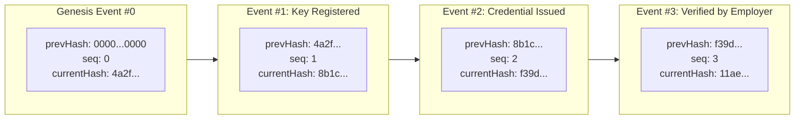

# Audit Trail & Historical Evidence Preservation Specification

## 1. Core Principles

1. **Strict Append-Only Immutability**:
   * No `UPDATE` or `DELETE` operations are ever executed on the `AuditLogs` collection.
   * Database permissions for standard application workers should restrict write operations to `INSERT` only.
2. **Cryptographic Hash-Linked Chain**:
   * Every audit log entry incorporates the SHA-256 hash of its immediate predecessor.
   * Tampering with, inserting, or deleting any historical log immediately invalidates the hash chain.

---

## 2. Cryptographic Hash Chain Mechanics

### Formula
$$\text{EntryHash}_n = \text{SHA256}\Big(\text{EntryHash}_{n-1} \parallel \text{Seq}_n \parallel \text{Timestamp}_n \parallel \text{ActorId}_n \parallel \text{Action}_n \parallel \text{JCS}(\text{Payload}_n)\Big)$$

---

## 3. Compliance and Audit Export

* **Verification Utility**: The platform provides `auditService.verifyAuditChainIntegrity()`, which traverses the sequence from genesis to head and verifies all cryptographic linkages.
* **SOC 2 & ISO 27001 Readiness**: Provides non-repudiable proof of all credential lifecycle events, key rotations, and supervisor overrides.
* **Portable Export**: Complete audit trails can be exported as signed JSON-LD / JCS packages for external legal discovery.
