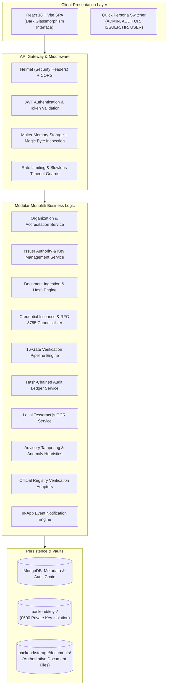

# SecureWork Verify — Comprehensive System & Feature Specification

## 1. Executive Summary & Core Philosophy

**SecureWork Verify** is an enterprise-grade workforce qualification and credential verification platform designed around an **Evidence-First Architecture**.

### The Fundamental Problem
Traditional credential verification systems suffer from critical design flaws:
1. **Unbacked Trust Scores**: Many modern platforms use black-box machine learning to return percentage scores (e.g. *"94% confidence this certificate is genuine"*), which offers zero legal accountability or cryptographic backing.
2. **Insecure Storage & Forgery**: PDF documents and scanned images are easily manipulated using basic graphic editing tools without leaving detectable visual traces.
3. **Inefficient Blockchain Approaches**: Early Web3 solutions forced every qualification onto public blockchains, resulting in high transaction fees, sluggish confirmation latency, and severe privacy violations (failing GDPR Article 17 "Right to be Forgotten").

### The SecureWork Verify Solution
SecureWork Verify replaces probabilistic guesswork and cumbersome blockchains with **deterministic, mathematically verifiable public-key cryptography**:
- **Authoritative Cryptographic Fingerprints**: Every ingested document is bound to an immutable **SHA-256** cryptographic hash.
- **RFC 8785 Canonicalization & Ed25519 Signatures**: Issuers sign a deterministically serialized JSON structure using **Ed25519** asymmetric cryptography.
- **Non-Repudiation**: Any employer, background screener, or third party can independently verify a credential offline in milliseconds using only the public key.
- **Append-Only Cryptographic Audit Log**: Every administrative, issuance, or verification event is sealed in a **hash-chained ledger** where each entry contains the SHA-256 hash of its predecessor.
- **Zero Paid Dependencies**: The entire platform runs completely on zero-cost, open-source technology (native Node.js `crypto`, MongoDB, local storage adapters, and local Tesseract OCR).

---

## 2. Platform Architecture & Invariant Principles

### Key Architectural Invariants
1. **Zero Private Key Leakage**: Private keys are strictly generated on the server and written directly to the file system with POSIX `0600` permissions. They are **never** stored in MongoDB, never included in logs, and never returned in any API response.
2. **AI/OCR Non-Override Rule**: AI tampering analysis and OCR text extractions are strictly **advisory**. If a document's cryptographic hash or digital signature fails, the document is rejected as `ALTERED` or `SIGNATURE_INVALID`. AI confidence scores **cannot** overturn a cryptographic failure.
3. **Deterministic RFC 8785 Canonicalization**: Before signing or verifying JSON payloads, data is serialized according to RFC 8785 (JSON Canonicalization Scheme - JCS) to guarantee byte-level consistency regardless of key order or whitespace formatting.

---

## 3. Detailed Breakdown of All 15 Core Features

---

### Feature 1: Document Ingestion & Cryptographic Fingerprinting
- **Purpose**: Reliably ingest workforce documents and generate an authoritative cryptographic baseline before any credential can be issued or verified.
- **Supported Formats**: PDF (`application/pdf`), PNG (`image/png`), JPG/JPEG (`image/jpeg`).
- **File Size Ceiling**: 10 MB maximum.
- **Magic Bytes Validation**: Rejects file extension spoofing (e.g. an `.exe` renamed to `.pdf`) by inspecting the first file header bytes (`%PDF` for PDFs, `\x89PNG` for PNGs, `\xFF\xD8\xFF` for JPEGs).
- **Authoritative SHA-256 Digest**: Computes a 64-character hexadecimal SHA-256 digest over the raw binary bytes.
- **Representation Tagging**: Categorizes documents into:
  - `ORIGINAL_DIGITAL_FILE`: True source vector PDF or digital master.
  - `SCAN`: Flatbed scanner output.
  - `SCREENSHOT`: Camera capture or screen capture.
- **Local Storage Adapter**: Writes the binary file into `backend/storage/documents/<hash>.<ext>` using content-addressable storage principles.

---

### Feature 2: Organization Accreditation & Trust Registry
- **Purpose**: Establish institutional root-of-trust by vetting the universities, enterprise employers, and licensing boards authorized to sponsor credential issuers.
- **Lifecycle States**:
  - `PENDING`: Newly created organization awaiting administrative review.
  - `VERIFIED`: Approved by an administrator with validated accreditation evidence.
  - `SUSPENDED`: Temporarily halted; prevents new issuances.
  - `REVOKED`: Discredited organization; immediately cascades revocation across all sponsored issuers.
- **Supported Organization Types**:
  - `UNIVERSITY` / Academic Institutions
  - `ENTERPRISE` / Corporate Employers
  - `GOVERNMENT_AGENCY` / State Departments
  - `HEALTHCARE` / Medical Boards
  - `ACCREDITATION_BOARD` / Independent Auditing Entities
- **Domain Binding**: Enforces official domain matching (e.g. `camford.ac.uk` or `stanford.edu`).

---

### Feature 3: Issuer Onboarding & Authorization Scoping
- **Purpose**: Authorize specific human agents (e.g. University Deans, HR Directors, State Licensing Officers) to issue digitally signed qualifications.
- **Self-Service Prevention**: Administrative accounts and approved issuer roles cannot be created via public user registration. Candidates register as standard `USER` accounts and submit a formal Issuer Request bound to an accredited organization.
- **Admin Review Pipeline**:
  - Administrator reviews appointment resolutions, official contact records, and job title credentials.
  - Upon approval, the system transitions the issuer profile to `ACTIVE` and elevates the user's RBAC role from `USER` to `ISSUER`.
- **Automatic Key Generation Hook**: Approving an issuer automatically triggers the generation of an Ed25519 cryptographic keypair dedicated to that issuer.

---

### Feature 4: PKI & Ed25519 Asymmetric Key Management
- **Purpose**: Maintain high-performance public-key infrastructure for signing credentials.
- **Algorithm**: **Ed25519** (Edwards-curve Digital Signature Algorithm), offering 128-bit security level with microsecond signing speeds and tiny 64-byte signatures.
- **Key Storage Separation**:
  - **Public Key**: Exported as SPKI PEM format and stored in the database (`IssuerKeys` collection) for public verification.
  - **Private Key**: Exported as PKCS#8 PEM format and written strictly to `backend/keys/<keyId>.key`. Never touches MongoDB.
- **Key Lifecycle Management**:
  - `ACTIVE`: Currently authorized to sign new credentials.
  - `RETIRED`: Gracefully rotated; can no longer sign new credentials, but remains valid for verifying historical credentials issued prior to retirement.
  - `REVOKED`: Key permanently invalidated due to administrative de-authorization.
  - `COMPROMISED`: Key compromised by adversary. Requires a mandatory `compromisedAt` timestamp. All credentials signed after this timestamp are classified as `KEY_COMPROMISED`.

---

### Feature 5: Cryptographic Credential Issuance
- **Purpose**: Bind an individual professional (recipient) to an ingested document artifact through an unforgeable digital signature.
- **9-Field RFC 8785 Canonical Payload**:
  Before signing, the following schema is canonicalized using deterministic JCS:
  1. `credentialId`: Unique platform ID (`crd_...`).
  2. `issuerId`: Accredited issuer ID (`iss_...`).
  3. `recipientId`: Subject worker user ID (`usr_...`).
  4. `credentialType`: Enum (`DEGREE`, `LICENSE`, `CERTIFICATION`, `EMPLOYMENT`, etc.).
  5. `title`: Name of qualification (e.g., *Bachelor of Science in Cybersecurity*).
  6. `documentHash`: Authoritative SHA-256 of the bound original document file.
  7. `issuedAt`: ISO-8601 issuance timestamp.
  8. `expiresAt`: Expiration timestamp (or `null` for perpetual credentials).
  9. `versionNumber`: Revision number (starts at 1).
- **Digital Signature**: The canonical string is signed with the issuer's active private key. The resulting base64 signature is stored in the database.

---

### Feature 6: Immutable Versioning & Credential Timeline
- **Purpose**: Manage qualifications that evolve over time (e.g., license renewals, title promotions) without losing historical audit trails.
- **Immutable Revision Nodes**: Editing or updating an issued credential creates a new `CredentialVersion` entry (`v2`, `v3`, etc.).
- **Lineage Preservation**: The previous version is marked as `SUPERSEDED`. Verifiers can trace the complete historical timeline from initial award to the current active revision.

---

### Feature 7: The 16-Gate Verification Engine
- **Purpose**: Provide rigorous, multi-dimensional verification by evaluating 16 discrete checks rather than producing opaque percentage scores.
- **The 16 Automated Gates**:
  1. `credentialExistence`: Verifies credential record exists in database.
  2. `versionExistence`: Validates specified version number or resolves latest version.
  3. `organizationTrust`: Confirms issuing organization is `VERIFIED` and `ACTIVE`.
  4. `issuerAuthorization`: Confirms issuer profile is `ACTIVE` and bound to organization.
  5. `issuerKeyStatus`: Assesses public key state and ensures issuance predates any compromise window.
  6. `documentIntegrity`: Compares SHA-256 of submitted file against original registered hash.
  7. `digitalSignature`: Rebuilds RFC 8785 canonical JSON and validates Ed25519 signature mathematically against the public key.
  8. `recipientBinding`: Confirms credential is bound to the claimed professional ID.
  9. `credentialStatus`: Validates credential is not superseded or suspended.
  10. `expiration`: Checks temporal validity against current timestamp.
  11. `revocation`: Asserts credential does not exist in revocation registry.
  12. `sourceEvidence`: Queries external official source registry for corroboration.
  13. `ocrEvidence`: Cross-references OCR extracted text against canonical metadata claims.
  14. `aiEvidence`: Scans for document tampering heuristics and visual anomalies.
  15. `humanEvidence`: Evaluates manual inspection decision if reviewed by a supervisor.
  16. `conflicts`: Detects contradictions across sources (e.g. valid signature but conflicting OCR degree title).

---

### Feature 8: The 6 Standardized Verification Trust Levels

| Trust Level | Code | Meaning & System Decision |
|:---:|---|---|
| **Level 5** | **`CURRENTLY_VALID`** | **Full Verification Pass**: Active accredited issuer, valid key, valid Ed25519 signature, byte-exact SHA-256 match, unexpired, unrevoked, confirmed recipient identity. |
| **Level 4** | **`SIGNATURE_VERIFIED`** | **Historically Authentic**: Signature and document are genuine, but the qualification has expired (`CREDENTIAL_EXPIRED`), was superseded (`CREDENTIAL_SUPERSEDED`), or was revoked (`CREDENTIAL_REVOKED`). |
| **Level 3** | **`INTEGRITY_VERIFIED`** | **Discrepancy / Integrity Flag**: Document bytes match, but recipient identity does not match (`IDENTITY_MISMATCH`), signing key was flagged compromised (`KEY_COMPROMISED`), conflicting evidence was detected, or document is pending manual review. |
| **Level 2** | **`SOURCE_VERIFIED`** | **Document Integrity Failure**: Issuer exists, but document bytes were altered (`ALTERED`), a camera scan does not match the byte-exact original (`NOT_EXACT_FILE_MATCH`), or the digital signature failed. |
| **Level 1** | **`SOURCE_FOUND`** | **Untrusted Origin**: Organization exists in directory, but the issuer was never accredited or is unverified (`UNTRUSTED_ORIGIN`). |
| **Level 0** | **`UNKNOWN`** | **Record Not Found**: Credential ID or document hash does not exist in the registry (`NOT_FOUND`). |

---

### Feature 9: Real-Time Tamper & Fraud Detection
- **Purpose**: Immediately catch fraudulent modifications to credentials.
- **Single-Character Sensitivity**: Because SHA-256 exhibits the avalanche effect, modifying a single letter (e.g. changing *"Jane Doe"* to *"Lane Doe"*) or altering a GPA completely transforms the hash.
- **Immediate Rejection**: The verification engine flags the document as `ALTERED`, outputs the mismatched hashes, and records a security event in the audit log.

---

### Feature 10: Revocation Registry Management
- **Purpose**: Invalidate credentials when a qualification is suspended or revoked (e.g. medical license revoked for malpractice, or degree rescinded for academic misconduct).
- **Structured Revocation Reasons**:
  - `DISCIPLINARY_ACTION`
  - `ISSUED_IN_ERROR`
  - `QUALIFICATION_RESCHEDULED`
  - `ADMINISTRATIVE_CANCELLATION`
- **Audit Logging**: Every revocation records the revoking actor ID, exact timestamp, and mandatory explanation note into the cryptographic hash chain.

---

### Feature 11: Embedded Local OCR Engine (Tesseract.js)
- **Purpose**: Extract text and structured metadata from scanned certificates and document images entirely offline.
- **Engine**: Tesseract.js running locally inside the Node.js runtime using local language data files (`eng.traineddata`).
- **Zero Cloud Leakage**: Document binaries are never transmitted to external cloud computer vision APIs.
- **Heuristic Token Parsing**: Automatically extracts:
  - Recipient Name
  - Institution Name
  - Degree / Certification Title
  - Date of Conformance / Expiration
- **Confidence Scoring**: Computes per-word and aggregate confidence scores (0.0 to 1.0) and bounding box telemetry.

---

### Feature 12: Local AI/ML Document Tampering Heuristics
- **Purpose**: Inspect document images for signs of visual tampering, metadata discrepancies, and font splicing.
- **Inspection Metrics**:
  - **Font Inconsistency Analysis**: Detects mismatched typography or varying resolution blocks indicative of spliced text.
  - **Edge Artifact Detection**: Scans bounding areas for JPEG compression anomalies around names and dates.
  - **Metadata Discrepancy Checks**: Compares document creation dates against internal file metadata.
- **Advisory Isolation**: AI output is logged as an advisory anomaly report. It alerts the human verifier but **cannot** overrule mathematical cryptographic verification.

---

### Feature 13: Official Source Verification Adapters
- **Purpose**: Cross-reference qualifications against external authoritative state registries, licensing boards, or enterprise directories.
- **Adapter Interface Pattern**: Decoupled driver architecture allowing swappable registry connectors:
  - `LocalSourceVerificationAdapter`: Built-in local mock registry for zero-cost, offline testing and demonstration.
  - `ExternalRegistryAdapter`: Real-time HTTP connector for official state and national databases.
- **Proof Differentiation**:
  - `SOURCE_VERIFIED`: Registry returned a cryptographically signed confirmation response.
  - `SOURCE_FOUND`: Registry confirmed the record exists in a relational database, but without cryptographic proof.

---

### Feature 14: Cryptographically Hash-Chained Audit Ledger
- **Purpose**: Guarantee complete non-repudiation and detect any unauthorized modifications to database records.
- **Hash Chain Mechanics**:
  Every audit event entry calculates its `currentHash` by hashing its contents concatenated with the `currentHash` of the preceding record:
  $$\text{CurrentHash}_n = \text{SHA256}\Big(\text{PreviousHash}_{n-1} \parallel \text{Seq}_n \parallel \text{Timestamp}_n \parallel \text{ActorId}_n \parallel \text{Action}_n \parallel \text{JCS}(\text{Metadata}_n)\Big)$$
- **Genesis Block**: Sequence #0 links to `SHA256("GENESIS_SECUREWORK_VERIFY")`.
- **Integrity Validation Tool**:
  - The UI and API provide an automated chain validation endpoint (`GET /api/audit-logs/validate`).
  - Iterates through the entire collection from genesis to head.
  - If a database administrator directly modifies, deletes, or reorders an entry, the validator flags **`TAMPERING DETECTED`** and reports the exact sequence number that failed.

---

### Feature 15: Role-Based Access Control (RBAC) & Notifications
- **5 Granular Roles**:
  - `ADMIN`: Platform configuration, organization approvals, issuer onboarding, audit chain validation.
  - `ISSUER`: Public key registration, credential issuance, version creation, revocation management.
  - `HR`: Verification evaluation, document inspection, manual review submissions.
  - `AUDITOR`: Full read access to audit logs, compliance reports, and cryptographic validation tools.
  - `USER`: Document holder/candidate; views and presents owned credentials.
- **Real-Time Notification Drawer**: In-app event system alerting users to approvals, credential issuances, status revocations, and verification results.

---

## 4. End-to-End User Workflows (How It Works in Practice)

### Workflow A: The Issuance Journey (University / Employer)
1. **Accreditation**: System Administrator verifies *Camford University* and approves *Dr. Bell* as Dean of Engineering.
2. **Key Generation**: Platform automatically creates an Ed25519 keypair for Dr. Bell; public key is registered, private key is locked to disk.
3. **Ingestion**: Dean uploads the student's graduation diploma PDF. The server calculates SHA-256 hash `82024f...`.
4. **Signing**: Dean submits the issuance form. System builds the RFC 8785 canonical JSON, signs it with the private key, and stores Credential `crd_...`.
5. **Audit**: An immutable audit log entry is chained onto the audit ledger.

---

### Workflow B: The Verification Journey (HR Manager / Screener)
1. **Submission**: Job candidate provides their Credential ID or uploads their original diploma PDF.
2. **Pipeline Execution**: The HR manager submits the file on the **Verify Document** page.
3. **Evaluation**:
   - The engine checks organization accreditation and issuer key validity.
   - Computes the file hash and verifies the Ed25519 digital signature.
   - Checks the revocation registry and expiration dates.
4. **Decision**: The system returns **Level 5 `CURRENTLY_VALID`** with a green evidence badge and full telemetry.

---

### Workflow C: Fraud Attempt (Candidate Forges Document)
1. **Tampering**: A candidate opens their diploma PDF in an editor and alters their grade or degree title.
2. **Submission**: The candidate submits the modified PDF for verification.
3. **Detection**:
   - The engine calculates the SHA-256 hash of the modified file.
   - The hash does not match the original hash signed by the university.
4. **Decision**: The system immediately flags **`ALTERED` (Level 2 `SOURCE_VERIFIED`)**, preventing credential fraud.

---

### Workflow D: Compliance Audit (Auditor Inspection)
1. **Audit Inspection**: Auditor navigates to **Audit Logs** to view chronological lifecycle events.
2. **Chain Validation**: Auditor navigates to **Audit Chain Validation** and clicks **Validate Entire Hash Chain**.
3. **Cryptographic Proof**: The engine re-computes all SHA-256 hashes across all sequence entries. If clean, it confirms cryptographic chain integrity.

---

## 5. Technology Stack Specification

| Component | Technology | Rationale & Architectural Purpose |
|:---|:---|:---|
| **Frontend Framework** | React 18, Vite | High-performance single-page app with fast hot module replacement and clean component architecture. |
| **Styling & Design** | Pure Vanilla CSS | Custom design system using dark glassmorphism, responsive grid layouts, and custom tokens without heavy utility frameworks. |
| **Icons & UI Assets** | Lucide React | Clean, lightweight SVG iconography across dashboards and verification badges. |
| **Backend Framework** | Node.js (v18+) & Express.js | Modular monolith architecture featuring strict service encapsulation, route controllers, and clean error handling. |
| **Persistence Engine** | MongoDB Community Server & Mongoose | Flexible JSON document store with compound indexes, unique constraints, and schema validations. |
| **Cryptographic Engine** | Native Node.js `crypto` | Native C++ bindings for Ed25519 keypair generation, digital signing, and SHA-256 hashing. |
| **JSON Canonicalization** | Custom RFC 8785 (JCS) Utility | Deterministic recursive JSON serialization ensuring consistent hashing across disparate environments. |
| **OCR Processing** | Tesseract.js | In-process WebAssembly/C++ OCR engine running locally without external cloud dependencies. |
| **Security & Headers** | Helmet, Bcrypt.js, JsonWebToken | Defense-in-depth security: HTTP response headers, salted password hashing, and stateless JWT tokens. |
| **Multipart File Upload** | Multer | Memory-backed file upload buffer enabling instant in-memory magic-byte inspection before disk persistence. |
