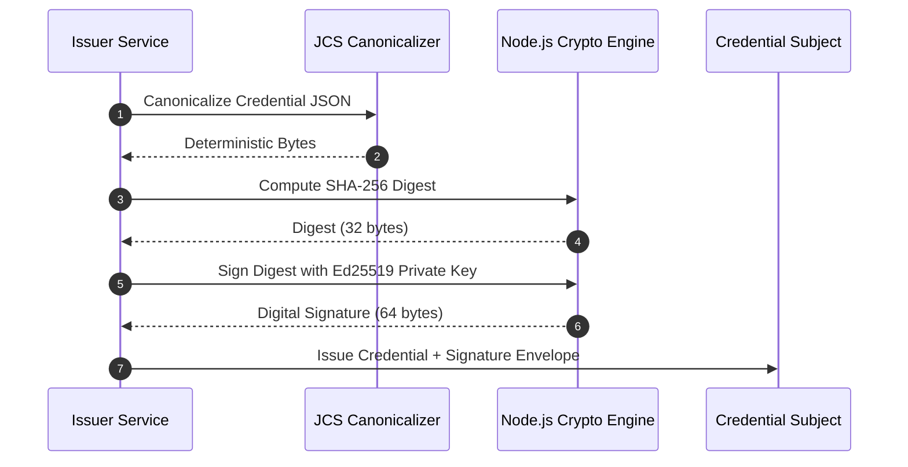

# Cryptography Specification & Mathematical Foundations

## 1. Supported Cryptographic Algorithms

### Asymmetric Digital Signatures
* **Ed25519 (Primary)**:
  * Edwards-curve Digital Signature Algorithm over Curve25519.
  * Benefits: Immune to side-channel timing attacks, extremely compact signatures (64 bytes), ultra-fast signature generation and verification.
* **ECDSA P-256 (Secondary)**:
  * Standard NIST curve for legacy enterprise environments.
* **RSA-4096 (Secondary)**:
  * PSS padding with SHA-256 for institutional and government PKI compatibility.

---

## 2. Deterministic Canonicalization (RFC 8785 - JCS)

Because JSON does not guarantee key ordering or whitespace consistency across runtimes, hashing a raw JSON string leads to false verification failures. 

**Rule**: Before computing a hash or signing a payload, the JSON object must be serialized using **RFC 8785 (JSON Canonicalization Scheme)**:
1. Object keys are lexicographically sorted by UTF-16 code units.
2. No unnecessary whitespace between tokens.
3. Strings use standard unicode escapes.
4. Floating-point numbers follow IEEE 754 canonical formatting.

---

## 3. Cryptographic Signature Pipeline

---

## 4. Hash Chaining for Append-Only Audit Logs

Each audit event record computes an immutable link:
$$\text{CurrentHash} = \text{SHA256}(\text{PrevHash} \parallel \text{SequenceNumber} \parallel \text{Timestamp} \parallel \text{JCS}(\text{Payload}))$$

* **Tamper-Evident**: Altering any historical log record breaks the cryptographic chain for all subsequent entries.
* **Auditor Verification**: External auditors can replay and mathematically verify the chain offline in $O(N)$ time.
