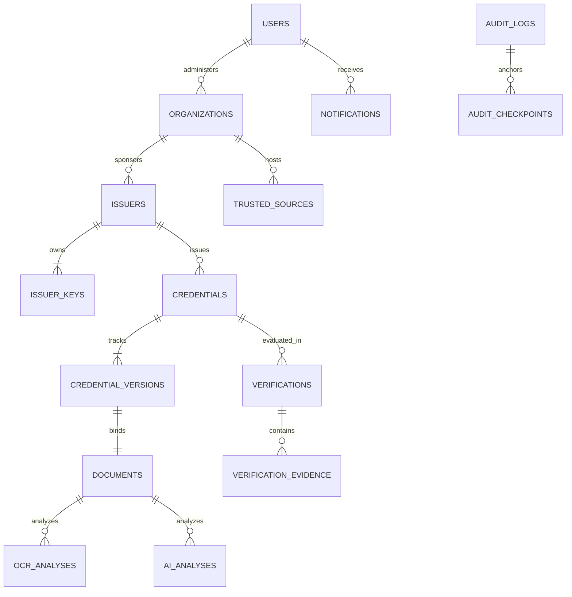

# Database Architecture & Schema Specification

## 1. Overview

SecureWork Verify uses **MongoDB** via **Mongoose** as its persistence engine. The schema enforces strict domain boundaries, index coverage for fast retrieval, and mathematical invariants for append-only audit tracking.

---

## 2. Core Collections & Entity Relationships

---

## 3. Schema Definitions

### 3.1 `Users` (`users`)
- `userId`: String (`usr_...`, unique, indexed)
- `name`: String
- `email`: String (lowercase, unique, indexed)
- `passwordHash`: String (bcrypt, salt rounds = 10)
- `role`: Enum (`ADMIN`, `ISSUER`, `AUDITOR`, `USER`)
- `status`: Enum (`ACTIVE`, `SUSPENDED`)
- `createdAt`, `updatedAt`: ISO-8601 Timestamps

### 3.2 `Organizations` (`organizations`)
- `organizationId`: String (`org_...`, unique, indexed)
- `name`: String
- `organizationCode`: String (unique, uppercase)
- `officialDomain`: String (lowercase, indexed)
- `type`: Enum (`UNIVERSITY`, `ENTERPRISE`, `GOVERNMENT_AGENCY`, `HEALTHCARE`, `ACCREDITATION_BOARD`, `OTHER`)
- `organizationVerificationStatus`: Enum (`PENDING`, `VERIFIED`, `SUSPENDED`, `REVOKED`)
- `status`: Enum (`ACTIVE`, `SUSPENDED`, `REVOKED`)
- `verificationEvidence`: Object (accreditation board, certificate, inspection details)
- `verifiedBy`: String (`userId` ref)
- `verifiedAt`: Date

### 3.3 `Issuers` (`issuers`)
- `issuerId`: String (`iss_...`, unique, indexed)
- `userId`: String (`usr_...`, unique, indexed — 1 issuer profile per user)
- `organizationId`: String (`org_...`, indexed)
- `issuerCode`: String (unique, uppercase)
- `status`: Enum (`PENDING`, `ACTIVE`, `SUSPENDED`, `REVOKED`)
- `authorizationEvidence`: Object (job title, appointment gazette, contact)
- `approvedBy`: String (`userId` ref)
- `approvedAt`: Date

### 3.4 `IssuerKeys` (`issuerkeys`)
- `keyId`: String (`key_...`, unique, indexed)
- `issuerId`: String (`iss_...`, indexed)
- `algorithm`: String (`ED25519`)
- `publicKey`: String (PEM encoded)
- `status`: Enum (`ACTIVE`, `RETIRED`, `REVOKED`, `COMPROMISED`)
- `activatedAt`: Date
- `retiredAt`: Date
- `revokedAt`: Date
- `compromisedAt`: Date
- **Invariant**: `privateKey` is NEVER stored in MongoDB; saved strictly to disk in `backend/keys/<keyId>.key` (`0600`).

### 3.5 `Documents` (`documents`)
- `documentId`: String (`doc_...`, unique, indexed)
- `originalFilename`: String
- `mimeType`: String (`application/pdf`, `image/png`, `image/jpeg`)
- `fileSize`: Number (bytes, max 10MB)
- `storagePath`: String
- `sha256Hash`: String (64-char hex digest, indexed)
- `hashAlgorithm`: String (`SHA-256`)
- `representationType`: Enum (`ORIGINAL_DIGITAL_FILE`, `SCAN`, `SCREENSHOT`)
- `uploadedBy`: String (`userId` ref)

### 3.6 `Credentials` (`credentials`)
- `credentialId`: String (`crd_...`, unique, indexed)
- `issuerId`: String (`iss_...`, indexed)
- `recipientId`: String (`usr_...`, indexed)
- `currentVersionNumber`: Number (starts at 1)
- `status`: Enum (`ACTIVE`, `REVOKED`, `EXPIRED`)
- `credentialType`: Enum (`DEGREE`, `LICENSE`, `CERTIFICATION`, `EMPLOYMENT`, `MEMBERSHIP`, `OTHER`)
- `title`: String
- `expiresAt`: Date (optional; null denotes perpetual validity)
- `revokedAt`: Date
- `revocationReason`: String

### 3.7 `CredentialVersions` (`credentialversions`)
- `versionId`: String (`ver_...`, unique, indexed)
- `credentialId`: String (`crd_...`, indexed)
- `versionNumber`: Number
- `documentId`: String (`doc_...`)
- `documentHash`: String (SHA-256)
- `issuerKeyId`: String (`key_...`)
- `signedPayload`: Object (9 sorted canonical fields)
- `signature`: String (Ed25519 Base64)
- `status`: Enum (`ACTIVE`, `SUPERSEDED`, `REVOKED`)
- `issuedAt`: Date

### 3.8 `Verifications` (`verifications`)
- `verificationId`: String (`vrf_...`, unique, indexed)
- `credentialId`: String (`crd_...`, indexed)
- `verifierUserId`: String
- `result`: Enum (`VERIFIED`, `NOT_FOUND`, `ALTERED`, `SIGNATURE_INVALID`, `CREDENTIAL_REVOKED`, `CREDENTIAL_EXPIRED`, `CREDENTIAL_SUPERSEDED`, `KEY_COMPROMISED`, `IDENTITY_MISMATCH`, `NOT_EXACT_FILE_MATCH`, `UNTRUSTED_ORIGIN`, `ISSUER_REVOKED`, `ISSUER_SUSPENDED`, `ISSUER_INACTIVE`, `CONFLICTING_EVIDENCE`, `MANUAL_REVIEW`, `MANUALLY_VERIFIED`)
- `trustLevel`: Enum (`LEVEL 0 UNKNOWN`, `LEVEL 1 SOURCE_FOUND`, `LEVEL 2 SOURCE_VERIFIED`, `LEVEL 3 INTEGRITY_VERIFIED`, `LEVEL 4 SIGNATURE_VERIFIED`, `LEVEL 5 CURRENTLY_VALID`)
- `checks`: Object (16 discrete gate checks)
- `warnings`: Array of Strings
- `explanation`: String

### 3.9 `VerificationEvidence` (`verificationevidences`)
- `evidenceId`: String (`evi_...`, unique, indexed)
- `verificationId`: String (`vrf_...`, indexed)
- `evidenceType`: Enum (`DIGITAL_SIGNATURE`, `HASH_MATCH`, `ISSUER_STATUS`, `CREDENTIAL_STATUS`, `DOMAIN_VERIFICATION`, `IDENTITY_EVIDENCE`, `AI_ANALYSIS`, `OCR_EXTRACTION`, `REGISTRY_CONFIRMATION`, `MANUAL_REVIEW`)
- `evidenceStatus`: Enum (`CONFIRMED`, `CONTRADICTED`, `INCONCLUSIVE`)
- `sourceResponseSummary`: Object

### 3.10 `TrustedSources` (`trustedsources`)
- `sourceCode`: String (unique, uppercase, indexed)
- `organizationId`: String (`org_...`, indexed)
- `name`: String
- `sourceType`: Enum (`OFFICIAL_WEBSITE`, `VERIFICATION_PORTAL`, `API`, `DOCUMENT_REPOSITORY`)
- `baseUrl`: String
- `verificationEndpoint`: String
- `domain`: String (lowercase, indexed)
- `status`: Enum (`PENDING`, `ACTIVE`, `SUSPENDED`, `REVOKED`)
- `verificationStatus`: Enum (`PENDING`, `VERIFIED`, `FAILED`)

### 3.11 `OcrAnalyses` (`ocranalyses`)
- `analysisId`: String (`ana_...`, unique, indexed)
- `documentId`: String (`doc_...`, indexed)
- `status`: Enum (`PENDING`, `SUCCESS`, `UNAVAILABLE`, `FAILED`)
- `ocrText`: String
- `confidence`: Number (0.0 to 1.0)
- `extractedFields`: Object (parsed tokens)
- `engine`: String (`Tesseract.js (Local)`)

### 3.12 `AIAnalyses` (`aianalyses`)
- `analysisId`: String (`ai_...`, unique, indexed)
- `documentId`: String (`doc_...`, indexed)
- `status`: Enum (`SUCCESS`, `UNAVAILABLE`, `FAILED`)
- `riskLevel`: Enum (`LOW`, `MEDIUM`, `HIGH`)
- `riskScore`: Number (0.0 to 1.0)
- `findings`: Array of Strings
- `modelName`: String (`SecureWork Local Heuristic/Classifier`)

### 3.13 `AuditLogs` (`auditlogs` — Append-Only)
- `eventId`: String (`aud_...`, unique, indexed)
- `sequenceNumber`: Number (Monotonically increasing, unique, indexed)
- `timestamp`: Date
- `actorId`: String
- `actorRole`: String
- `action`: String (e.g. `CREDENTIAL_ISSUED`, `KEY_COMPROMISED`)
- `targetResource`: String
- `currentHash`: String (SHA-256 of entry content + prevHash, indexed)
- `previousHash`: String (SHA-256 of immediate predecessor, indexed)
- `metadata`: Object

### 3.14 `AuditCheckpoints` (`auditcheckpoints`)
- `checkpointId`: String (`chk_...`, unique, indexed)
- `sequenceNumber`: Number
- `checkpointHash`: String
- `recordCount`: Number
- `createdAt`: Date

### 3.15 `Notifications` (`notifications`)
- `notificationId`: String (`notif_...`, unique, indexed)
- `recipientUserId`: String (`usr_...`, indexed)
- `type`: String
- `severity`: Enum (`INFO`, `SUCCESS`, `WARNING`, `DANGER`)
- `title`: String
- `message`: String
- `isRead`: Boolean (indexed)
- `createdAt`: Date
