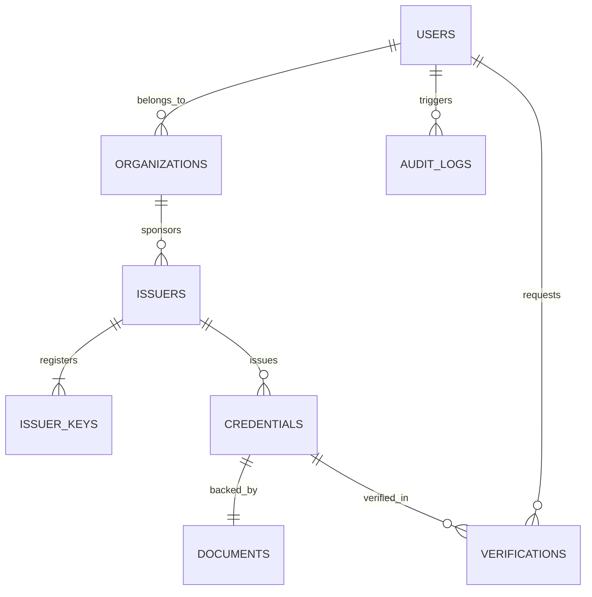

# Database Architecture & Schema Specification

## 1. Overview

SecureWork Verify uses **MongoDB** via **Mongoose** as its primary persistence engine for Phase 0–3. The database schema is designed with strict domain ownership to facilitate future extraction into individual database instances per microservice.

---

## 2. Core Collections & Entity Relationships

---

## 3. Schema Definitions

### 3.1 `Users`
- `_id`: ObjectId
- `email`: String (Unique, Indexed, Lowercase)
- `passwordHash`: String (bcrypt, salt rounds = 12)
- `role`: Enum (`ADMIN`, `ISSUER`, `VERIFIER`, `SUBJECT`)
- `status`: Enum (`ACTIVE`, `SUSPENDED`, `PENDING_ACTIVATION`)
- `profile`: Object (fullName, organizationId, contact)
- `createdAt`, `updatedAt`: ISO-8601 Timestamps

### 3.2 `Issuers` & `IssuerKeys`
- `_id`: ObjectId
- `legalName`: String
- `accreditationNumber`: String
- `trustTier`: Enum (`TIER_1`, `TIER_2`, `TIER_3`)
- `status`: Enum (`ACTIVE`, `SUSPENDED`, `REVOKED`)
- `keys`:
  - `keyId`: String (Unique URI/UUID)
  - `algorithm`: Enum (`ed25519`, `rsa-4096`, `ecdsa-p256`)
  - `publicKeyPem`: String
  - `fingerprint`: String (SHA-256)
  - `validFrom`, `validUntil`: Date
  - `isRevoked`: Boolean

### 3.3 `Credentials`
- `_id`: ObjectId
- `credentialId`: String (Unique UUID)
- `issuerId`: ObjectId (Ref: Issuers)
- `subjectId`: ObjectId (Ref: Users)
- `credentialType`: String (e.g., `EmploymentVerification`, `DegreeCertificate`)
- `claimData`: Canonical JSON Object
- `canonicalHash`: String (SHA-256)
- `signature`:
  - `algorithm`: String
  - `keyId`: String
  - `value`: String (Base64 / Hex)
- `status`: Enum (`VALID`, `REVOKED`, `EXPIRED`)
- `issuedAt`, `expiresAt`: Date

### 3.4 `AuditLogs` (Append-Only)
- `_id`: ObjectId
- `sequenceNumber`: Number (Monotonically increasing index)
- `actorId`: ObjectId (Ref: Users)
- `actorRole`: String
- `action`: String (e.g., `CREDENTIAL_ISSUED`, `KEY_REVOKED`)
- `targetResource`: String
- `payload`: Object
- `prevHash`: String (SHA-256 of previous record)
- `currentHash`: String (SHA-256 of canonical entry content + prevHash)
- `timestamp`: Date

---

## 4. Indexing Strategy

1. **Unique Lookups**:
   - `users.email` (Unique)
   - `credentials.credentialId` (Unique)
   - `issuers.accreditationNumber` (Unique)
2. **Compound Indexes**:
   - `issuer_keys: { issuerId: 1, keyId: 1, isRevoked: 1 }`
   - `verifications: { credentialId: 1, createdAt: -1 }`
3. **Audit Chain Monotonicity**:
   - `audit_logs: { sequenceNumber: 1 }` (Unique ascending index)
