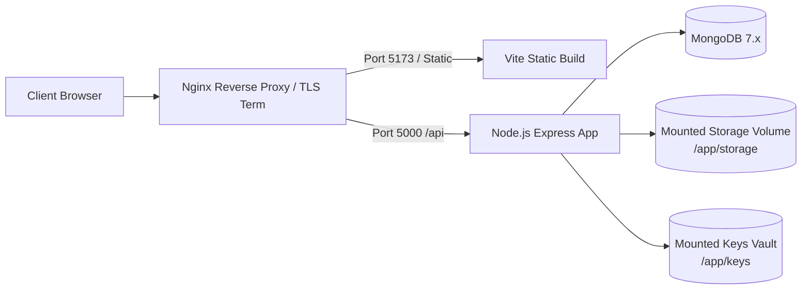

# Deployment & Operations Guide

## 1. Zero-Cost Local Development

SecureWork Verify is engineered to run completely free on a standard developer workstation:

```bash
# 1. Clone repository
git clone <repo-url> SecureWork-Verify
cd SecureWork-Verify

# 2. Install workspace dependencies
npm install

# 3. Configure environment
cp backend/.env.example backend/.env
cp frontend/.env.example frontend/.env

# 4. Start local development (concurrent backend + frontend)
npm run dev
```

* **Backend**: `http://localhost:5000`
* **Frontend**: `http://localhost:5173`
* **Health Probe**: `http://localhost:5000/api/health`

---

## 2. Docker & Container Deployment

### Production Container Model



### Key Management in Containers
* Private key directories (`backend/keys/`) must be mounted via secure read-only Docker volumes with permissions `0600` or populated via container secret managers (e.g. Docker Secrets, HashiCorp Vault).

---

## 3. Air-Gapped / Isolated Deployments

SecureWork Verify can run in classified or air-gapped environments:
* **No Outbound Internet Required**: Digital signature verification executes entirely offline using pre-loaded public key trust manifests.
* **Local OCR**: Tesseract data files (`tessdata/eng.traineddata`) are bundled locally within the container image.
* **Zero Telemetry**: The application transmits zero telemetry or usage metrics to external servers.
