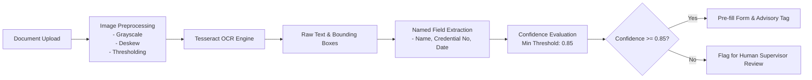

# Optical Character Recognition (OCR) Engine Specification

## 1. Scope & Core Architectural Rule

> [!IMPORTANT]
> **Advisory Only**: OCR extraction is strictly an assistive pipeline for human review and document pre-filling. OCR results never substitute for or override cryptographic digital signatures.

---

## 2. Technology Stack & Zero-Cost Principle

* **Open-Source Engine**: Tesseract (via `tesseract.js` or native Tesseract binary wrapper).
* **Zero External Cloud Costs**: No reliance on Google Cloud Vision, AWS Textract, or Azure Cognitive Services.
* **Local Image Preprocessing**: Pure in-process canvas/sharp transformations (grayscale, contrast stretching, Otsu thresholding, deskew).

---

## 3. OCR Pipeline Workflow



---

## 4. Confidence Thresholds & Telemetry

Each extracted field generates a structured telemetry object:
```json
{
  "field": "credentialNumber",
  "extractedValue": "RN-998241",
  "confidence": 0.94,
  "boundingBox": { "x0": 120, "y0": 340, "x1": 280, "y1": 365 },
  "pageNumber": 1
}
```

* **High Confidence (≥ 0.90)**: Eligible for expedited human review.
* **Medium Confidence (0.75 – 0.89)**: Highlighted with warning flags for supervisor double-check.
* **Low Confidence (< 0.75)**: Rejected for automated extraction; requires manual entry.
