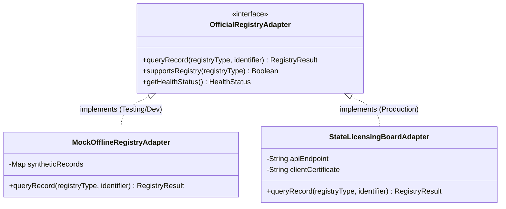

# Official Source Verification Specification

## 1. Objective & Architectural Standard

SecureWork Verify interfaces with authoritative external registries (e.g. State Nursing Boards, Bar Associations, Department of Education databases) to corroborate digital claims against government or institutional records.

> [!CAUTION]
> **Strict Rule on External Integrations**:
> * **No Fake or Half-Baked APIs**: Do not simulate real external APIs with ad-hoc mock endpoints disguised as production integrations.
> * **Adapter Interface Pattern**: External registry drivers must implement a formal interface with explicit error handling, retries, and synthetic testing datasets.

---

## 2. Registry Adapter Architecture

---

## 3. Data Flow & Fallback Strategy

1. **Registry Lookup**:
   * Request contains candidate identifier and license number.
   * Registry adapter sends signed query over mutual TLS (mTLS) to official endpoint.
2. **Offline / Outage Handling**:
   * If the authoritative source is unreachable, the verification status does **not** fail.
   * Instead, status becomes `PENDING_SOURCE_CONFIRMATION`, and cryptographic Tier 1 verification remains intact.
3. **Audit Preservation**:
   * Exact HTTP responses, registry timestamps, and raw JSON payloads are hashed and included in the audit trail.
