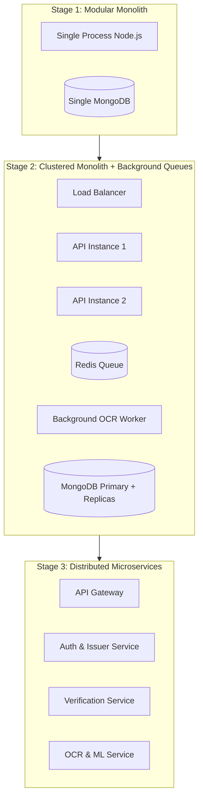

# Scalability & Performance Specification

## 1. Architectural Scaling Strategy

The modular monolith is structured to scale horizontally across three evolution stages:

---

## 2. Stateless Core Verification

* **Sub-5ms Latency**: Cryptographic verification of Ed25519 signatures requires zero database writes and zero external network calls.
* **Public Key In-Memory Caching**: Active issuer public keys are cached in memory with a short TTL (e.g. 5 minutes) and cache-invalidation hooks on key revocation.
* **No Server Sessions**: All API authentication uses stateless JWTs, enabling round-robin load balancing across unlimited Node.js instances without sticky sessions.

---

## 3. High-Throughput Asynchronous Workers

Heavy compute tasks are offloaded from the main event loop:
* **OCR & Heuristic Image Processing**: When documents are uploaded, the API server saves the binary, computes the SHA-256 hash immediately, returns an ingestion ID, and offloads image processing to an asynchronous worker queue.
* **Batch Verification**: Enterprise verifiers submitting thousands of employee records for annual audit utilize a bulk verification worker pool.
