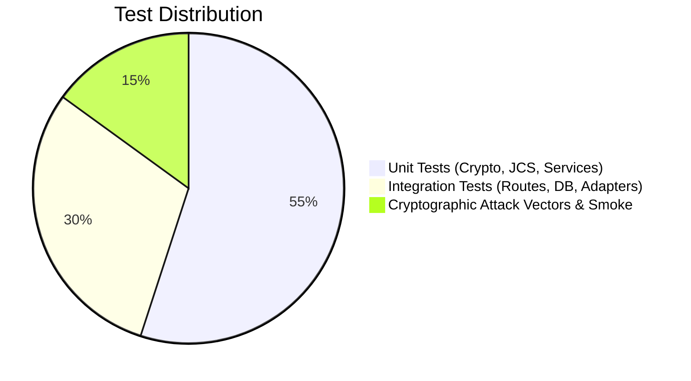

# Testing & Quality Assurance Strategy

## 1. Testing Pyramid

SecureWork Verify enforces a rigorous automated testing strategy:



---

## 2. Test Execution Commands

```bash
# Run backend smoke and unit tests using native Node.js test runner:
npm run test

# Run repo foundation and health verification script:
npm run verify

# Build frontend to assert React / Vite compilation integrity:
npm run build
```

---

## 3. Mandatory Cryptographic Test Vectors

Every release must satisfy standard cryptographic assertions:

1. **JCS RFC 8785 Compliance**:
   * Given JSON payloads with disparate key orderings, whitespace, and Unicode sequences, canonical outputs must yield byte-for-byte identical SHA-256 digests.
2. **Signature Tamper Resistance**:
   * Flipping a single bit anywhere in the canonical credential payload, public key, or signature must cause `verify()` to return `false`.
3. **Revocation Registry Invalidation**:
   * A mathematically valid signature on a credential whose ID appears in the active revocation list must be marked `REVOKED`.
4. **Time Window Expiration**:
   * A valid signature on a credential with an expired `validUntil` timestamp must be marked `EXPIRED`.
5. **Zero Private Key Leakage**:
   * Automated assertions must inspect serialized API outputs and assert that no private key material is present.
