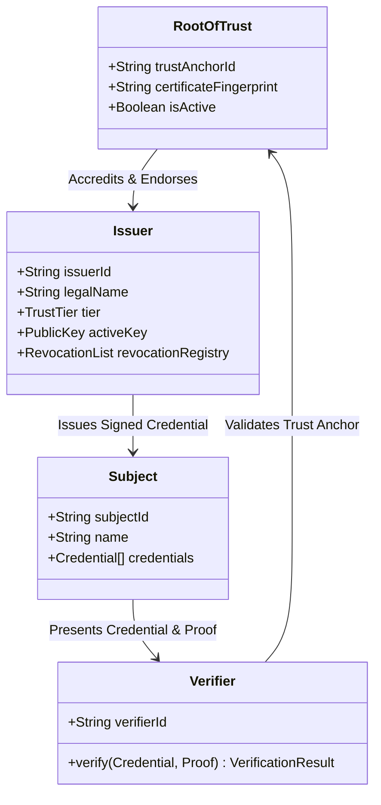

# Trust Model Specification

## 1. Core Trust Entities

### Roles & Responsibilities

1. **Root of Trust (Trust Registry)**:
   * Maintained platform-side or federated via decentralized trust anchor manifests.
   * Manages accredited issuer identities, accreditation statuses, and public key certificates.
2. **Credential Issuer**:
   * Authorized enterprise, educational institution, licensing board, or background check provider.
   * Holds an isolated private key; signs verifiable credentials bound to subjects.
3. **Credential Subject (Worker / Professional)**:
   * The individual who earned the degree, license, or employment history.
   * Owns and controls access to their digital credentials.
4. **Verifier (Employer / Auditor)**:
   * Third party verifying candidate qualifications.
   * Evaluates digital signatures, validity dates, revocation status, and trust anchors.

---

## 2. Cryptographic Trust Anchor vs. Blockchain

Traditional Web3 approaches require public blockchain transactions for every credential, introducing:
- Public privacy leakage (violates GDPR Article 17 "Right to be Forgotten").
- Unpredictable transaction gas costs.
- Latency (seconds to minutes for block finalization).

**SecureWork Verify Solution**:
* Trust is rooted in **Public-Key Cryptography (PKI)** and **Verifiable Hash Chains**.
* Issuers publish public keys via signed JSON-LD / JCS trust manifests.
* Offline verification takes under 5 milliseconds with mathematical certainty.

---

## 3. Trust Tiers and Verification Levels

| Tier | Level Name | Verification Requirements | Trust Score |
| :--- | :--- | :--- | :--- |
| **Tier 1** | **Cryptographically Signed** | Valid Ed25519 signature from accredited active issuer key, unrevoked, canonical schema match. | **95 - 100%** |
| **Tier 2** | **Official Registry Corroborated** | Tier 1 signature + cross-check with state/national licensing board or corporate directory. | **98 - 100%** |
| **Tier 3** | **Document OCR & Heuristic Verified** | High-confidence OCR extraction (≥0.85), AI tampering check passed, manual supervisor verification. | **80 - 90%** |
| **Tier 4** | **Unverified / Self-Claimed** | Claim submitted without cryptographic proof or with low-confidence OCR. | **0 - 49%** |

---

## 4. Revocation Model

Issuers publish a cryptographically signed **Revocation Registry**:
* Each entry contains the revoked credential ID, timestamp, and RFC 5280 revocation reason code (e.g. `keyCompromise`, `cessationOfOperation`, `licenseRevoked`).
* Verifiers query the local cached revocation registry or verify the signed status list during the verification pipeline.
