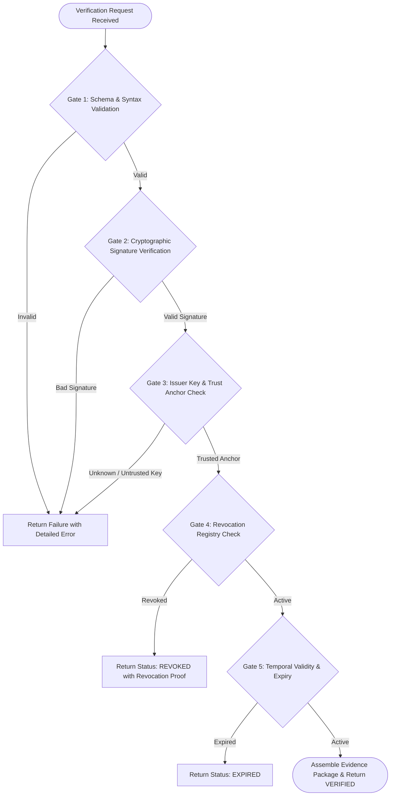

# Multi-Phase Verification Pipeline

## 1. Pipeline Overview

Verification in SecureWork Verify is deterministic, fail-fast, and executes through five distinct evaluation gates.



---

## 2. Verification Gates in Detail

### Gate 1: Schema & Syntax Validation
* Ensures payload adheres strictly to the credential schema.
* Verifies mandatory fields: `credentialId`, `issuerId`, `subjectId`, `issuedAt`, `claimData`, `signature`.

### Gate 2: Cryptographic Signature Verification
* Extracts the claim payload and passes it to the RFC 8785 canonicalizer.
* Computes the SHA-256 digest.
* Evaluates `crypto.verify(algorithm, digest, publicKey, signature)`.
* Result must be mathematically valid.

### Gate 3: Issuer Key & Trust Anchor Check
* Locates the active public key certificate for the specified `issuerId` and `keyId`.
* Verifies that the signing key was active and unrevoked at `issuedAt`.
* Assesses the issuer's accreditation status against the Trust Registry.

### Gate 4: Revocation Registry Check
* Checks the issuer's cryptographically signed Revocation Registry.
* If `credentialId` appears on the revocation list, the pipeline fails immediately with the recorded revocation reason.

### Gate 5: Temporal Validity & Expiry
* Assesses whether the credential has an `expiresAt` timestamp and whether `currentTimestamp < expiresAt`.
* Credentials past expiration are marked `EXPIRED`.

---

## 3. Verification Result Output

A successful verification yields an **Evidence Package**:
```json
{
  "status": "VERIFIED",
  "verificationId": "ver_9f8c12a4",
  "verifiedAt": "2026-08-30T10:15:30.000Z",
  "credentialId": "cred_a1b2c3d4",
  "issuer": {
    "id": "iss_7712",
    "name": "State Medical Licensing Board",
    "trustTier": "TIER_1"
  },
  "cryptographicProof": {
    "algorithm": "ed25519",
    "signatureValid": true,
    "keyFingerprint": "sha256:d8a2...3f1c"
  },
  "revocationStatus": {
    "checked": true,
    "isRevoked": false
  },
  "overallTrustScore": 1.0
}
```
