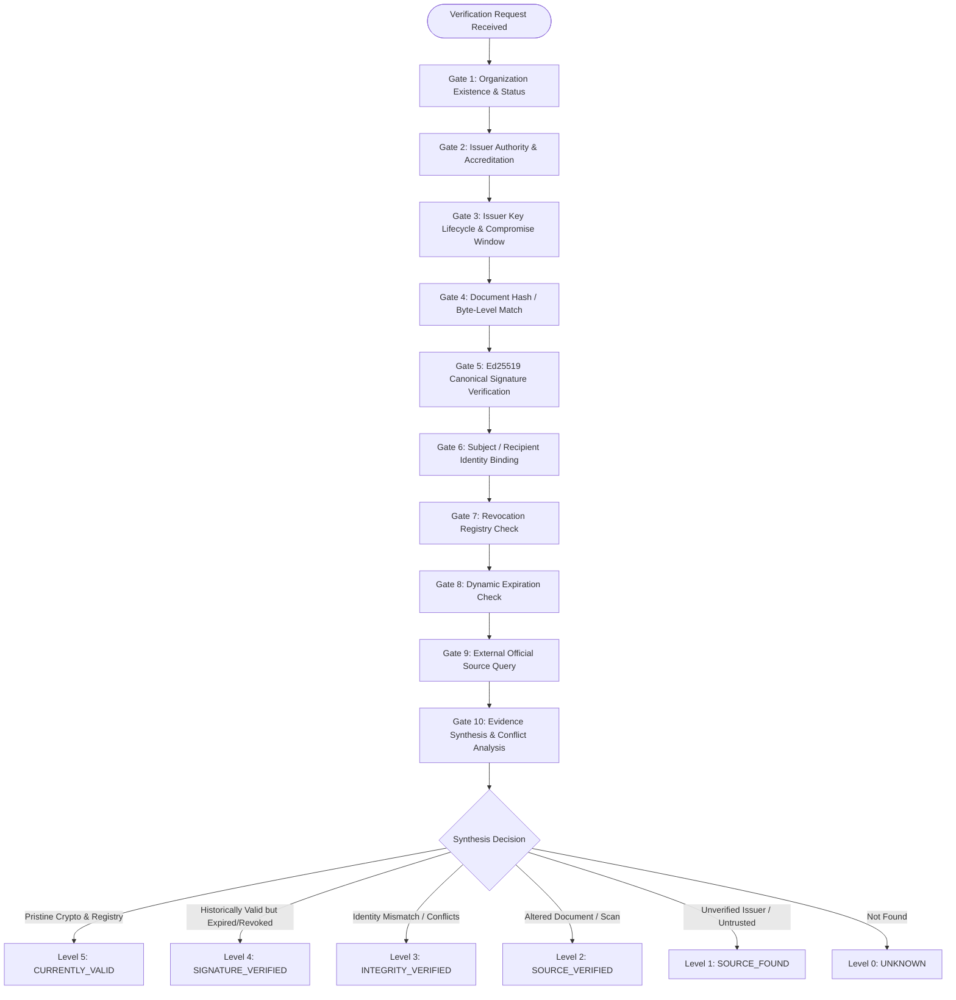

# Multi-Dimensional Verification Engine Specification

## 1. Pipeline Overview

Verification in SecureWork Verify is deterministic, fail-fast, and executes through **16 discrete verification gates** synthesizing evidence across cryptographic proof, registry authority, documentary match, identity binding, and advisory heuristics into **6 distinct trust levels**.



---

## 2. The 16 Discrete Verification Gates

Every verification evaluation assesses and records the pass/fail state and detailed telemetry across all 16 checks:

1. **`credentialExistence`**: Locates credential in platform registry.
2. **`versionExistence`**: Locates requested version number or latest active version.
3. **`organizationTrust`**: Assesses whether issuing organization is recognized and verified (`organizationVerificationStatus === 'VERIFIED'`).
4. **`issuerAuthorization`**: Validates issuer accreditation, active status, and organization binding.
5. **`issuerKeyStatus`**: Checks if key is `ACTIVE`, `RETIRED` (historical validity preserved), `REVOKED` (invalid), or `COMPROMISED` (checks if issuance timestamp predates or postdates compromise timestamp).
6. **`documentIntegrity`**: Evaluates uploaded document SHA-256 against registered hash. Distinguishes byte-level alteration from scan/screenshot representation caveats.
7. **`digitalSignature`**: Reconstructs 9-field RFC 8785 canonical JSON payload and validates Ed25519 signature against issuer's public key.
8. **`recipientBinding`**: Ensures credential is bound to claimed recipient ID, preventing presentation attacks.
9. **`credentialStatus`**: Verifies whether credential is active or superseded by a newer version revision.
10. **`expiration`**: Evaluates temporal validity against `expiresAt`. Expired credentials evaluate to `CREDENTIAL_EXPIRED`, not fake.
11. **`revocation`**: Evaluates revocation status and extracts timestamp and revocation reason.
12. **`sourceEvidence`**: Assesses official external registry query confirmation (`SOURCE_VERIFIED` or `SOURCE_FOUND`).
13. **`ocrEvidence`**: Records extracted text and flags discrepancies against canonical claims.
14. **`aiEvidence`**: Ingests heuristic anomaly scores and tampering detection flags.
15. **`humanEvidence`**: Evaluates supervisor or auditor manual review decision (`PENDING`, `VERIFIED`, `REJECTED`).
16. **`conflicts`**: Cross-references evidence across dimensions (e.g. AI clean vs signature bad; doc hash match vs signature bad; OCR claim vs registry claim).

---

## 3. Trust Levels and Outcomes

| Trust Level | Code | Criteria & Behavior |
|---|---|---|
| **Level 0** | **`UNKNOWN`** | Credential identifier does not exist in platform registry (`NOT_FOUND`). |
| **Level 1** | **`SOURCE_FOUND`** | Document claims an organization or source that is unregistered, unverified, or untrusted (`UNTRUSTED_ORIGIN`). |
| **Level 2** | **`SOURCE_VERIFIED`** | Issuer is authentic, but document bytes were altered (`ALTERED`), scan/screenshot does not match byte-exact file (`NOT_EXACT_FILE_MATCH`), or digital signature verification failed (`SIGNATURE_INVALID`). |
| **Level 3** | **`INTEGRITY_VERIFIED`** | Document and source match, but subject identity mismatched (`IDENTITY_MISMATCH`), signing key was compromised (`KEY_COMPROMISED`), conflicting evidence exists (`CONFLICTING_EVIDENCE`), or pending manual review (`MANUAL_REVIEW`). |
| **Level 4** | **`SIGNATURE_VERIFIED`** | Credential possesses a mathematically valid digital signature and untampered document hash, but has expired (`CREDENTIAL_EXPIRED`), was superseded by a newer version (`CREDENTIAL_SUPERSEDED`), or was revoked (`CREDENTIAL_REVOKED`). |
| **Level 5** | **`CURRENTLY_VALID`** | Complete verification pass: active accredited issuer, uncompromised key, valid Ed25519 signature, byte-exact document SHA-256 match, unexpired, unrevoked, and confirmed identity (`VERIFIED` or `MANUALLY_VERIFIED`). |

---

## 4. Invariant Rule: Non-Override Principle

> [!CRITICAL]
> **Cryptographic Inviolability**:
> Under no circumstances can AI anomaly detection or OCR field extraction override a cryptographic signature failure, document hash mismatch, or credential revocation.
> If a digital signature fails mathematical verification, the verification result is strictly `SIGNATURE_INVALID` (or `ALTERED`), regardless of whether AI reports 0% anomaly risk or high confidence.

---

## 5. Verification Result Output

```json
{
  "verificationId": "vrf_fc87553ff8187907",
  "credentialId": "crd_139af79e38925a36",
  "result": "VERIFIED",
  "trustLevel": "LEVEL 5 CURRENTLY_VALID",
  "cryptographicStatus": "PASSED",
  "humanVerificationStatus": "PENDING",
  "checks": {
    "organizationTrust": { "passed": true, "detail": "Organization verified" },
    "issuerAuthorization": { "passed": true, "detail": "Issuer active and accredited" },
    "issuerKeyStatus": { "passed": true, "detail": "Key active" },
    "documentIntegrity": { "passed": true, "detail": "Exact SHA-256 hash match" },
    "digitalSignature": { "passed": true, "detail": "Ed25519 signature verified" },
    "recipientBinding": { "passed": true, "detail": "Recipient bound" },
    "expiration": { "passed": true, "detail": "Perpetual validity" },
    "revocation": { "passed": true, "detail": "Clean revocation status" },
    "conflicts": { "passed": true, "detail": "No conflicting evidence" }
  },
  "warnings": [],
  "explanation": "Credential successfully verified against accredited issuer authority.",
  "evaluatedAt": "2026-08-31T09:43:36.465Z"
}
```
